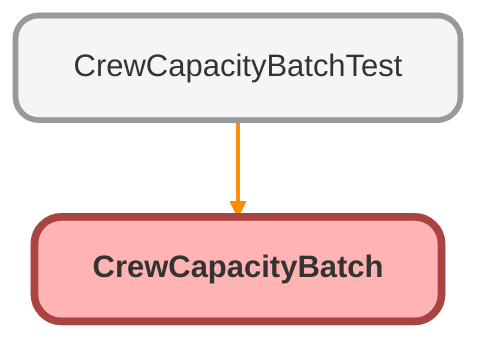

# CrewCapacityBatch Class

Sample for Lab 2.4. Copy it into your org as it is. 
 
It recalculates Total Capacity kW on every planned installation, from how many 
panels a crew can lay in a day on that roof type. What it computes matters far 
less than the fact that it has to be scheduled in every org it is deployed to, 
which is what the lab is about. 
 
It is both Batchable, so it can work through thousands of records, and 
Schedulable, so Salesforce can run it every night.

**Implements**

Database.Batchable<SObject>, 
Database.Stateful, 
Schedulable

## Class Diagram



<!-- Apex description -->

## Apex Code

```java
/**
 * Sample for Lab 2.4. Copy it into your org as it is.
 *
 * It recalculates Total Capacity kW on every planned installation, from how many
 * panels a crew can lay in a day on that roof type. What it computes matters far
 * less than the fact that it has to be scheduled in every org it is deployed to,
 * which is what the lab is about.
 *
 * It is both Batchable, so it can work through thousands of records, and
 * Schedulable, so Salesforce can run it every night.
 */
public with sharing class CrewCapacityBatch implements Database.Batchable<SObject>, Database.Stateful, Schedulable {
  // Rough panel output, used only to turn a panel count into kW
  private static final Decimal KW_PER_PANEL = 0.4;

  // Kept across the chunks of one run, for the summary email
  private Integer recalculated = 0;

  public Database.QueryLocator start(Database.BatchableContext context) {
    return Database.getQueryLocator(
      'SELECT Id, Crew_Size__c, Roof_Type__c, Total_Capacity_kW__c ' +
      'FROM Installation__c ' +
      'WHERE Status__c = \'Planned\''
    );
  }

  public void execute(Database.BatchableContext context, List<Installation__c> installations) {
    Map<String, Decimal> panelsPerDayByRoofType = new Map<String, Decimal>();
    for (Crew_Capacity__c capacity : [
      SELECT Roof_Type__c, Panels_Per_Day__c
      FROM Crew_Capacity__c
      WITH USER_MODE
    ]) {
      panelsPerDayByRoofType.put(capacity.Roof_Type__c, capacity.Panels_Per_Day__c);
    }

    for (Installation__c installation : installations) {
      Decimal panelsPerDay = panelsPerDayByRoofType.get(installation.Roof_Type__c);
      Decimal crewSize = installation.Crew_Size__c == null ? 0 : installation.Crew_Size__c;
      installation.Total_Capacity_kW__c = panelsPerDay == null
        ? 0
        : (crewSize * panelsPerDay * KW_PER_PANEL).setScale(2);
    }
    update installations;
    recalculated += installations.size();
  }

  /**
   * Emails the summary to whoever scheduled the job. An org whose email
   * deliverability is not All email refuses to send it, which is why Lab 2.4
   * declares a manual step: no deployment can change that setting.
   */
  public void finish(Database.BatchableContext context) {
    Messaging.SingleEmailMessage summary = new Messaging.SingleEmailMessage();
    summary.setToAddresses(new List<String>{ UserInfo.getUserEmail() });
    summary.setSubject('Crew capacity recalculated');
    summary.setPlainTextBody(recalculated + ' planned installation(s) recalculated.');
    try {
      Messaging.sendEmail(new List<Messaging.SingleEmailMessage>{ summary });
    } catch (EmailException e) {
      System.debug(LoggingLevel.WARN, 'Summary email not sent: ' + e.getMessage());
    }
  }

  /** Entry point when Salesforce runs this on a schedule. */
  public void execute(SchedulableContext context) {
    Database.executeBatch(new CrewCapacityBatch(), 200);
  }
}
```

## Fields
### `KW_PER_PANEL`

#### Signature
```apex
private static final KW_PER_PANEL
```

#### Type
Decimal

---

### `recalculated`

#### Signature
```apex
private recalculated
```

#### Type
Integer

## Methods
### `start(context)`

#### Signature
```apex
public Database.QueryLocator start(Database.BatchableContext context)
```

#### Parameters
| Name | Type | Description |
|------|------|-------------|
| context | Database.BatchableContext |  |

#### Return Type
**Database.QueryLocator**

---

### `execute(context, installations)`

#### Signature
```apex
public void execute(Database.BatchableContext context, List<Installation__c> installations)
```

#### Parameters
| Name | Type | Description |
|------|------|-------------|
| context | Database.BatchableContext |  |
| installations | List<Installation__c> |  |

#### Return Type
**void**

---

### `finish(context)`

Emails the summary to whoever scheduled the job. An org whose email 
deliverability is not All email refuses to send it, which is why Lab 2.4 
declares a manual step: no deployment can change that setting.

#### Signature
```apex
public void finish(Database.BatchableContext context)
```

#### Parameters
| Name | Type | Description |
|------|------|-------------|
| context | Database.BatchableContext |  |

#### Return Type
**void**

---

### `execute(context)`

Entry point when Salesforce runs this on a schedule.

#### Signature
```apex
public void execute(SchedulableContext context)
```

#### Parameters
| Name | Type | Description |
|------|------|-------------|
| context | SchedulableContext |  |

#### Return Type
**void**