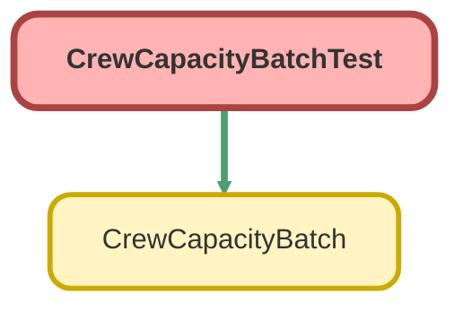

# CrewCapacityBatchTest Class

`ISTEST`

Sample for Lab 2.4. Copy it into your org as it is. 
 
Salesforce refuses to deploy Apex unless tests cover at least 75% of it, and 
this project keeps that rule. Lab 2.5 is entirely about that gate. 
 
It creates the records it needs rather than trusting whatever happens to be in 
the org, which is the one habit worth taking from this file.

## Class Diagram



<!-- Apex description -->

## Apex Code

```java
/**
 * Sample for Lab 2.4. Copy it into your org as it is.
 *
 * Salesforce refuses to deploy Apex unless tests cover at least 75% of it, and
 * this project keeps that rule. Lab 2.5 is entirely about that gate.
 *
 * It creates the records it needs rather than trusting whatever happens to be in
 * the org, which is the one habit worth taking from this file.
 */
@isTest
private class CrewCapacityBatchTest {
  @testSetup
  static void makeData() {
    insert new Crew_Capacity__c(
      External_Id__c = 'ROOF-TILE',
      Crew_Type__c = 'Roof',
      Roof_Type__c = 'Tile',
      Panels_Per_Day__c = 10
    );
    insert new Installation__c(
      External_Id__c = 'INST-TEST-1',
      Status__c = 'Planned',
      Roof_Type__c = 'Tile',
      Crew_Size__c = 3
    );
  }

  @isTest
  static void recalculatesPlannedInstallations() {
    Test.startTest();
    Database.executeBatch(new CrewCapacityBatch(), 200);
    Test.stopTest();

    Installation__c installation = [
      SELECT Total_Capacity_kW__c
      FROM Installation__c
      WHERE External_Id__c = 'INST-TEST-1'
      LIMIT 1
    ];
    // 3 people x 10 panels a day x 0.4 kW a panel
    Assert.areEqual(12.00, installation.Total_Capacity_kW__c, 'Capacity should be recalculated');
  }

  @isTest
  static void leavesInstallationsWithNoMatchingCapacityAtZero() {
    Installation__c slate = new Installation__c(
      External_Id__c = 'INST-TEST-2',
      Status__c = 'Planned',
      Roof_Type__c = 'Slate',
      Crew_Size__c = 3
    );
    insert slate;

    Test.startTest();
    Database.executeBatch(new CrewCapacityBatch(), 200);
    Test.stopTest();

    Installation__c reloaded = [
      SELECT Total_Capacity_kW__c
      FROM Installation__c
      WHERE Id = :slate.Id
      LIMIT 1
    ];
    Assert.areEqual(0, reloaded.Total_Capacity_kW__c, 'No capacity row means no capacity');
  }
}
```

## Methods
### `makeData()`

`TESTSETUP`

#### Signature
```apex
private static void makeData()
```

#### Return Type
**void**

---

### `recalculatesPlannedInstallations()`

`ISTEST`

#### Signature
```apex
private static void recalculatesPlannedInstallations()
```

#### Return Type
**void**

---

### `leavesInstallationsWithNoMatchingCapacityAtZero()`

`ISTEST`

#### Signature
```apex
private static void leavesInstallationsWithNoMatchingCapacityAtZero()
```

#### Return Type
**void**