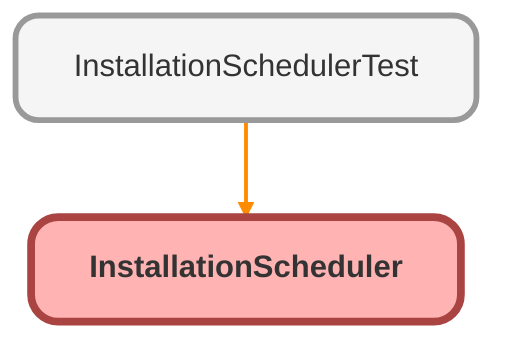

# InstallationScheduler Class

## Class Diagram



<!-- Apex description -->

## Apex Code

```java
public with sharing class InstallationScheduler {
    /**
     * Number of working days Helios keeps between the panels arriving and the crew
     * turning up, so the warehouse has time to prepare the pallets.
     */
    public static final Integer PREPARATION_DAYS = 3;

    // Returns the earliest date a crew can be sent to this installation.
    // The panels have to be in the warehouse, plus the preparation buffer.
    public static Date earliestInstallDate(Id installationId) {
        Date arrival = null;
        for (Panel_Batch__c batch : [
            SELECT Arrival_Date__c
            FROM Panel_Batch__c
            WHERE Installation__c = :installationId
            AND Arrival_Date__c != null
            ORDER BY Arrival_Date__c DESC
            LIMIT 1
        ]) {
            arrival = batch.Arrival_Date__c;
        }
        if (arrival == null) {
            return null;
        }
        return arrival.addDays(PREPARATION_DAYS);
    }

    /**
     * Suggests a crew size from the number of panels on the job.
     * One person can fit roughly eight panels in a day.
     *
     * @param panelCount total panels to install
     * @return the crew size a planner should assign, at least 2
     */
    public static Integer suggestedCrewSize(Integer panelCount) {
        if (panelCount == null || panelCount <= 0) {
            return 2;
        }
        Integer suggested = (Integer) Math.ceil(panelCount / 8.0);
        return suggested < 2 ? 2 : suggested;
    }

    public static List<Installation__c> installationsReadyToSchedule() {
        return [
            SELECT Id, Name, Install_Date__c, Status__c, Crew_Size__c
            FROM Installation__c
            WHERE Status__c = 'Planned'
            ORDER BY Install_Date__c NULLS LAST
            LIMIT 200
        ];
    }

    /**
     * The installations from the list that can be scheduled on the given day.
     *
     * @param installationIds the installations to check
     * @param wanted the day the planner wants
     * @return the ids that can take a crew that day
     */
    public static List<Id> schedulableOn(List<Id> installationIds, Date wanted) {
        Map<Id, Date> latestArrival = new Map<Id, Date>();
        for (Panel_Batch__c batch : [
            SELECT Installation__c, Arrival_Date__c
            FROM Panel_Batch__c
            WHERE Installation__c IN :installationIds
            AND Arrival_Date__c != null
            ORDER BY Arrival_Date__c ASC
        ]) {
            latestArrival.put(batch.Installation__c, batch.Arrival_Date__c);
        }
        List<Id> allowed = new List<Id>();
        for (Id installationId : installationIds) {
            Date arrival = latestArrival.get(installationId);
            if (arrival != null && wanted >= arrival.addDays(PREPARATION_DAYS)) {
                allowed.add(installationId);
            }
        }
        return allowed;
    }
}

```

## Fields
### `PREPARATION_DAYS`

Number of working days Helios keeps between the panels arriving and the crew 
turning up, so the warehouse has time to prepare the pallets.

#### Signature
```apex
public static final PREPARATION_DAYS
```

#### Type
Integer

## Methods
### `earliestInstallDate(installationId)`

#### Signature
```apex
public static Date earliestInstallDate(Id installationId)
```

#### Parameters
| Name | Type | Description |
|------|------|-------------|
| installationId | Id |  |

#### Return Type
**Date**

---

### `suggestedCrewSize(panelCount)`

Suggests a crew size from the number of panels on the job. 
One person can fit roughly eight panels in a day.

#### Signature
```apex
public static Integer suggestedCrewSize(Integer panelCount)
```

#### Parameters
| Name | Type | Description |
|------|------|-------------|
| panelCount | Integer | total panels to install |

#### Return Type
**Integer**

the crew size a planner should assign, at least 2

---

### `installationsReadyToSchedule()`

#### Signature
```apex
public static List<Installation__c> installationsReadyToSchedule()
```

#### Return Type
**List<Installation__c>**

---

### `schedulableOn(installationIds, wanted)`

The installations from the list that can be scheduled on the given day.

#### Signature
```apex
public static List<Id> schedulableOn(List<Id> installationIds, Date wanted)
```

#### Parameters
| Name | Type | Description |
|------|------|-------------|
| installationIds | List<Id> | the installations to check |
| wanted | Date | the day the planner wants |

#### Return Type
**List<Id>**

the ids that can take a crew that day