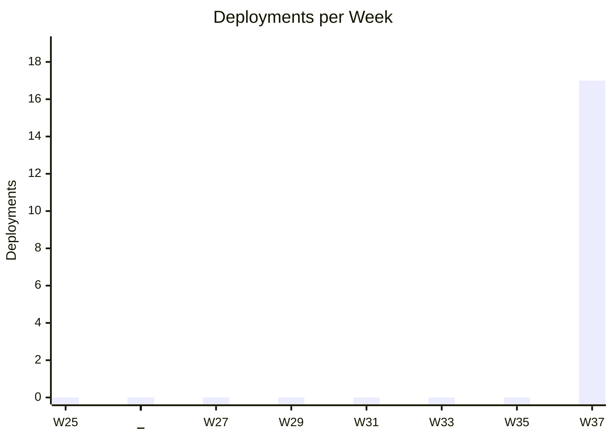
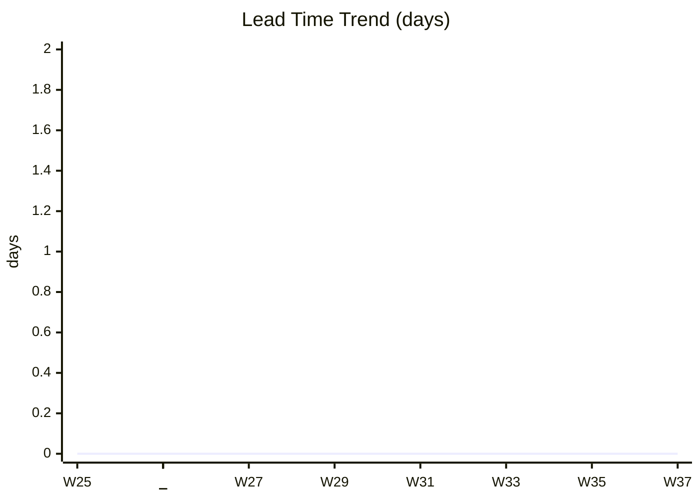
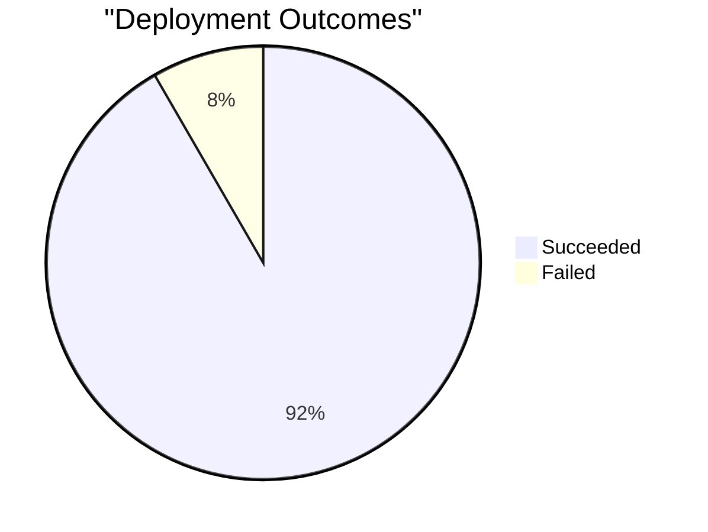
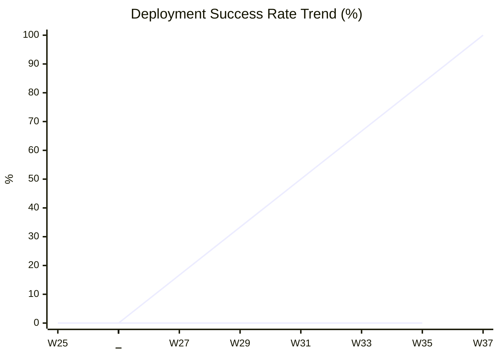

# DORA Metrics Report

**Period**: Last 90 days | **Org**: veurtio+demo.73193ee31bf8@agentforce.com | **Branch**: main | **Generated**: 2026-09-18

---

> DORA metrics measure software delivery performance across four key dimensions: speed, stability, throughput, and recovery. They are the industry standard for assessing DevOps maturity. Learn more: [DORA](https://dora.dev/guides/dora-metrics/)

## Executive Summary

| Metric | Value | Classification |
|--------|-------|----------------|
| Deployment Frequency | 1.7 per week | 🔵 High |
| Lead Time for Changes | 0 days (p50) | 🟢 Elite |
| Change Failure Rate | 8.3% | 🔵 High |
| Mean Time to Recovery | 7.9 hours | 🔵 High |
| Deployment Rework Rate | 8.3% | 🔵 High |

---

## Deployment Frequency

_How often your team successfully deploys to this org. Higher frequency indicates a more mature CI/CD pipeline. Learn more at https://dora.dev/guides/dora-metrics/_

| Period | Deployments | Validations |
|--------|-------------|-------------|
| 2026-W37 | 17 | 9 |

---

## Lead Time for Changes

_Time from pull request creation to production deployment. Shorter lead time means faster value delivery. Learn more at https://dora.dev/guides/dora-metrics/_

| Median | p90 | Average |
|--------|------|---------|
| 0 days | 0 days | 0 days |

---

## Change Failure Rate

_Percentage of deployments that cause a failure requiring immediate fix. Lower is better. Learn more at https://dora.dev/guides/dora-metrics/_

**Change Failure Rate**: 8.3%

Failed deployment details (2)

| Date | Deployed By | ID | Recovered in |
|------|-------------|----|--------------------|
| 2026-09-17 | Huhu Vi | [0Afg700000CBK2vCAH](https://orgfarm-c77e7e1127-dev-ed.develop.my.salesforce.com/changemgmt/monitorDeploymentsDetails.apexp?asyncId=0Afg700000CBK2vCAH) | 0.1 hours |
| 2026-09-17 | Huhu Vi | [0Afg700000CDAFaCAP](https://orgfarm-c77e7e1127-dev-ed.develop.my.salesforce.com/changemgmt/monitorDeploymentsDetails.apexp?asyncId=0Afg700000CDAFaCAP) | 15.6 hours |

---

## Mean Time to Recovery

_How quickly the team recovers after a failed deployment. Measured as time between a failure and the next successful deployment. Learn more at https://dora.dev/guides/dora-metrics/_

| Median | Average | Recovery Events |
|--------|---------|------------------|
| 7.9 hours | 7.9 hours | 2 |

Recovery timeline (2 events)

| Failed | Deployed By | Recovered in |
|--------|-------------|-------------------|
| 2026-09-17 | Huhu Vi | 0.1 hours |
| 2026-09-17 | Huhu Vi | 15.6 hours |

---

## Deployment Rework Rate

_Ratio of unplanned deployments triggered by hotfixes or immediate fixes after failures. Reflects deployment stability. Learn more at https://dora.dev/guides/dora-metrics/_

**Deployment Rework Rate**: 8.3%

---

## Supplementary Metrics

### Deployment Duration

| Median | p90 | Average |
|--------|------|---------|
| 0.2 min | 0.2 min | 0.2 min |

### PR Cycle Time

| Median | p90 | Average |
|--------|------|---------|
| 0 days | 0 days | 0 days |

### Change Volume

| Pull Requests | Deployments |
|----------------|-------------|
| 0.1 per week | 1.7 per week |

### Deployment Activity

| Deployer | Deployments | Success Rate |
|----------|-------------|--------------|
| Huhu Vi | 20 | 90% |
| OrgFarm EPIC | 2 | 100% |
| Automated Process | 2 | 100% |

### Deployment Queue Time

| Median | p90 | Average |
|--------|------|---------|
| 0.2 min | 0.4 min | 0.2 min |

### Contributor Statistics

| Author | Pull Requests | Avg Cycle Time |
|--------|----------------|-----------------|
| nvuillam | 1 | 0 days |

### Validation Metrics

**Success Rate**: 90.9% (10/11)

---

## DORA Benchmarks Reference

| Metric | Elite | High | Medium | Low |
|--------|-------|------|--------|-----|
| Deployment Frequency | Multiple/day | Weekly to daily | Monthly to weekly | < Monthly |
| Lead Time for Changes | < 1 day | 1 day - 1 week | 1 week - 1 month | > 1 month |
| Change Failure Rate | < 5% | 5-10% | 10-15% | > 15% |
| Mean Time to Recovery | < 1 hour | < 1 day | < 1 week | > 1 week |

---

## Detailed Data

### Deployments

| Date | Status | Type | Deployed By | ID | Duration (min) |
|------|--------|------|-------------|----|----------------|
| 2026-09-18 | Succeeded | Deployment | Huhu Vi | [0Afg700000CJ0YVCA1](https://orgfarm-c77e7e1127-dev-ed.develop.my.salesforce.com/changemgmt/monitorDeploymentsDetails.apexp?asyncId=0Afg700000CJ0YVCA1) | 0.1 |
| 2026-09-18 | Succeeded | Deployment | Huhu Vi | [0Afg700000CJ0lNCAT](https://orgfarm-c77e7e1127-dev-ed.develop.my.salesforce.com/changemgmt/monitorDeploymentsDetails.apexp?asyncId=0Afg700000CJ0lNCAT) | 0.2 |
| 2026-09-18 | Succeeded | Deployment | Huhu Vi | [0Afg700000CIV4sCAH](https://orgfarm-c77e7e1127-dev-ed.develop.my.salesforce.com/changemgmt/monitorDeploymentsDetails.apexp?asyncId=0Afg700000CIV4sCAH) | 0 |
| 2026-09-18 | Succeeded | Deployment | Huhu Vi | [0Afg700000CIRxLCAX](https://orgfarm-c77e7e1127-dev-ed.develop.my.salesforce.com/changemgmt/monitorDeploymentsDetails.apexp?asyncId=0Afg700000CIRxLCAX) | 0.2 |
| 2026-09-17 | Failed | Deployment | Huhu Vi | [0Afg700000CDAFaCAP](https://orgfarm-c77e7e1127-dev-ed.develop.my.salesforce.com/changemgmt/monitorDeploymentsDetails.apexp?asyncId=0Afg700000CDAFaCAP) | 0.2 |
| 2026-09-17 | Succeeded | Deployment | Huhu Vi | [0Afg700000CAySFCA1](https://orgfarm-c77e7e1127-dev-ed.develop.my.salesforce.com/changemgmt/monitorDeploymentsDetails.apexp?asyncId=0Afg700000CAySFCA1) | 0 |
| 2026-09-17 | Failed | Deployment | Huhu Vi | [0Afg700000CBK2vCAH](https://orgfarm-c77e7e1127-dev-ed.develop.my.salesforce.com/changemgmt/monitorDeploymentsDetails.apexp?asyncId=0Afg700000CBK2vCAH) | 0 |
| 2026-09-16 | Succeeded | Deployment | Huhu Vi | [0Afg700000C58neCAB](https://orgfarm-c77e7e1127-dev-ed.develop.my.salesforce.com/changemgmt/monitorDeploymentsDetails.apexp?asyncId=0Afg700000C58neCAB) | 0.2 |
| 2026-09-16 | Succeeded | Deployment | Huhu Vi | [0Afg700000C4jfZCAR](https://orgfarm-c77e7e1127-dev-ed.develop.my.salesforce.com/changemgmt/monitorDeploymentsDetails.apexp?asyncId=0Afg700000C4jfZCAR) | 0.2 |
| 2026-09-16 | Succeeded | Deployment | Huhu Vi | [0Afg700000C1ERpCAN](https://orgfarm-c77e7e1127-dev-ed.develop.my.salesforce.com/changemgmt/monitorDeploymentsDetails.apexp?asyncId=0Afg700000C1ERpCAN) | 0.2 |
| 2026-09-16 | Succeeded | Deployment | Huhu Vi | [0Afg700000C0tLmCAJ](https://orgfarm-c77e7e1127-dev-ed.develop.my.salesforce.com/changemgmt/monitorDeploymentsDetails.apexp?asyncId=0Afg700000C0tLmCAJ) | 0.2 |
| 2026-09-16 | Succeeded | Deployment | Huhu Vi | [0Afg700000C17wbCAB](https://orgfarm-c77e7e1127-dev-ed.develop.my.salesforce.com/changemgmt/monitorDeploymentsDetails.apexp?asyncId=0Afg700000C17wbCAB) | 0.2 |
| 2026-09-16 | Succeeded | Deployment | Huhu Vi | [0Afg700000C15BdCAJ](https://orgfarm-c77e7e1127-dev-ed.develop.my.salesforce.com/changemgmt/monitorDeploymentsDetails.apexp?asyncId=0Afg700000C15BdCAJ) | 0.2 |
| 2026-09-16 | Succeeded | Deployment | Huhu Vi | [0Afg700000C0lpeCAB](https://orgfarm-c77e7e1127-dev-ed.develop.my.salesforce.com/changemgmt/monitorDeploymentsDetails.apexp?asyncId=0Afg700000C0lpeCAB) | 0.2 |
| 2026-09-16 | Succeeded | Deployment | Huhu Vi | [0Afg700000BzilmCAB](https://orgfarm-c77e7e1127-dev-ed.develop.my.salesforce.com/changemgmt/monitorDeploymentsDetails.apexp?asyncId=0Afg700000BzilmCAB) | 0.2 |
| 2026-09-16 | Succeeded | Deployment | Huhu Vi | [0Afg700000C01zhCAB](https://orgfarm-c77e7e1127-dev-ed.develop.my.salesforce.com/changemgmt/monitorDeploymentsDetails.apexp?asyncId=0Afg700000C01zhCAB) | 0.2 |
| 2026-09-16 | Succeeded | Deployment | Huhu Vi | [0Afg700000BzfPiCAJ](https://orgfarm-c77e7e1127-dev-ed.develop.my.salesforce.com/changemgmt/monitorDeploymentsDetails.apexp?asyncId=0Afg700000BzfPiCAJ) | 0.1 |
| 2026-09-16 | Succeeded | Deployment | Huhu Vi | [0Afg700000BzvavCAB](https://orgfarm-c77e7e1127-dev-ed.develop.my.salesforce.com/changemgmt/monitorDeploymentsDetails.apexp?asyncId=0Afg700000BzvavCAB) | 0.1 |
| 2026-09-16 | Succeeded | Deployment | Huhu Vi | [0Afg700000BzNJ7CAN](https://orgfarm-c77e7e1127-dev-ed.develop.my.salesforce.com/changemgmt/monitorDeploymentsDetails.apexp?asyncId=0Afg700000BzNJ7CAN) | 0.1 |
| 2026-09-16 | Succeeded | Deployment | Huhu Vi | [0Afg700000BzKgDCAV](https://orgfarm-c77e7e1127-dev-ed.develop.my.salesforce.com/changemgmt/monitorDeploymentsDetails.apexp?asyncId=0Afg700000BzKgDCAV) | 0.2 |
| 2026-09-10 | Succeeded | Deployment | OrgFarm EPIC | [0Afg700000BLFKJCA5](https://orgfarm-c77e7e1127-dev-ed.develop.my.salesforce.com/changemgmt/monitorDeploymentsDetails.apexp?asyncId=0Afg700000BLFKJCA5) | 0 |
| 2026-09-10 | Succeeded | Deployment | OrgFarm EPIC | [0Afg700000BLMVSCA5](https://orgfarm-c77e7e1127-dev-ed.develop.my.salesforce.com/changemgmt/monitorDeploymentsDetails.apexp?asyncId=0Afg700000BLMVSCA5) | 0.4 |
| 2026-09-10 | Succeeded | Deployment | Automated Process | [0Afg700000BLgFfCAL](https://orgfarm-c77e7e1127-dev-ed.develop.my.salesforce.com/changemgmt/monitorDeploymentsDetails.apexp?asyncId=0Afg700000BLgFfCAL) | 0.1 |
| 2026-09-10 | Succeeded | Deployment | Automated Process | [0Afg700000BLthWCAT](https://orgfarm-c77e7e1127-dev-ed.develop.my.salesforce.com/changemgmt/monitorDeploymentsDetails.apexp?asyncId=0Afg700000BLthWCAT) | 0.1 |

### Validations

| Date | Status | Type | Deployed By | ID | Duration (min) |
|------|--------|------|-------------|----|----------------|
| 2026-09-18 | Succeeded | Validation | Huhu Vi | [0Afg700000CJa8vCAD](https://orgfarm-c77e7e1127-dev-ed.develop.my.salesforce.com/changemgmt/monitorDeploymentsDetails.apexp?asyncId=0Afg700000CJa8vCAD) | 0.1 |
| 2026-09-18 | Succeeded | Validation | Huhu Vi | [0Afg700000CJXkXCAX](https://orgfarm-c77e7e1127-dev-ed.develop.my.salesforce.com/changemgmt/monitorDeploymentsDetails.apexp?asyncId=0Afg700000CJXkXCAX) | 0.2 |
| 2026-09-16 | Succeeded | Validation | Huhu Vi | [0Afg700000C4SoPCAV](https://orgfarm-c77e7e1127-dev-ed.develop.my.salesforce.com/changemgmt/monitorDeploymentsDetails.apexp?asyncId=0Afg700000C4SoPCAV) | 0.2 |
| 2026-09-16 | Succeeded | Validation | Huhu Vi | [0Afg700000C1DPJCA3](https://orgfarm-c77e7e1127-dev-ed.develop.my.salesforce.com/changemgmt/monitorDeploymentsDetails.apexp?asyncId=0Afg700000C1DPJCA3) | 0.2 |
| 2026-09-16 | Succeeded | Validation | Huhu Vi | [0Afg700000C16xJCAR](https://orgfarm-c77e7e1127-dev-ed.develop.my.salesforce.com/changemgmt/monitorDeploymentsDetails.apexp?asyncId=0Afg700000C16xJCAR) | 0.2 |
| 2026-09-16 | Succeeded | Validation | Huhu Vi | [0Afg700000C11ETCAZ](https://orgfarm-c77e7e1127-dev-ed.develop.my.salesforce.com/changemgmt/monitorDeploymentsDetails.apexp?asyncId=0Afg700000C11ETCAZ) | 0.2 |
| 2026-09-16 | Succeeded | Validation | Huhu Vi | [0Afg700000C0xCTCAZ](https://orgfarm-c77e7e1127-dev-ed.develop.my.salesforce.com/changemgmt/monitorDeploymentsDetails.apexp?asyncId=0Afg700000C0xCTCAZ) | 0.2 |
| 2026-09-16 | Succeeded | Validation | Huhu Vi | [0Afg700000C0UlaCAF](https://orgfarm-c77e7e1127-dev-ed.develop.my.salesforce.com/changemgmt/monitorDeploymentsDetails.apexp?asyncId=0Afg700000C0UlaCAF) | 0.2 |
| 2026-09-16 | Succeeded | Validation | Huhu Vi | [0Afg700000BzKxyCAF](https://orgfarm-c77e7e1127-dev-ed.develop.my.salesforce.com/changemgmt/monitorDeploymentsDetails.apexp?asyncId=0Afg700000BzKxyCAF) | 0.2 |
| 2026-09-16 | Failed | Validation | Huhu Vi | [0Afg700000Bz99iCAB](https://orgfarm-c77e7e1127-dev-ed.develop.my.salesforce.com/changemgmt/monitorDeploymentsDetails.apexp?asyncId=0Afg700000Bz99iCAB) | 0.1 |
| 2026-09-15 | Succeeded | Validation | Huhu Vi | [0Afg700000ByBgeCAF](https://orgfarm-c77e7e1127-dev-ed.develop.my.salesforce.com/changemgmt/monitorDeploymentsDetails.apexp?asyncId=0Afg700000ByBgeCAF) | 0.1 |

### Pull Requests

| PR | Value | Tickets | Author | Created | Merged | PR Cycle Time |
|----|-------|---------|--------|---------|--------|-----------|
| [#47](https://github.com/nvuillam/sfdx-hardis-training/pull/47) | [Release 2026-09 to production](https://github.com/nvuillam/sfdx-hardis-training/pull/47) | - | nvuillam | 2026-09-18 | 2026-09-18 | 0 days |

---

_Generated by [sfdx-hardis](https://sfdx-hardis.cloudity.com) DORA Report_
