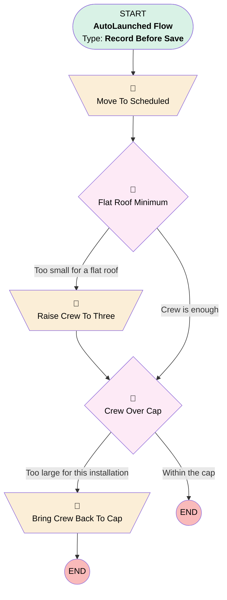

# Installation Assign Crew

## Flow Diagram [(_View History_)](Installation_Assign_Crew-history.md)

<!-- Flow description -->

## General Information

|<!-- -->|<!-- -->|
|:---|:---|
|Object|Installation__c|
|Process Type|Auto Launched Flow|
|Trigger Type|Record Before Save|
|Record Trigger Type|Create And Update|
|Label|Installation Assign Crew|
|Status|Active|
|Filter Formula|AND(   NOT(ISBLANK({!$Record.Crew_Size__c})),   NOT(ISBLANK({!$Record.Install_Date__c})),   ISPICKVAL({!$Record.Status__c}, "Planned") )|
|Description|When a planner puts a crew on a planned installation that already has a date, the installation moves to Scheduled on its own. A crew larger than the installation cap is brought back down to the cap: too many people on a small roof is a safety problem.|
|Environments|Default|
|Interview Label|Installation Assign Crew {!$Flow.CurrentDateTime}|
|Connector|[Move_To_Scheduled](#move_to_scheduled)|
|Next Node|[Move_To_Scheduled](#move_to_scheduled)|

## Flow Nodes Details

### Bring_Crew_Back_To_Cap

|<!-- -->|<!-- -->|
|:---|:---|
|Type|Assignment|
|Label|Bring Crew Back To Cap|
|Description|US-018: the crew never exceeds the cap the planner set on the installation.|

#### Assignments

|Assign To Reference|Operator|Value|
|:-- |:--:|:--: |
|$Record.Crew_Size__c|Assign|$Record.Crew_Capacity_Cap__c|

### Move_To_Scheduled

|<!-- -->|<!-- -->|
|:---|:---|
|Type|Assignment|
|Label|Move To Scheduled|
|Description|A planned installation with a crew and a date is scheduled: the status follows the facts rather than waiting for somebody to change it.|
|Connector|[Flat_Roof_Minimum](#flat_roof_minimum)|

#### Assignments

|Assign To Reference|Operator|Value|
|:-- |:--:|:--: |
|$Record.Status__c|Assign|Scheduled|

### Raise_Crew_To_Three

|<!-- -->|<!-- -->|
|:---|:---|
|Type|Assignment|
|Label|Raise Crew To Three|
|Description|US-034: a flat roof needs a crew of at least three.|
|Connector|[Crew_Over_Cap](#crew_over_cap)|

#### Assignments

|Assign To Reference|Operator|Value|
|:-- |:--:|:--: |
|$Record.Crew_Size__c|Assign|3|

### Crew_Over_Cap

|<!-- -->|<!-- -->|
|:---|:---|
|Type|Decision|
|Label|Crew Over Cap|
|Description|Is the crew larger than the cap this installation allows?|
|Default Connector Label|Within the cap|

#### Rule Too_Large (Too large for this installation)

|<!-- -->|<!-- -->|
|:---|:---|
|Connector|[Bring_Crew_Back_To_Cap](#bring_crew_back_to_cap)|
|Condition Logic|and|

|Condition Id|Left Value Reference|Operator|Right Value|
|:-- |:-- |:--:|:--: |
|1|$Record.Crew_Capacity_Cap__c|Is Null|⬜|
|2|$Record.Crew_Size__c|Greater Than|$Record.Crew_Capacity_Cap__c|

### Flat_Roof_Minimum

|<!-- -->|<!-- -->|
|:---|:---|
|Type|Decision|
|Label|Flat Roof Minimum|
|Description|Does a flat roof have fewer than three people on it? Runs before the cap, so the cap has the last word.|
|Default Connector|[Crew_Over_Cap](#crew_over_cap)|
|Default Connector Label|Crew is enough|

#### Rule Too_Small_For_Flat_Roof (Too small for a flat roof)

|<!-- -->|<!-- -->|
|:---|:---|
|Connector|[Raise_Crew_To_Three](#raise_crew_to_three)|
|Condition Logic|and|

|Condition Id|Left Value Reference|Operator|Right Value|
|:-- |:-- |:--:|:--: |
|1|$Record.Roof_Type__c|Equal To|Flat|
|2|$Record.Crew_Size__c|Less Than|3|

___

_Documentation generated from branch features/US-054-project-documentation by [sfdx-hardis](https://sfdx-hardis.cloudity.com), featuring [salesforce-flow-visualiser](https://github.com/toddhalfpenny/salesforce-flow-visualiser)_