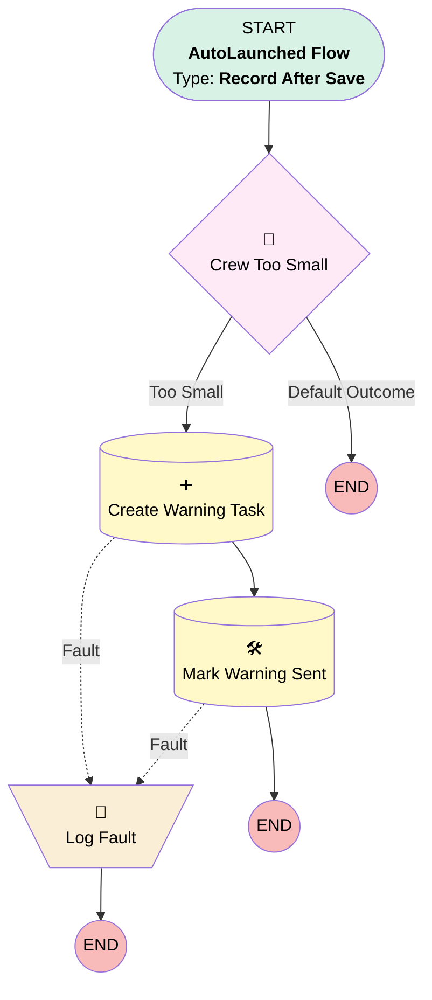

# Installation Crew Warning

## Flow Diagram

<!-- Flow description -->

## General Information

|<!-- -->|<!-- -->|
|:---|:---|
|Object|Installation__c|
|Process Type|Auto Launched Flow|
|Trigger Type|Record After Save|
|Record Trigger Type|Create And Update|
|Label|Installation Crew Warning|
|Status|Active|
|Description|Warns the planner when the crew assigned to an installation is too small for the panels it needs.|
|Environments|Default|
|Interview Label|Installation Crew Warning {!$Flow.CurrentDateTime}|
|BuilderType (PM)|LightningFlowBuilder|
|CanvasMode (PM)|AUTO_LAYOUT_CANVAS|
|Connector|[Crew_Too_Small](#crew_too_small)|
|Next Node|[Crew_Too_Small](#crew_too_small)|

#### Filters (logic: **and**)

|Filter Id|Field|Operator|Value|
|:-- |:-- |:--:|:--: |
|1|Crew_Size__c|Is Null|<!-- -->|
|2|Panels_Required__c|Is Null|<!-- -->|

## Variables

|Name|Data Type|Is Collection|Is Input|Is Output|Object Type|Description|
|:-- |:--:|:--:|:--:|:--:|:--:|:--  |
|faultMessage|String|⬜|⬜|⬜|<!-- -->|The error a failed record element reported.|

## Formulas

|Name|Data Type|Expression|Description|
|:-- |:--:|:-- |:--  |
|crewTooSmall|Boolean|AND({!$Record.Crew_Size__c} * 8 < {!$Record.Panels_Required__c}, NOT({!$Record.Crew_Warning_Sent__c}))|True when eight panels a person cannot cover the job and no warning was sent yet.|

## Flow Nodes Details

### Log_Fault

|<!-- -->|<!-- -->|
|:---|:---|
|Type|Assignment|
|Label|Log Fault|
|Description|Keeps the fault message so that a failed warning leaves a trace.|

#### Assignments

|Assign To Reference|Operator|Value|
|:-- |:--:|:--: |
|faultMessage|Assign|$Flow.FaultMessage|

### Crew_Too_Small

|<!-- -->|<!-- -->|
|:---|:---|
|Type|Decision|
|Label|Crew Too Small|
|Description|Warns only when the crew cannot lay the panels, and only once.|
|Default Connector Label|Default Outcome|

#### Rule Too_Small (Too Small)

|<!-- -->|<!-- -->|
|:---|:---|
|Connector|[Create_Warning_Task](#create_warning_task)|
|Condition Logic|and|

|Condition Id|Left Value Reference|Operator|Right Value|
|:-- |:-- |:--:|:--: |
|1|crewTooSmall|Equal To|✅|

### Create_Warning_Task

|<!-- -->|<!-- -->|
|:---|:---|
|Type|Record Create|
|Object|Task|
|Label|Create Warning Task|
|Description|Gives the planner a task on the installation, so the warning cannot be missed.|
|Fault Connector|[Log_Fault](#log_fault)|
|Store Output Automatically|✅|
|Connector|[Mark_Warning_Sent](#mark_warning_sent)|

#### Input Assignments

|Field|Value|
|:-- |:--: |
|OwnerId|$Record.OwnerId|
|Subject|Crew may be too small for this installation|
|WhatId|$Record.Id|

### Mark_Warning_Sent

|<!-- -->|<!-- -->|
|:---|:---|
|Type|Record Update|
|Label|Mark Warning Sent|
|Description|Records that the warning was sent, so that saving again does not warn twice.|
|Fault Connector|[Log_Fault](#log_fault)|
|Input Reference|$Record|

#### Input Assignments

|Field|Value|
|:-- |:--: |
|Crew_Warning_Sent__c|✅|

___

_Documentation generated from branch features/US-054-project-documentation by [sfdx-hardis](https://sfdx-hardis.cloudity.com), featuring [salesforce-flow-visualiser](https://github.com/toddhalfpenny/salesforce-flow-visualiser)_