<!-- This file is auto-generated. if you do not want it to be overwritten, set TRUE in the line below -->
<!-- DO_NOT_OVERWRITE_DOC=FALSE -->

# Crew_Capacity__c

## Schema

```mermaid
graph TD
Crew_Capacity__c["Crew Capacity"]:::mainObject
click Crew_Capacity__c "../Crew_Capacity__c/"
Crew_Capacity__c["Crew Capacity"]:::mainObject
click Crew_Capacity__c "../Crew_Capacity__c/"


classDef object fill:#D6E9FF,stroke:#0070D2,stroke-width:3px,rx:12px,ry:12px,shadow:drop,color:#333;
classDef customObject fill:#FFF4C2,stroke:#CCAA00,stroke-width:3px,rx:12px,ry:12px,shadow:drop,color:#333;
classDef customObjectManaged fill:#FFD8B2,stroke:#CC5500,stroke-width:3px,rx:12px,ry:12px,shadow:drop,color:#333;
classDef mainObject fill:#FFB3B3,stroke:#A94442,stroke-width:4px,rx:14px,ry:14px,shadow:drop,color:#333,font-weight:bold;

```

<!-- Object description -->

## Fields

| Name | Label | Type | Description |
| :-------- | :---- | :--: | :---------- | 
| Crew_Type__c | Crew Type | Picklist | <!-- --> |
| External_Id__c | External Id | Text | <!-- --> |
| Panels_Per_Day__c | Panels Per Day | Number | <!-- --> |
| Roof_Type__c | Roof Type | Picklist | <!-- --> |

## Related Apex Classes

| Apex Class | Type |
| :----      | :--: | 
| [CrewCapacityBatch](../apex/CrewCapacityBatch.md) | Batch |
| [CrewCapacityBatchTest](../apex/CrewCapacityBatchTest.md) | Test |

## Related Permission Sets

| Permission Set | User License |
| :----      | :--: | 
| [Helios_Delivery_Manager](../permissionsets/Helios_Delivery_Manager.md) | None |
| [Helios_Delivery_Manager](../permissionsets/Helios_Delivery_Manager.md) | None |

_Documentation generated with [sfdx-hardis](https://sfdx-hardis.cloudity.com), by [Cloudity](https://www.cloudity.com/) & [friends](https://github.com/hardisgroupcom/sfdx-hardis/graphs/contributors)_
