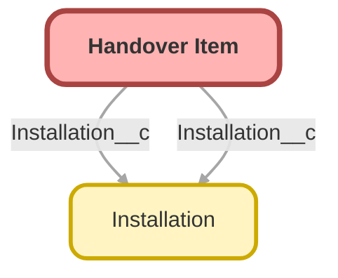

<!-- This file is auto-generated. if you do not want it to be overwritten, set TRUE in the line below -->
<!-- DO_NOT_OVERWRITE_DOC=FALSE -->

# Handover_Item__c

## Schema

<!-- Object description -->

## Fields

| Name | Label | Type | Description |
| :-------- | :---- | :--: | :---------- | 
| External_Id__c | External Id | Text | <!-- --> |
| Installation__c | Installation | Lookup | The installation this item belongs to. Empty on the template items. |
| Is_Done__c | Is Done | Checkbox | <!-- --> |
| Is_Template__c | Is Template | Checkbox | <!-- --> |
| Label__c | Label | Text | What the crew has to check before handing over. |
| Sequence__c | Sequence | Number | <!-- --> |

## Related Flows

| Object | Name | Type | Description | Status |
| :----  | :-------- | :--: | :---------- | :----- |
| Installation__c | [Installation_Close_Check](../flows/Installation_Close_Check.md) [🕒](../flows/Installation_Close_Check-history.md) | Record Before Save | An installation cannot be closed while its handover checklist has an item not done. | Active |

## Related Permission Sets

| Permission Set | User License |
| :----      | :--: | 
| [Helios_Delivery_Manager](../permissionsets/Helios_Delivery_Manager.md) | None |
| [Helios_Delivery_Manager](../permissionsets/Helios_Delivery_Manager.md) | None |

_Documentation generated with [sfdx-hardis](https://sfdx-hardis.cloudity.com), by [Cloudity](https://www.cloudity.com/) & [friends](https://github.com/hardisgroupcom/sfdx-hardis/graphs/contributors)_
