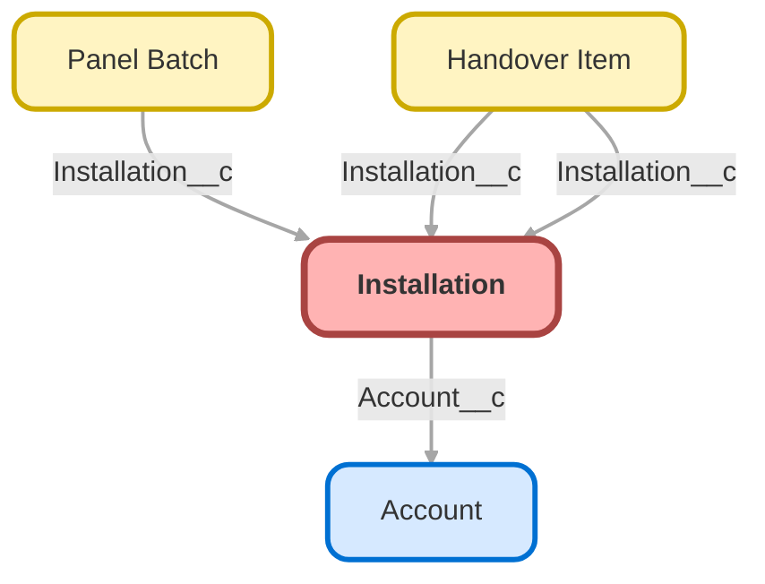

<!-- This file is auto-generated. if you do not want it to be overwritten, set TRUE in the line below -->
<!-- DO_NOT_OVERWRITE_DOC=TRUE -->

# Installation__c

An installation is one solar job at one customer site: the panels, the crew that fits them and the
day they go on the roof. The crew capacity cap is a safety rule, not a cost rule: too many people on
a small roof get in each other's way.

## Schema

<!-- Object description -->

## Fields

| Name | Label | Type | Description |
| :-------- | :---- | :--: | :---------- | 
| Account__c | Account | Lookup | The customer whose roof this is. |
| Crew_Capacity_Cap__c | Crew Capacity Cap | Number | The largest crew this installation can take. Above it, people get in each other's way on the roof. |
| Crew_Notes__c | Crew Notes | LongTextArea | Free text the crew leaves for the next shift. |
| Crew_Size__c | Crew Size | Number | How many people are assigned to this job. Level 2 makes it mandatory. |
| Crew_Warning_Sent__c | Crew Warning Sent | Checkbox | Ticked once the planner has been warned that the crew is too small. |
| External_Id__c | External Id | Text | Stable key used by the training data loader. Never edit it by hand. |
| Install_Date__c | Install Date | Date | The day the crew is expected on site. |
| Panels_Required__c | Panels Required | Number | How many panels the crew has to load for this installation. |
| Roof_Type__c | Roof Type | Picklist | Drives how long the job takes. |
| Signed_Off_By__c | Signed Off By | Text | Who signed the installation off with the customer. |
| Status__c | Status | Picklist | Where this installation stands. |
| Total_Capacity_kW__c | Total Capacity kW | Number | Total installed capacity once every panel is on the roof. |

## Validation Rules

| Rule | Active | Description | Formula |
| :-------- | :---- | :---------- | :------ |
| Installation_Date_Not_Past | Yes | A planner cannot move an installation into the past. Completed jobs are exempt, and the rule stays quiet on insert so the training data can be loaded. | <code>AND(   ISCHANGED(Install_Date__c),   Install_Date__c &lt; TODAY(),   NOT(ISPICKVAL(Status__c, "Completed")),   NOT(ISPICKVAL(Status__c, "Cancelled")) )</code> |

## Related Flows

| Object | Name | Type | Description | Status |
| :----  | :-------- | :--: | :---------- | :----- |
| Installation__c | [Installation_Assign_Crew](../flows/Installation_Assign_Crew.md) [🕒](../flows/Installation_Assign_Crew-history.md) | Record Before Save | When a planner puts a crew on a planned installation that already has a date, the installation moves to Scheduled on its own. A crew larger than the installation cap is brought back down to the cap: too many people on a small roof is a safety problem. | Active |
| Installation__c | [Installation_Close_Check](../flows/Installation_Close_Check.md) [🕒](../flows/Installation_Close_Check-history.md) | Record Before Save | An installation cannot be closed while its handover checklist has an item not done. | Active |
| Installation__c | [Installation_Crew_Warning](../flows/Installation_Crew_Warning.md) | Record After Save | Warns the planner when the crew assigned to an installation is too small for the panels it needs. | Active |

## Related Apex Classes

| Apex Class | Type |
| :----      | :--: | 
| [CrewCapacityBatch](../apex/CrewCapacityBatch.md) | Batch |
| [CrewCapacityBatchTest](../apex/CrewCapacityBatchTest.md) | Test |
| [InstallationScheduler](../apex/InstallationScheduler.md) | Class |
| [InstallationSchedulerTest](../apex/InstallationSchedulerTest.md) | Test |

## Related Lightning Web Components

| Component | Description | Exposed | Targets |
| :-------- | :---------- | :-----: | :------------- |
| [installationTimeline](../lwc/installationTimeline.md) | Shows the panel batches booked for an installation, in arrival order. | ✅ | lightning__RecordPage |

## Related Lightning Pages

| Lightning Page | Type |
| :----      | :--: | 
| [Installation_Record_Page](../pages/Installation_Record_Page.md) | Record Page |

## Related Permission Sets

| Permission Set | User License |
| :----      | :--: | 
| [Helios_Delivery_Crew](../permissionsets/Helios_Delivery_Crew.md) | None |
| [Helios_Delivery_Crew](../permissionsets/Helios_Delivery_Crew.md) | None |
| [Helios_Delivery_Crew](../permissionsets/Helios_Delivery_Crew.md) | None |
| [Helios_Delivery_Manager](../permissionsets/Helios_Delivery_Manager.md) | None |
| [Helios_Delivery_Manager](../permissionsets/Helios_Delivery_Manager.md) | None |
| [Helios_Delivery_Manager](../permissionsets/Helios_Delivery_Manager.md) | None |

_Documentation generated with [sfdx-hardis](https://sfdx-hardis.cloudity.com), by [Cloudity](https://www.cloudity.com/) & [friends](https://github.com/hardisgroupcom/sfdx-hardis/graphs/contributors)_
