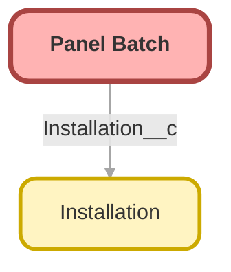

<!-- This file is auto-generated. if you do not want it to be overwritten, set TRUE in the line below -->
<!-- DO_NOT_OVERWRITE_DOC=FALSE -->

# Panel_Batch__c

## Schema

<!-- Object description -->

## Fields

| Name | Label | Type | Description |
| :-------- | :---- | :--: | :---------- | 
| Arrival_Date__c | Arrival Date | Date | The day the pallet reaches the warehouse. |
| Cost__c | Cost | Currency | What Helios paid for this pallet. Level 2 opens it to the crews. |
| External_Id__c | External Id | Text | Stable key used by the training data loader. Never edit it by hand. |
| Installation__c | Installation | Lookup | The installation this pallet is for. |
| Quantity__c | Quantity | Number | How many panels are on this pallet. |
| Quote_Pdf_Url__c | Quote PDF URL | Url | Where the generated quote PDF for this batch is stored. |
| Serial_Prefix__c | Serial Prefix | Text | First characters of the serial numbers on this pallet. |

## Related Apex Classes

| Apex Class | Type |
| :----      | :--: | 
| [InstallationScheduler](../apex/InstallationScheduler.md) | Class |
| [InstallationSchedulerTest](../apex/InstallationSchedulerTest.md) | Test |

## Related Lightning Web Components

| Component | Description | Exposed | Targets |
| :-------- | :---------- | :-----: | :------------- |
| [installationTimeline](../lwc/installationTimeline.md) | Shows the panel batches booked for an installation, in arrival order. | ✅ | lightning__RecordPage |

## Related Permission Sets

| Permission Set | User License |
| :----      | :--: | 
| [Helios_Delivery_Crew](../permissionsets/Helios_Delivery_Crew.md) | None |
| [Helios_Delivery_Manager](../permissionsets/Helios_Delivery_Manager.md) | None |

_Documentation generated with [sfdx-hardis](https://sfdx-hardis.cloudity.com), by [Cloudity](https://www.cloudity.com/) & [friends](https://github.com/hardisgroupcom/sfdx-hardis/graphs/contributors)_
