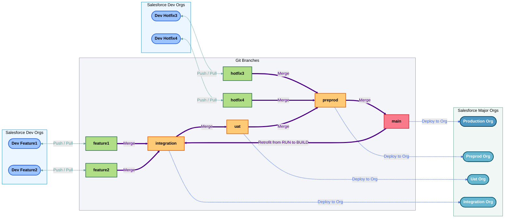

# Branches & Orgs

## Branches & Orgs strategy

| Git branch | Salesforce Org | Deployment Username |
| :--------- | :------------- | :------------------ |
| main | https://login.salesforce.com | veurtio+demo.73193ee31bf8@agentforce.com |
| preprod | https://login.salesforce.com | veurtio.dd9da51447c4@agentforce.com |
| uat | https://test.salesforce.com | test-y0vnmsc9mzwr@example.com |
| integration | https://test.salesforce.com | test-m276mvg5vkjy@example.com |

___

_Documentation generated from branch features/US-054-project-documentation with [sfdx-hardis](https://sfdx-hardis.cloudity.com) by [Cloudity](https://cloudity.com?ref=sfdxhardis) command [`sf hardis:doc:project2markdown`](https://sfdx-hardis.cloudity.com/hardis/doc/project2markdown/)_

