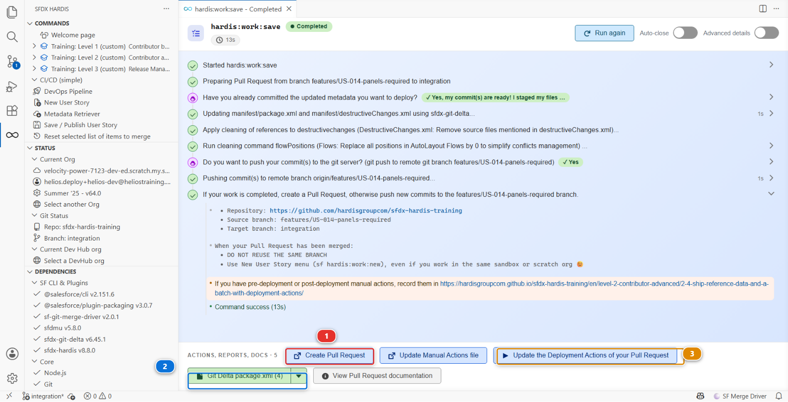
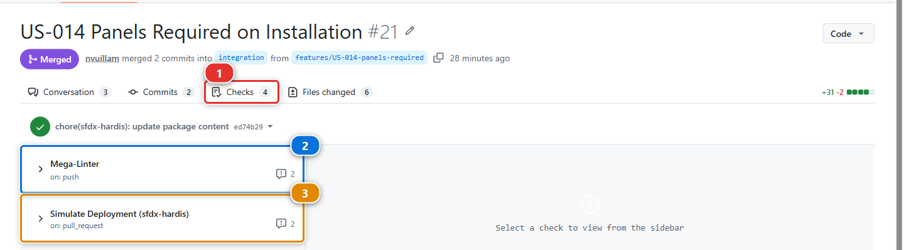
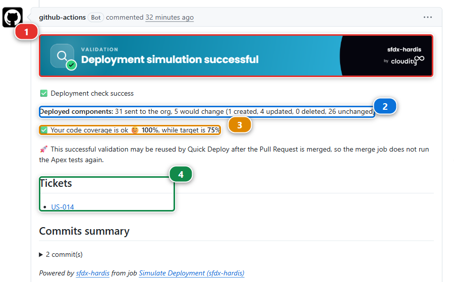
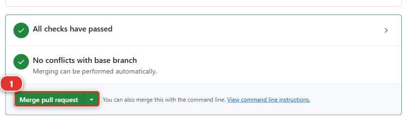
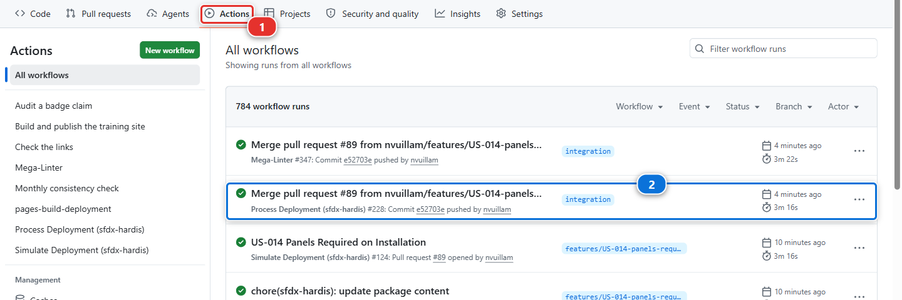
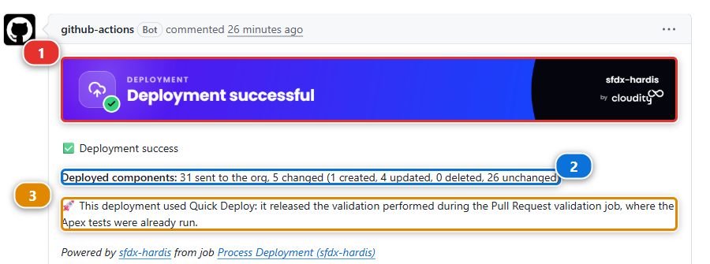

# Lab 1.6 - Open a Pull Request, pass the deployment check, merge

**Level**: 1 Contributor basics

**Time**: ~20 min

**You will**: have a robot check your work before a human does, read what it says, and put US-014
into the shared integration org.

## The situation

Your branch is on GitHub. Now you ask for it to be merged, and something interesting happens: before
anybody looks at it, a job takes your changes and rehearses the deployment into the integration org.
Salesforce compiles everything and runs the tests, then throws the result away rather than keeping
it, so the org is left exactly as it was. The job also runs the linters, and writes the whole verdict
back on the Pull Request.

That is the whole point of this way of working. You find out your deployment fails while it is
still yours to fix, not on release night.

!!! info "Pull Request, in one sentence"
    A Pull Request asks for one branch to be folded into another, yours into `integration` here. It
    is a page on GitHub holding three things: what your branch changes, the result of every check
    that ran on it, and the conversation about whether it should go in. Nothing moves until somebody
    clicks Merge. Everyone shortens it to "PR".

## Before you start

- [ ] Lab 1.5 finished: the branch is pushed to your fork
- [ ] Lab 1.2 finished: **Set up my training environment** turned Actions on and set the CI
      credential

## Steps

### 1. Open the Pull Request

Go back to the panel where **Save / Publish** finished in Lab 1.5. Along the bottom is a bar of
actions, and the first one is **Create Pull Request** **(1)**. Click it: the extension opens GitHub
on the right page, with base and head already filled in.

Two other things in that bar are worth knowing now, because later labs use them. **(2)** is the
`package.xml` the command generated, the one you read in Lab 1.5 step 6. **(3)** opens the Deployment
Actions of this Pull Request, which is what the whole of Lab 2.3 is about.

!!! note "If you closed that panel"
    Nothing is lost. Open your fork on GitHub: it shows a banner offering to open a Pull Request
    for the branch you just pushed. The **+ PR** pill you may have noticed in the DevOps Pipeline
    diagram is for major branches, not for your feature branch.

Check two things before clicking, every single time:

1. **base** is `integration`, in **your** fork
2. **compare** is `features/US-014-panels-required`

!!! danger "Check the base repository"
    GitHub defaults the base of a fork's Pull Request to the **original** repository. If the base
    says `hardisgroupcom/sfdx-hardis-training`, click it and change it to your own fork. A Pull
    Request opened upstream cannot reach your org, will never turn green, and adds noise to a
    repository a few hundred other learners are using.

The title reads **Features/us 014 panels required**: GitHub makes it up from the branch name
whenever a branch carries more than one commit, and yours carries two, the one you wrote and the
one Save / Publish added. Replace it with the first line of your commit message,
`US-014 Panels Required on Installation`, and paste the rest of that message into the
description. It is what the reviewer reads first. Click **Create pull request**.

### 2. Watch the checks run

Open the **Checks** tab **(1)**. Two of them matter here, and both start on their own:

| Check                                         | What it does                                                                                |
|-----------------------------------------------|---------------------------------------------------------------------------------------------|
| **Simulate Deployment (sfdx-hardis)** **(3)** | Deploys your metadata into `helios-integration` in validation mode, and runs the Apex tests |
| **Mega-Linter** **(2)**                       | Runs the code quality linters over the repository                                           |

Click either one to read its log while it runs. The deployment check takes about two minutes, and
you can watch it authenticate with your secret, work out what changed, and start the deployment.

The pictures in this lab were taken on a later story of this same course, so the story number in the
title is not yours. The page is the same page, and so are the two checks.

### 3. Read the sfdx-hardis comment

When the deployment check finishes, sfdx-hardis writes a comment on the **Conversation** tab. It is
the most useful thing on the page.

1. **The banner** **(1)** says whether the simulated deployment succeeded
2. **What would change** **(2)**. Not a list of your files: sfdx-hardis sends the package and
   Salesforce answers how much of it differs, as in `34 sent to the org, 10 would change (0 created,
   10 updated, 0 deleted, 24 unchanged)`
3. **Apex coverage** **(3)**, against the target this project sets
4. **Tickets** **(4)**, the stories it recognised in your branch name and commit messages

Below those, a summary of your commits and the name of the job that wrote the comment.

!!! note "The numbers in that picture are from another story"
    It is a real comment from a real run on this repository, kept as it came out. Yours will carry
    your own story and your own counts.

### 4. Merge

Both checks green, the comment says success. Back on the **Conversation** tab, scroll to the bottom:
the merge box says **All checks have passed** and **No conflicts with base branch**, and the button
is live.

It is live *because* both are green. Setting up your environment in Lab 1.2 protected `integration`:
while a check is running or red, the box reads **Merging is blocked** and the button stays grey, for
you as for anybody else. That is the rule of every real pipeline, and here GitHub enforces it rather
than trusting everybody to read the checks first.

Click **Merge pull request** **(1)**, then **Confirm merge**.

Then delete the branch. GitHub offers a button for it. A merged branch that stays around is one
more thing in everyone's list for no benefit.

!!! note "What the linter is for, since it had nothing to say"
    MegaLinter reads the whole repository, not only your change, and reports anything that breaks
    the project's quality rules. It found nothing here because this repository is clean. When it
    does find something, it writes it on the Pull Request the same way the deployment check does,
    and whether a finding fails the job is a choice the project makes in `.mega-linter.yml`. A job that
    fails blocks the merge, like the deployment check.
    Level 2 has a lab where one blocks you, on purpose.

### 5. Watch the real deployment

Merging into `integration` starts a second job, and this one is not a check: it deploys for real.

Go to the **Actions** tab **(1)** of your fork. The run at the top is **Process Deployment
(sfdx-hardis)** **(2)**, on `integration`, and it takes about two minutes.

When it finishes, it writes a second comment on the Pull Request you just merged:

1. **Deployment successful** **(1)**, and this time the org really changed
2. **What changed** **(2)**, in the same shape as the check said it would: `10 changed` where the
   check said `10 would change`
3. **Quick Deploy** **(3)**. The merge job did not start from nothing. It released the validation
   the Pull Request check had already done, which is why it did not run the Apex tests a second
   time and why it took two minutes rather than five

Then open `helios-integration` from **Orgs Manager** and look at an installation.

`Panels Required` is there. You built it in one org and it arrived in another, and you never
deployed anything by hand.

`helios-uat` does not have it, and it should not yet. Work moves from `integration` to `uat` when a
release manager promotes it, several stories at a time, and that is Level 3.

Under the hood: what the two jobs ran

The Pull Request check ran:

    sf hardis:project:deploy:smart --check

`--check` is a **validation deployment**: Salesforce compiles everything, runs the tests and
reports what it would do, then throws the result away. Your org is not modified. That is why it is
safe to run on every push.

The job after the merge ran the same command **without** `--check`, against the same org. Same
code, same configuration, one flag apart. A check that passes and a deployment that then fails is
rare, and when it happens it is almost always because somebody changed the target org by hand in
between.

Both jobs authenticate first, through the sfdx-hardis hook that reads
`SFDX_AUTH_URL_INTEGRATION`, the secret **Set up my training environment** wrote in Lab 1.2. The workflow files are in
`.github/workflows/`, and they are worth reading once: they are about thirty lines each.

The test level comes from `config/.sfdx-hardis.yml`:

    testLevel: RunLocalTests
    apexTestsMinCoverageOrgWide: 75

`RunLocalTests` runs every test in the org except those from managed packages. 75% is the Salesforce
minimum, and most real projects set it higher.

## What you should see

- The Pull Request merged, with a green sfdx-hardis comment above the merge
- The **Process Deployment (sfdx-hardis)** run green in the Actions tab
- `Panels Required` present on the Installation object in `helios-integration`

That is one full delivery loop. Every story for the rest of your life on this project is this loop.

## If it goes wrong

**The checks never start.**
Actions are still disabled on your fork. Run **Training: Level 1 > Set up my training environment**
again: it turns them on, and tells you what to click if GitHub will not let it.

**The check fails at authentication:** *No authentication found for org integration*.
The secret is missing, misnamed, or truncated. It must be named exactly
`SFDX_AUTH_URL_INTEGRATION` and its value must start with `force://`. The quickest repair is
**Training: Level 1 > Set up my training environment**, which writes it again. Then open the
**Checks** tab of your Pull Request and click **Re-run all jobs**.

**The check fails with `INVALID_CROSS_REFERENCE_KEY` on the permission set.**
The permission set grants a field that is not in your package. You retrieved the permission set
without the field. Redo Lab 1.5 step 3 and take both.

**The check is stuck as "Expected".**
The workflow is waiting for a job that will never run, usually because the base of the Pull Request
is the original repository and not your fork. Close it and open it again with the right base.

**The merge box says Merging is blocked, and the button is grey.**
A required check is still running, or it failed. Wait for it, or open it from the **Checks** tab,
fix what it reports on your branch, and push again: the checks run again on their own. There is no
way around it, and there is not meant to be.

**The deployment succeeds but the field is not in the org.**
Look at the deployed components list in the comment. If the field is not there, it is not in
`manifest/package.xml`, and Lab 1.5 step 6 is where you read it.

## Check your work

Welcome page > **Training: Level 1** > **Check my work**, then pick Lab 1.6.

## Go deeper

- [Create the Pull Request on GitHub](https://sfdx-hardis.cloudity.com/salesforce-devops-pull-request-github/)
- [Check the Pull Request results](https://sfdx-hardis.cloudity.com/salesforce-devops-handle-merge-request-results/)
- [Solve MegaLinter errors](https://sfdx-hardis.cloudity.com/salesforce-devops-solve-megalinter-errors/)

[Next: Lab 1.7 - Capstone: deliver a User Story on your own](1-7-capstone-deliver-a-user-story-on-your-own.md){ .md-button .md-button--primary }
