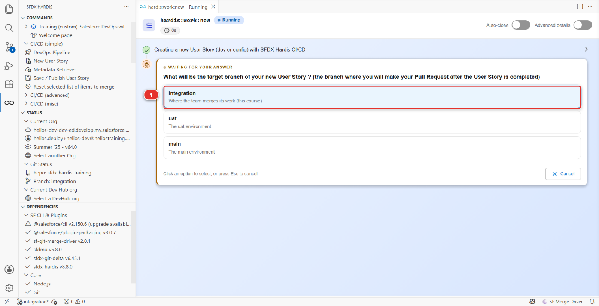
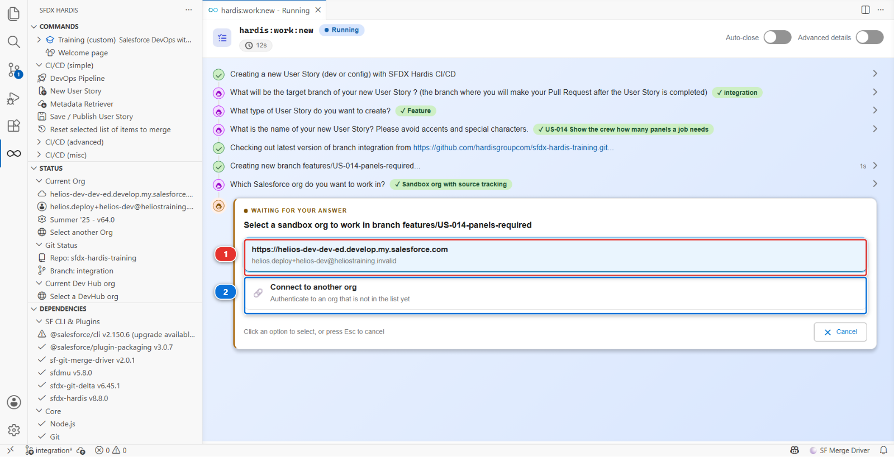

# Lab 2 - Take US-014 from the backlog

**Level**: 1 Contributor basics
**Time**: ~20 min
**You will**: pick up your first ticket and land on a clean branch, pointed at your dev org.

## The situation

The backlog is in [BACKLOG.md](../../../BACKLOG.md). Your first story is at the top:

> **US-014 - Show the crew how many panels a job needs**
>
> As a delivery crew member, I want to see the number of panels required on the installation
> record, so that I load the right quantity on the van.
>
> Acceptance criteria:
>
> - A Panels Required field exists on Installation
> - It is visible to the crew permission set
> - It appears on the Installation record page

Small on purpose. What matters in this lab is not the field, it is the loop you are about to learn
and repeat for the rest of your career on this project.

## Before you start

- [ ] Lab 1 finished: your fork is cloned and `integration` names your org
- [ ] `helios-dev` connected in **Orgs Manager**

## Steps

### 1. Start the User Story

On the Welcome page, open the **DevOps Pipeline** panel and scroll past the diagram to the
**Project Contribution Workflow** **(1)**. Click the **New User Story** card **(2)**.

!!! tip "Cannot see the cards?"
    They sit under the branch diagram, and a project with several feature branches makes that
    diagram tall enough to push them off the screen. Turn **Show feature branches** off in the
    header: the diagram shrinks to the major branches and the cards come into view.

The extension asks a short series of questions, one screen at a time. Answer them:

1. **What do you want to do?** - *Start a new User Story*
2. **Target branch** - `integration` **(1)**, the choice described as where the team merges its
   work. `uat` and `main` are under it, and nothing is wired to them yet
3. **Type of branch** - **Feature**, because this adds something rather than fixing it
4. **Name** - `US-014-panels-required`

You never guess where your work is going: the command asks, and writes the answer down.

The name is checked against a pattern the project declares, so every branch on this repository
looks the same. Type something else and it tells you what it expected.

### 2. Pick the org you will build in

The next question is which org this User Story is developed in. The list shows the orgs you
connected in Lab 0, by their instance URL, with the username underneath.

Pick the **first org** **(1)**, the one you gave the alias `helios-dev`. **(2)** authenticates an
org that is not in the list yet, which you do not need today.

This is the org you seeded in Lab 0, and the one you are about to change by hand in Setup. Never
pick `helios-integration` here: that is the shared org, and building directly in it is exactly what
this whole way of working exists to stop.

### 3. Read what it tells you at the end

When it finishes, the command prints a summary. Read it rather than closing it:

- the branch it created and checked out
- the org it associated with this User Story
- what to do next

Under the hood: what "New User Story" just did

The panel ran:

    sf hardis:work:new

which did five things, in order:

1. **Fetched and updated the target branch.** `git fetch`, then `git checkout integration` and
   `git pull`, so your branch starts from what the team has now rather than from whatever you had
   last week. This is the step people skip by hand and regret a week later
2. **Created the branch**, named from your answers:
   `git checkout -b features/US-014-panels-required`
3. **Wrote your user configuration** in `config/user/.sfdx-hardis.<your-username>.yml`, recording
   the org for this User Story. That file is git-ignored: it is yours, nobody else needs it
4. **Selected the org** as the default target for the following commands
5. **Offered to refresh the org** with what is currently on `integration`, so you are not building
   on top of a stale org

The branch prefix `features/` and the name pattern come from `config/.sfdx-hardis.yml`:

    branchPrefixChoices:
      - value: features
        title: "Feature: a new capability or an improvement"
      - value: fixes
        title: "Fix: correct something that is broken"
    newTaskNameRegex: '^US-\d{3}-[a-z0-9-]+$'

Change those two settings and every contributor gets different prompts. That is how a project
enforces a convention without anybody having to remember it.

## What you should see

Three things, all visible without leaving VS Code:

1. **Bottom left of the status bar**: the branch is now `features/US-014-panels-required`
2. **The sfdx-hardis panel, Status section**: *Current Org* is your `helios-dev` org
3. **The DevOps Pipeline panel**: your new branch appears as a small box feeding `integration`

If any of the three disagrees with the others, stop and fix it now rather than after you have built
something.

## If it goes wrong

**The command refuses the name.**
The pattern this project uses is `US-014-panels-required`: three digits, then lowercase words
separated by hyphens. `US14-PanelsRequired` is rejected on purpose.

**It says you have uncommitted changes.**
You changed something before starting. Either commit it on the branch you are on, or discard it
from the Source Control panel. `hardis:work:new` will not carry stray work onto a fresh branch.

**The org list does not show `helios-dev`.**
It is not connected any more. Open **Orgs Manager** and reconnect it. Developer Edition sessions do
expire.

## Check your work

Welcome page > **Training** > **Check my work**, then pick level 1 and lab 2.

## Go deeper

- [Start a User Story](https://sfdx-hardis.cloudity.com/salesforce-devops-create-new-user-story/)
- [The contributor loop in one page](https://sfdx-hardis.cloudity.com/salesforce-devops-use-home/)

[Next: Lab 3 - Build it in your org](lab-03-build-in-org.md){ .md-button .md-button--primary }
