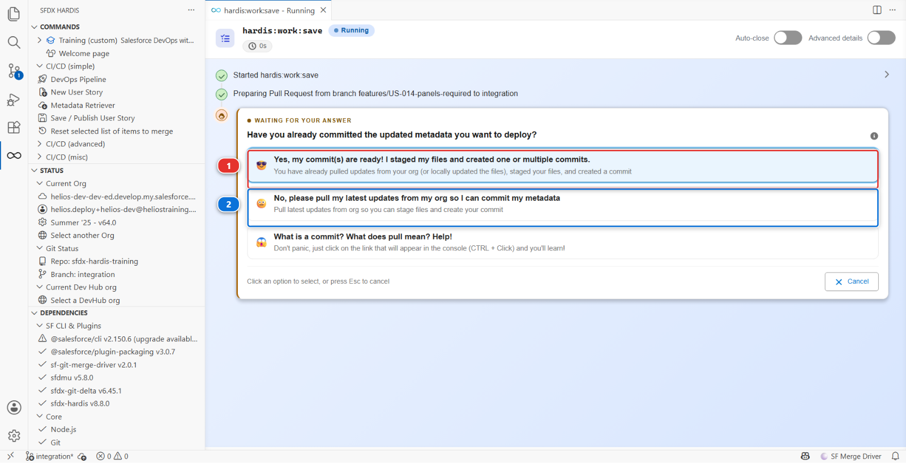
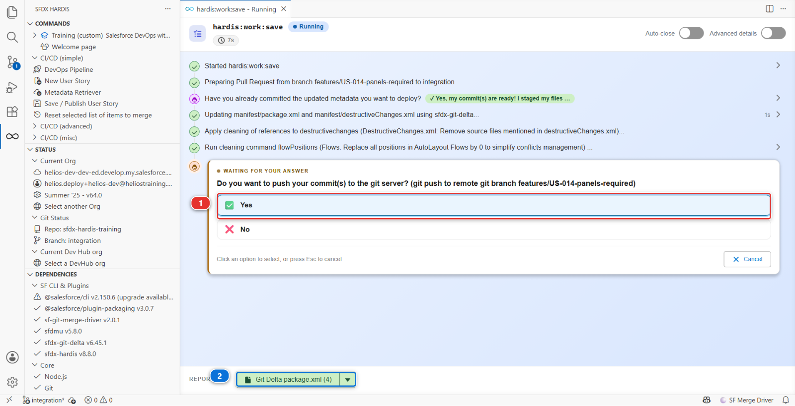

# Lab 4 - Publish it and read the package.xml diff

**Level**: 1 Contributor basics
**Time**: ~40 min
**You will**: pull your org changes into the repository, understand what the tool chose to keep and
what it removed, and push a branch that is ready to be reviewed.

## The situation

Your field exists in one org. If your laptop died tonight, so would the story. Publishing is what
turns "it works in my org" into "the team has it".

This is the step where most of the thinking happens in a CI/CD project, and the one people rush.
Go slowly here once, and every following story takes five minutes.

## Before you start

- [ ] Lab 3 finished: the field exists in `helios-dev`, granted to the crew, on the layout
- [ ] You are still on `features/US-014-panels-required`

## Steps

### 1. Start the publish

In the **DevOps Pipeline** panel, click the **Save / Publish** card, or in
**Commands > CI/CD (simple)**, click **Save / Publish User Story**.

The first question is the one that catches everybody out.



Answer **(1)** if you have already pulled your changes from the org, staged the files and made a
commit. Answer **(2)** if you have not, and the command pulls the org for you so you can commit.
There is a third answer that explains what a commit is, and taking it costs nothing.

If you are following this lab straight through from Lab 3, you have changed the org and nothing
else, so **(2)** is your answer. The command then lists what changed in your org since the branch
started, and compares it with what is in the repository.

### 2. Select what belongs to US-014

You are shown a list of changed metadata and asked to choose. This screen is the one that matters.

For US-014, tick exactly three things:

1. **CustomField** `Installation__c.Panels_Required__c` - the field
2. **PermissionSet** `Helios_Delivery_Crew` - the grant
3. **Layout** `Installation__c-Installation Layout` - the placement

Leave everything else unticked, even if it looks harmless. Two rules make that decision for you:

- **If you did not mean to change it, it does not belong in your story.** An org accumulates noise:
  a Lightning page somebody touched, a setting that moved on its own. Committing it makes your
  Pull Request about something other than US-014, and the reviewer cannot tell which part is yours
- **If you are not sure, leave it out.** Nothing is lost. It is still in your org, and you can
  publish it in a later story once you know what it is

!!! tip "Picked the wrong things?"
    It happens, and it is recoverable. **Commands > CI/CD (simple) > Reset selected list of items
    to merge** clears the selection so you can start over. Level 2 lab 7 is a whole lab about
    exactly that situation.

### 3. Describe the story

The command asks for a description of what you did. Write it for the person reviewing tomorrow, not
for yourself today:

> US-014 Panels Required on Installation
>
> Adds Panels_Required__c on Installation__c so the crew knows how many panels to load.
> Read access granted on Helios_Delivery_Crew, field added to the Installation layout.

This becomes the commit message and the body of your Pull Request.

### 4. Read the manifest before you push

Open `manifest/package.xml` in VS Code, or open the **Deployment Packages** menu at the top of the
DevOps Pipeline panel and choose **Package XML**. The command hands it to you as well, as the
**Git Delta package.xml** report at the bottom of its own panel **(2)**, with the number of
components it holds.



It should say something close to:

```xml
<types>
    <members>Installation__c.Panels_Required__c</members>
    <name>CustomField</name>
</types>
<types>
    <members>Installation__c-Installation Layout</members>
    <name>Layout</name>
</types>
<types>
    <members>Helios_Delivery_Crew</members>
    <name>PermissionSet</name>
</types>
```

**This file is the contract.** It is the list of what will be deployed to the next org, and nothing
outside it travels. If a component you expected is missing here, it will be missing in integration
too, and the deployment will either fail or, worse, succeed while doing half of what you meant.

Reading this file before every push is the single habit that separates a contributor who has
trouble with deployments from one who does not.

### 5. Look at what the cleaning removed

Open the **Source Control** panel and look at the diff of
`force-app/main/default/permissionsets/Helios_Delivery_Crew.permissionset-meta.xml`.

You will see your `Panels_Required__c` grant added. You may also see things you never touched being
**removed**. That is automated cleaning, and it is deliberate.

<details markdown="1"><summary>Under the hood: what "Save / Publish" just did</summary>

The panel ran:

    sf hardis:work:save

which performed, in order:

1. **Retrieved** the metadata you selected from your org into `force-app/`, in source format
2. **Generated `manifest/package.xml`** from the git diff between your branch and `integration`.
   Not from your selection: from what actually differs. That is why reading it is worth the minute
3. **Applied the cleaning rules** declared in `config/.sfdx-hardis.yml`:

        autoCleanTypes:
          - destructivechanges
          - localfields
          - productrequest
          - flowPositions
          - minimizeProfiles
          - listViewsMine

   `flowPositions` strips the pixel coordinates of flow elements, which change every time anybody
   opens a flow and produce conflicts that mean nothing. `minimizeProfiles` removes from Profiles
   everything that a Permission Set should carry. `listViewsMine` rewrites list view scopes that
   only make sense for the user who retrieved them

4. **Removed the user permissions** listed under `autoRemoveUserPermissions`, which are permissions
   this project has decided must never travel between orgs through a deployment
5. **Committed** the result on your branch, with the description you typed
6. **Pushed** the branch to your fork

Every one of those steps is configuration, not magic. Everything it did is in
`config/.sfdx-hardis.yml`, and a project that wants different behaviour changes that file.

</details>

### 6. Push

The command asks before it pushes: that is the question marked **(1)** in the picture at step 4.
Answer **Yes** and the branch goes to your fork. If you answered **No**, open the **Source Control**
panel and click **Publish Branch**.

## What you should see

- `manifest/package.xml` listing exactly your three components
- Your branch on GitHub, in your fork, under **Branches**
- The DevOps Pipeline panel showing your branch feeding `integration`, with no Pull Request yet

## If it goes wrong

**The selection screen shows dozens of items you never touched.**
Normal on a Developer Edition org: Salesforce records a lot of internal churn. Tick only your
three. If you are unsure whether a line is yours, its name usually says so.

**`manifest/package.xml` is empty.**
The retrieve found nothing, which almost always means you built in a different org than the one the
User Story is pointed at. Check the Status section, then redo Lab 3 in the right org.

**The permission set diff shows deletions you do not understand.**
That is `minimizeProfiles` and `autoRemoveUserPermissions` doing their job. Read the
`config/.sfdx-hardis.yml` block above. Nothing is lost in your org: cleaning changes what is
committed, never what is in Salesforce.

**Push is rejected.**
Your fork moved, usually because you reset a level. Pull first: Source Control panel, **...** menu,
**Pull**.

## Check your work

Welcome page > **Training** > **Check my work**, then pick level 1 and lab 4.

## Go deeper

- [Publish your User Story](https://sfdx-hardis.cloudity.com/salesforce-devops-publish-user-story/)
- [Automated sources cleaning](https://sfdx-hardis.cloudity.com/salesforce-devops-config-cleaning/)

[Next: Lab 5 - Open the Pull Request, get it green, merge](lab-05-pull-request.md){ .md-button .md-button--primary }
