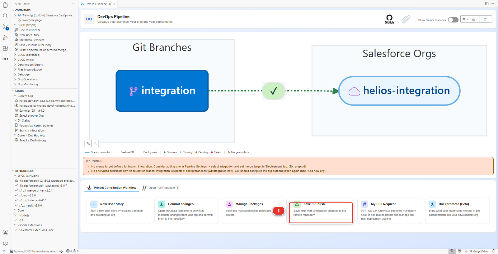
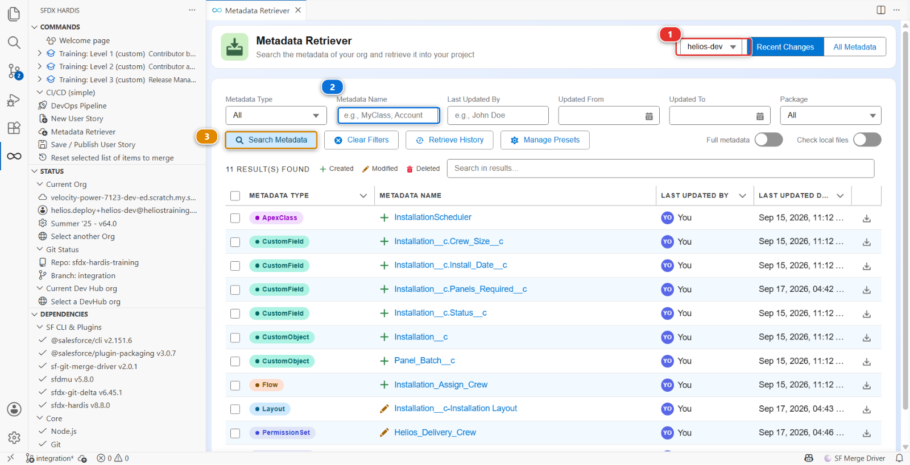

# Lab 2.2 - Fix a deployment error caused by a missing dependency

**Level**: 2 Contributor advanced

**Time**: ~25 min

**You will**: meet your first failing deployment check, read the error properly, and find the cause
in a file most people never open.

## The situation

> **US-021 - Warn the planner when a crew is too small**
>
> As a planner, I want a warning on the installation when the assigned crew is smaller than the job
> needs, so that I fix it before the van leaves.

Straightforward: a record-triggered flow that compares `Crew_Size__c` with what the panels
require. You build it, you publish it, and the check fails with an error about a field that is
right there in front of you in the org.

This lab is about the gap between "it exists in my org" and "it is in the package".

## Before you start

- [ ] Lab 2.1 finished
- [ ] `helios-dev` level with `integration`

## Steps

### 1. Take the story

In the **DevOps Pipeline** panel, under **Project Contribution Workflow** **(1)**, click **New User
Story** **(2)**, the same card as Lab 1.3.


Answer: type **Feature**, name `US-021-crew-size-warning`, org `helios-dev`. The target is
`integration` without asking, as in Level 1.

Then write the line Lab 2.1 left for this moment: open `MY-PIPELINE.md` (copy
`MY-PIPELINE.template.md` the first time) and add the backpromote line under Level 2. It will be
committed with this story.

### 2. Build the warning flow

First, the field the flow needs so it does not warn twice. In `helios-dev`,
**Setup > Object Manager > Installation > Fields & Relationships > New**:

| Setting       | Value                  |
|---------------|------------------------|
| Data Type     | **Checkbox**           |
| Field Label   | `Crew Warning Sent`    |
| Field Name    | `Crew_Warning_Sent__c` |
| Default Value | Unchecked              |

Then the flow. **Setup > Flows > New Flow > Record-Triggered Flow**:

| Setting          | Value                                                         |
|------------------|---------------------------------------------------------------|
| Object           | `Installation`                                                |
| Trigger          | A record is created or updated                                |
| Entry conditions | `Crew Size` is not null **and** `Panels Required` is not null |
| Optimize for     | Actions and Related Records                                   |
| Flow Label       | `Installation Crew Warning`                                   |
| Flow API Name    | `Installation_Crew_Warning`                                   |

Inside, add a **Decision** named `Crew Too Small` whose outcome condition is a
formula:

```
AND(
  {!$Record.Crew_Size__c} * 8 < {!$Record.Panels_Required__c},
  NOT({!$Record.Crew_Warning_Sent__c})
)
```

On that outcome, add a **Create Records** element that creates a Task on the installation's owner,
subject `Crew may be too small for this installation`, then an **Update Records** element that sets
`Crew Warning Sent` to true on the triggering record.

Two things before you save, both of which the pipeline will ask you for later if you skip them now:

1. **Give every element a description.** Click each one and fill in the description field with what
   it is for, in a sentence. The Flow analyzer asks for it, and the generated documentation of Lab
   3.10 is only as good as these
2. **Give both record elements a fault path.** On the Create Records element, drag the connector
   from its **fault** outlet to a new **Assignment** named `Log Fault`, and assign
   `{!$Flow.FaultMessage}` to a text variable. Connect the Update Records fault outlet to the same
   element

Save and **Activate**.

!!! info "Why a fault path, when nothing ever fails in a demo"
    A record element without one fails silently: the flow stops, the user sees nothing, and the Task
    that was supposed to warn the planner never appears. On a real project the fault path sends the
    message somewhere a person reads, through a platform event, an error log object or an email.
    Here it stops at recording it, because what the pipeline checks is that a fault path exists at
    all.

Test it: open an installation, set `Panels Required` to 40 and `Crew Size` to 2, save. A task
appears in its **Activity**. Save again: no second task. That is the story working, in your org.
The checkbox itself stays out of sight: no permission set grants it, because nobody but the flow
needs it.

### 3. Publish and watch it fail

Bring it down the way Level 1 taught you: **DevOps Pipeline > Commit changes**, **Recent Changes**,
**Search Metadata**, and tick the two things you made, the flow `Installation_Crew_Warning` and the
field `Installation__c.Crew_Warning_Sent__c`. Retrieve them, and commit from **Source Control**.

!!! warning "Look at what actually arrived"
    Only the flow is waiting in Source Control. The field is not there, and nothing said anything.
    Carry on and publish anyway: the point of this lab is to meet the failure that follows, and to
    learn to read it. Step 5 is where you find out why.

Then **Save / Publish** **(1)**.



Push, open the Pull Request into `integration` in your fork, and wait.

The check fails, and the sfdx-hardis comment on the Pull Request names the component:

```
Installation_Crew_Warning field integrity exception: unknown (The field "Crew_Warning_Sent__c"
for the object "Installation__c" doesn't exist.)
```

Your Pull Request cannot be merged while that check is red: `integration` refuses it, for you as
for anybody.

Read that twice. The field **does** exist. You can see it in the org. You created it ten minutes
ago and the flow you just tested reads it.

### 4. Read the package before you read anything else

When a deployment says something does not exist, the first question is never "is it in the org".
It is **"is it in the package"**.

Open `manifest/package.xml`. It lists your flow. It does not list
`Installation__c.Crew_Warning_Sent__c`.

The integration org is being sent a flow that reads a field the package does not carry, and the
integration org does not have that field either. From Salesforce's point of view the error is
exactly right.

So why is the field not in the package? Publishing builds the package out of what your commits
changed, and your field is not in that list, because the file for it never arrived in the project
at all. Look where the fields live, `force-app/main/default/objects/Installation__c/fields/`: it is
not there, even though you ticked it in the retriever and the retriever reported no error.

### 5. Find why the field never reached the repository

Open `.forceignore` at the root of the repository.

```
# Local artifacts, never versioned
**/jsconfig.json
...
# Temporary technical fields from the 2025 capacity spike, not versioned.
# TODO remove once the spike is over  (Sofia, 2025-11)
**/objects/Installation__c/fields/Crew_W*.field-meta.xml
```

Those lines are patterns, not file names. A `*` stands for any text, so the last one matches every
field on Installation whose name starts with `Crew_W`.

Sofia left a year ago and the spike is long over, but the pattern she wrote for her
`Crew_Workaround__c` field is still there, and it matches the field you created this morning too.

`.forceignore` tells the Salesforce CLI what to ignore when retrieving **and** when deploying. A
component listed there is invisible in both directions, with no error and no warning: the retrieve
quietly skipped your field, the publish quietly built a package without it, and the first thing
that noticed was Salesforce, in the integration org, three steps later.

### 6. Fix it

Delete the stale pattern. If you would rather keep Sofia's field excluded, name that one file
exactly, with no `*` in it, so nothing else can ever match by accident:

```
**/objects/Installation__c/fields/Crew_Workaround__c.field-meta.xml
```

An exact path ages badly too, but it ages **loudly**: the day the file disappears, nothing else
starts being ignored.

Then retrieve your field properly. Open the **Metadata Retriever** panel:

1. Check that the org at the top right **(1)** is `helios-dev`
2. Type `Crew_Warning_Sent__c` into **Metadata Name** **(2)**
3. Click **Search Metadata** **(3)**, then tick the field in the results and retrieve it



The field appears under `force-app/main/default/objects/Installation__c/fields/`.

### 7. Publish again

The field is in `force-app/` now. Commit it from **Source Control**, then **Save / Publish** again.
`manifest/package.xml` lists both the field and the flow. Push, and the check goes green.

<details markdown="1"><summary>Under the hood: why the error said what it said</summary>

The check job ran:

    sf hardis:project:deploy:smart --check

which handed `manifest/package.xml` to Salesforce as a validation deployment: the list Save /
Publish keeps up to date from the git diff between your branch and `integration`. Salesforce compiled the flow, looked for
`Installation__c.Crew_Warning_Sent__c` in the package **and** in the target org, found it in
neither, and refused.

The important part is the order of the two questions:

1. **Is it in the package?** `manifest/package.xml`, and behind it the git diff, and behind that
   `.forceignore`
2. **Is it in the target org?** Only ask this once the answer to the first is yes

Most deployment errors that say "does not exist" are question 1, and most people spend twenty
minutes on question 2 first. `.forceignore` is where the trail usually ends, because it is the one
file that makes metadata invisible without any error anywhere.

</details>

## What you should see

- `manifest/package.xml` listing `Installation__c.Crew_Warning_Sent__c` and
  `Installation_Crew_Warning`
- The Pull Request check green
- After the merge, the flow present and active in `helios-integration`

## If it goes wrong

**The retrieve brings nothing.**
The `.forceignore` change was not saved, or the pattern still matches. Check it by retrieving again
and looking for the file on disk.

**The check now fails on the flow being inactive.**
Salesforce will not deploy an active flow over an active flow of the same version in some
configurations. Deactivate the old version in the target org, or bump the flow version in your org
and retrieve again.

**The check fails on a Task field.**
Your Create Records element sets a field the integration org does not have, because you picked
something specific to your org. Simplify: subject and WhatId are enough.

## Check your work

Welcome page > **Training: Level 2** > **Check my work**, then pick Lab 2.2.

## Go deeper

- [Solve deployment errors](https://sfdx-hardis.cloudity.com/salesforce-devops-solve-deployment-errors/)
- [Source retrieve issues](https://sfdx-hardis.cloudity.com/salesforce-devops-retrieve/)

[Next: Lab 2.3 - Fix broken records with an Apex deployment action](2-3-fix-broken-records-with-an-apex-deployment-action.md){ .md-button .md-button--primary }
