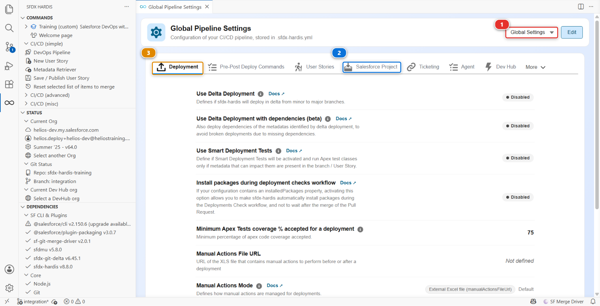

# Lab 2.6 - Permission sets, profiles and why a grant disappears

**Level**: 2 Contributor advanced

**Time**: ~25 min

**You will**: chase a permission that vanishes between a green deployment and the target org, and
find out it was removed on purpose.

## The situation

> **US-033 - Crews can read the panel batch cost**
>
> As a delivery crew member, I want to see the cost of the batch I am installing, so that I report
> damage with the right value.

You grant the permission, publish, the check is green, the deployment is green, and the permission
is not in the integration org. Nothing failed. Nothing warned you.

This is the failure mode that makes people distrust a pipeline, and it is entirely explainable.

## Before you start

- [ ] Lab 2.5 finished and merged
- [ ] `helios-dev` level with `integration`

## Steps

### 1. Take the story and do it the way an admin would

**New User Story** **(2)**, under **Project Contribution Workflow** **(1)** of the DevOps Pipeline
panel. Branch `US-033-batch-cost-visibility`, target `integration`, org `helios-dev`.


In `helios-dev`, the quick way: **Setup > Object Manager > Panel Batch > Fields & Relationships >
Cost > Set Field-Level Security**, tick **Visible** for the **System Administrator** profile and for
whatever profile your crew users have.

That is how most people grant a permission, and it is what this lab is built on.

Bring it down the usual way: **Commit changes**, **Recent Changes**, **Search Metadata**, tick the
Profile you changed, retrieve, and commit it from **Source Control**. Then **Save / Publish**, push,
Pull Request, green, merge.

### 2. Discover that nothing happened

Open `helios-integration`, log in as a crew user or check the field-level security on **Panel Batch
> Cost**. The permission is not there.

Go back to the Pull Request. The comment says success. Look at the list of deployed components: the
Profile is not in it.

### 3. Read your own diff

Your commit had the permission in it. You saw it in the diff before you clicked Commit.

Open the **Source Control** panel, look at the history of your branch, and read the commit
**Save / Publish** made after yours, `chore(sfdx-hardis): clean sfdx project`. It takes the
permission you added straight back out, along with most of the rest of the file.

That is a project setting called **minimizeProfiles**, one of the cleaning rules this project
switched on, and you can see it in the **Pipeline Settings** panel on the **Salesforce Project**
tab.

### 4. Understand why a project would ever do that

Profiles are the single worst metadata type to version, for three reasons that all bite at once:

1. **They are enormous and they are shared.** One Profile file lists every object, field, tab, app
   and class permission in the org. Two people touching two unrelated stories both produce a
   thousand-line diff of the same file, and they conflict every time
2. **They are not additive.** Deploying a Profile replaces the whole thing. If your file was
   retrieved before a colleague's permission existed, deploying yours **removes theirs**, silently
3. **What you retrieve depends on your package.** A Profile is retrieved with only the permissions
   for the components in your package, so the same Profile looks different depending on who
   retrieved it and when

`minimizeProfiles` strips from Profiles everything that a Permission Set could carry instead,
leaving Profiles to hold only what genuinely cannot live anywhere else: login hours, IP ranges,
default record types, page layout assignments.

So the pipeline did not lose your work. It refused to carry it, because carrying it would eventually
delete somebody else's.

### 5. Do it the way the project expects

Redo the grant where it belongs.

In `helios-dev`: **Setup > Permission Sets > Helios Delivery Crew > Object Settings > Panel Batches
> Edit**, tick **Read Access** on `Cost`, **Save**.

Retrieve the **Permission Set** this time, commit it, and publish. Read `manifest/package.xml`: it
lists `Helios_Delivery_Crew`. Push, green, merge.

Now check `helios-integration`. The permission is there.

One tidy-up before you move on. The Profile file you retrieved in step 1 is still in your branch,
emptied of everything the cleaning took out and carrying nothing this project wants. Delete
`force-app/main/default/profiles/` from the **Source Control** panel and commit that too. This
repository held no Profile before you arrived, and it should hold none after: the check at the end
of the lab looks for exactly that.

**Open `manifest/package.xml` and delete the Profile block as well**, the three lines naming
`Admin`:

```xml
<types>
    <members>Admin</members>
    <name>Profile</name>
</types>
```

The first publish put it there, and nothing takes it back out when you delete the file: the package
is only ever added to. A package that names a component the branch does not carry fails the next
deployment with *an object 'Admin' of type Profile was named in package.xml, but was not found in
zipped directory*, which is a confusing way of saying the two disagree. Reading the manifest before
pushing, the habit from Lab 1.5, is what catches it.

### 6. Look at the other protection while you are here

Open the **DevOps Pipeline** panel, then **Pipeline Settings** in the gear menu. Leave the scope
selector **(1)** on **Global Settings**: these are project rules, identical for every branch.



The settings are grouped in tabs. Three of them do related jobs, and it is worth knowing which is
which:

| Setting                            | Tab                            | What it protects against                                                                                                             |
|------------------------------------|--------------------------------|--------------------------------------------------------------------------------------------------------------------------------------|
| `autoCleanTypes: minimizeProfiles` | **Salesforce Project** **(2)** | A Profile carrying permissions that belong on a Permission Set                                                                       |
| `autoRemoveUserPermissions`        | **Salesforce Project** **(2)** | Specific user permissions that must never travel between orgs at all, whatever carries them                                          |
| `packageNoOverwritePath`           | **Deployment** **(3)**         | Components that exist in the target org and must never be overwritten by a deployment, listed in `manifest/package-no-overwrite.xml` |

The third one is the overwrite manager, and it is the one to reach for when a component is
deliberately different in each org: a named credential pointing at a different endpoint, a custom
setting holding an environment-specific value, a remote site setting. It is also the only one of the
three that is set per branch rather than globally, so the scope selector **(1)** has to name a
branch before the **Deployment** tab shows it.

### 7. Write it down

In `MY-PIPELINE.md`, under Level 2, add a line saying what you learned. Something like:

```markdown
- **Lab 2.6, profiles**: permissions go on Permission Sets. minimizeProfiles strips them from
  Profiles before the commit, so a Profile grant is silently dropped rather than deployed.
```

<details markdown="1"><summary>Under the hood: what cleaning actually did to the file</summary>

`hardis:work:save` retrieved the Profile, then ran the cleaning pass before committing. For
`minimizeProfiles` it rewrote the Profile XML.

Whole sections are deleted, because a Permission Set can carry all of them:

`agentAccesses`, `classAccesses`, `customMetadataTypeAccesses`, `customPermissions`,
`externalDataSourceAccesses`, `fieldPermissions`, `flowAccesses`, `objectPermissions`,
`pageAccesses`, `ServicePresenceStatusAccesses`.

Three sections are thinned rather than deleted, keeping only the entries a Permission Set cannot
express:

| Section                   | What survives                                                                    |
|---------------------------|----------------------------------------------------------------------------------|
| `recordTypeVisibilities`  | only the entries marked `default` (or `personAccountDefault`)                    |
| `applicationVisibilities` | only the default app, and apps explicitly hidden (`visible` false)               |
| `userPermissions`         | only permissions explicitly turned **off**, plus everything on the Admin profile |

And some sections are never touched, because nothing else can hold them: `loginHours`,
`loginIpRanges`, `layoutAssignments`, `tabVisibilities`, `custom`, `userLicense`.

So a Profile still does a job in this pipeline. It is just a much smaller one.

Nothing was removed from your org. The cleaning changes **what the repository carries**, never what
Salesforce holds. Your admin-style grant is still in `helios-dev`, which is exactly why the lab
asks you to do it again on the Permission Set rather than to fix the file by hand.

The rule to take away: **if a permission can live on a Permission Set, put it there.** This is not
an sfdx-hardis opinion, it is what Salesforce has been recommending for years, and this pipeline
enforces it rather than hoping.

</details>

## What you should see

- `manifest/package.xml` listing `Helios_Delivery_Crew`, not a Profile
- `Cost` readable by the crew in `helios-integration`
- No Profile file left in `force-app/main/default/profiles/`

## If it goes wrong

**The permission set edit does not show the Cost field.**
The field is not in the permission set's object settings until the object is granted. Grant read on
**Panel Batch** first.

**The deployment fails with `INSUFFICIENT_ACCESS` on the permission set.**
The CI user cannot grant a permission it does not have itself. Assign **Helios Delivery Manager** to
the integration org user, which **Training: Level 2 > Set up one of my training orgs** does.

**A Profile keeps coming back in your commits.**
Something in your selection pulls it in. Do not fight it in the file: untick it at publish time.

**`an object 'Admin' of type Profile was named in package.xml, but was not found in zipped directory`.**
You deleted the Profile file and left its three lines in `manifest/package.xml`. Delete them too, as
step 5 says, and push again.

## Check your work

Welcome page > **Training: Level 2** > **Check my work**, then pick Lab 2.6.

## Go deeper

- [Profiles and Permission Sets](https://sfdx-hardis.cloudity.com/salesforce-devops-work-on-user-story-profiles/)
- [Overwrite management](https://sfdx-hardis.cloudity.com/salesforce-devops-config-overwrite/)

[Next: Lab 2.7 - Resolve a Git merge conflict with a teammate](2-7-resolve-a-git-merge-conflict.md){ .md-button .md-button--primary }
