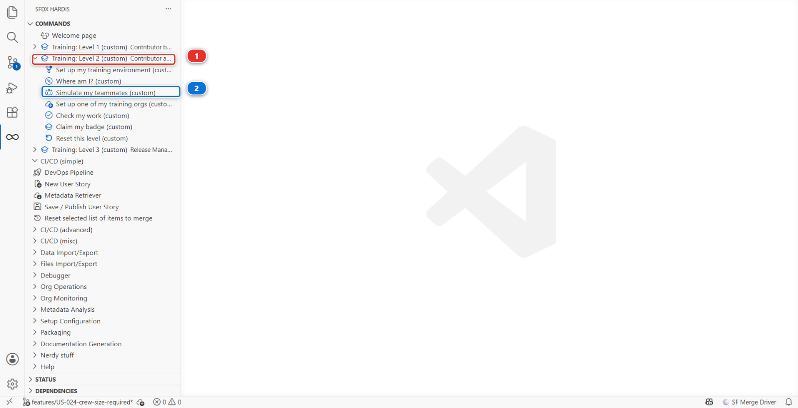

# Lab 2.7 - Resolve a Git merge conflict with a teammate

**Level**: 2 Contributor advanced

**Time**: ~35 min

**You will**: face a real merge conflict on two files that conflict very differently, and resolve
both without losing anybody's work.

## The situation

Marco Bianchi has been working on **US-018 - Cap the crew size a planner can assign**, in the same
flow and the same permission set as you. He merged this morning. You did not.

> Git conflicts on a Salesforce project are almost always one of two shapes: a Permission Set where
> two people added different entries, and a Flow where two people changed the logic. The first is
> mechanical. The second requires you to understand both changes.

## Before you start

- [ ] Lab 2.6 finished and merged
- [ ] Nothing waiting in the **Source Control** panel that you still care about

## Steps

### 1. Start your own change

**New User Story** **(2)**, under **Project Contribution Workflow** **(1)**. Name
`US-034-crew-override`, org `helios-dev`.


In `helios-dev`:

1. Open the flow `Installation Assign Crew` and add a decision so that an installation whose roof
   type is `Flat` gets a crew of at least 3, whatever else the flow decided. Connect it to the
   **same assignment** the flow already ends on, so the new rule runs after the status change
2. On the permission set `Helios Delivery Manager`, grant edit access on
   `Installation__c.Crew_Notes__c`, so a planner can say why a crew was raised

Retrieve the flow and the permission set, commit them, and **stop there**: do not publish yet.

### 2. While you were building it, Marco merged

Marco does not exist. His work does, and the training reproduces it inside **your own** fork so you
can genuinely review and merge it. Do this **after** your own change exists, because that is the
situation the lab is about: you branched, he merged, and neither of you knew about the other.

**Training: Level 2** **(1)** > **Simulate my teammates** **(2)**, from the Welcome page or from the
sfdx-hardis command list, and choose
**US-018 Cap the crew size a planner can assign**.



It creates the branch `training/mate-us-018-crew-capacity` from your current `integration`, commits
Marco's changes under his name, pushes it to your fork, and opens the Pull Request.

Review it briefly, then **merge it**. Marco is now in `integration`, and you are behind.

<details markdown="1"><summary>Under the hood: why the teammate is replayed rather than pre-existing</summary>

The command ran:

    node scripts/training.mjs simulate

which copied the files from `scripts/simulate/us-018-crew-capacity/files/` over your working tree,
committed them with Marco's name and email, pushed the branch to **your** fork and opened the Pull
Request there with `gh pr create`.

It has to work this way. A Pull Request lives in one repository: you cannot review one that exists
in somebody else's. And a branch shipped in the repository months ago would not share a sensible
ancestor with the `integration` you have built up over five labs, so the conflict would be either
absent or absurd.

The same patch set produced the real teammate Pull Requests on the public training repository, so
what you are reviewing is byte for byte what the screenshots show.

</details>

### 3. Publish, and watch the Pull Request refuse to merge

Now publish your own change: **Save / Publish**, push, and open the Pull Request into `integration`.

GitHub shows:

> This branch has conflicts that must be resolved
> `force-app/main/default/flows/Installation_Assign_Crew.flow-meta.xml`
> `force-app/main/default/permissionsets/Helios_Delivery_Manager.permissionset-meta.xml`

Two files, two completely different kinds of problem.

Neither of them is git being awkward. Both changes are real, both are wanted, and in both files the
two of you wrote in the same place: Marco granted a field on the permission set one line from where
you granted yours, and he connected the same assignment element in the flow to a decision of his
own. A merge tool cannot know which of two connectors should win. You can.

### 4. Bring integration into your branch

In the **Source Control** panel: the **...** menu > **Branch** > **Merge Branch**, and pick
`integration`.

Two files come back marked as conflicting, and they appear in the panel under **Merge Changes**.

<details markdown="1"><summary>Under the hood: what Merge Branch ran</summary>

    git fetch origin
    git merge origin/integration

A conflict is not an error. It is git saying that two people wrote in the same place and it will not
guess which one meant it.

</details>

### 5. Resolve the permission set: take both

Click the permission set file in the **Source Control** panel. VS Code opens its merge editor:
**Incoming**, Marco's version from `integration`, on the left, **Current**, yours, on the right, and
the result you are building at the bottom.

This one is mechanical, and you can decide it without reading a single line of XML: **both entries
belong**. Marco granted one field, you granted another, and a permission set holds as many as it
needs. Take the button that keeps both sides, **Accept Combination (Incoming First)** in the merge
editor, then read the result at the bottom before you click **Complete Merge**: you want two
complete `<fieldPermissions>` blocks, each naming one field, Marco's `Crew_Capacity_Cap__c` first
and your `Crew_Notes__c` second. If you see a single block holding two `<field>` lines, the editor
joined the two lines rather than the two blocks: copy the lines around it so that each field gets
its own block, as the under the hood section shows.

**Take both** is the right answer for almost every permission set conflict. Choosing one side is how
a teammate's permission quietly disappears, and nobody notices until somebody cannot see a field.

<details markdown="1"><summary>Under the hood: what the conflict actually looked like</summary>

Git conflicts on lines, not on XML, so the markers landed inside one block rather than around two:

```xml
    <fieldPermissions>
        <editable>true</editable>
<<<<<<< HEAD
        <field>Installation__c.Crew_Notes__c</field>
=======
        <field>Installation__c.Crew_Capacity_Cap__c</field>
>>>>>>> origin/integration
        <readable>true</readable>
    </fieldPermissions>
```

Keeping both sides wrote the two complete blocks, in alphabetical order, which is how Salesforce
writes them anyway:

```xml
    <fieldPermissions>
        <editable>true</editable>
        <field>Installation__c.Crew_Capacity_Cap__c</field>
        <readable>true</readable>
    </fieldPermissions>
    <fieldPermissions>
        <editable>true</editable>
        <field>Installation__c.Crew_Notes__c</field>
        <readable>true</readable>
    </fieldPermissions>
```

</details>

### 6. Resolve the flow: understand both, then decide

This one you cannot resolve by taking both, because the two changes are in the same decision path.

- **Marco's change** caps the crew at what the installation allows: never more than N
- **Your change** raises the crew to at least 3 on flat roofs: never fewer than 3

Read on their own, both are correct. Together, they can contradict each other on a flat roof whose
cap is 2.

This is the moment that matters, and the answer is not technical: **go and ask Marco**. On a real
project, a conflict in business logic is a conversation, not a merge strategy.

For this lab, the decision has been made for you: **the cap wins**. A crew larger than the
installation allows is a safety problem; a crew of 2 on a flat roof is a slow day. Resolve so that
your minimum applies **only when it does not exceed Marco's cap**.

Do it in Flow Builder, not in the file. A flow is stored as XML that nobody can read reliably,
developers included, and a flow that deploys but behaves wrongly is worse than one that fails.

1. In the merge editor, **Accept Incoming** on the flow: Marco's whole version wins for now
2. **Save / Publish User Story** is not what you want yet. First send what the merge brought in to
   your dev org, so `helios-dev` has Marco's field, his grant and his cap: in the **Explorer**,
   right-click the `force-app` folder, then **SFDX: Deploy This Source to Org**, the same command
   Lab 2.5 used on one class

   It deploys every file of the folder as it is on your machine, and nothing else. The sfdx-hardis
   **Push from local files to Salesforce org** command would send your org every change git has
   seen since the last sync, deletions included: the Admin profile you removed from the repository
   in Lab 2.6 would come back as a request to delete it, which Salesforce refuses

3. Open **Flow Builder** in the org, on `Installation_Assign_Crew`, and add your flat-roof rule
   again, **before** his cap: the flow raises a flat roof crew to three first, and his cap, which
   now runs last, has the final word
4. Come back to VS Code, bring the rebuilt flow down with **Commit changes**, commit it, and publish

Slower to describe, much faster to do, and you can see what you are building.

<details markdown="1"><summary>Under the hood: resolving it in the file instead</summary>

If you can read flow XML and want to: take Marco's version of the element and its connectors as the
base, re-add your flat-roof decision after his cap, and delete every conflict marker. Then publish,
which re-runs the cleaning rules over what you wrote by hand.

The risk is not that it fails. The risk is that it deploys and the decisions run in an order you did
not intend, which no check catches and no test in this project covers.

</details>

### 7. Finish the merge and re-validate

Mark both files resolved in the Source Control panel, commit the merge, push.

Then **re-publish**: **Save / Publish User Story**. This matters. The merge produced XML by hand,
and publishing re-runs the cleaning rules over it and rebuilds `manifest/package.xml` from what your
branch now changes. Skipping it is how a stray conflict marker reaches a deployment.

Watch the check go green, then merge.

### 8. Verify both changes survived

In `helios-integration`:

- The flow caps the crew, Marco's rule
- The flow raises flat-roof crews, your rule, without breaking the cap
- The permission set grants both fields

If either side is missing, the resolution lost work, and the badge audit will say so.

## What you should see

- No conflict markers anywhere: search the repository for `<<<<<<<`
- Both field permissions in `Helios_Delivery_Manager`
- Both behaviours in the flow

## If it goes wrong

**`Error parsing file: Element assignments is duplicated at this location in type Flow`.**
Your resolution left the flow with its elements out of order. A flow file groups every element of
the same kind together: all the assignments, then all the decisions. If your merge dropped a kept
element between two blocks of another kind, move it back up next to its own kind. The order inside
each group does not matter, the grouping does.

**`Element field is duplicated at this location in type PermissionSetFieldPermissions`.**
You kept both sides inside a single grant instead of keeping both grants. One `<fieldPermissions>`
block names one field: the fix is two blocks, not one block with two `<field>` lines.

**The flow will not deploy after the merge: "duplicate element name".**
You kept both sides of an element that can only exist once. Flow element names are unique. Rename or
remove one.

**You lost your change entirely.**
You accepted Marco's side on the whole file. In the **Source Control** panel, the **...** menu >
**Branch** > **Abort Merge**, then start step 4 again.

**The check fails on a conflict marker.**
Search the whole repository for `<<<<<<<`, `=======` and `>>>>>>>`. A marker in an XML file is
sometimes syntactically tolerated by git and always fatal to Salesforce.

**You cannot untangle it at all.**
**Training: Level 2 > Reset this level**, then redo from step 1. Losing twenty minutes is better than
merging something you do not understand.

## Check your work

Welcome page > **Training: Level 2** > **Check my work**, then pick Lab 2.7.

The check asserts **outcomes, not procedure**: both changes present and correct on `integration`,
no markers left. However you got there, including resolving in the GitHub web editor or redoing the
work in the Flow Builder, passes.

## Go deeper

- [Profiles and Permission Sets](https://sfdx-hardis.cloudity.com/salesforce-devops-work-on-user-story-profiles/)
- [Overwrite management](https://sfdx-hardis.cloudity.com/salesforce-devops-config-overwrite/)

[Next: Lab 2.8 - Recover from committing the wrong metadata](2-8-recover-from-committing-the-wrong-metadata.md){ .md-button .md-button--primary }
