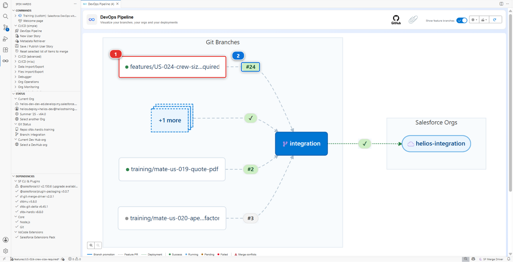
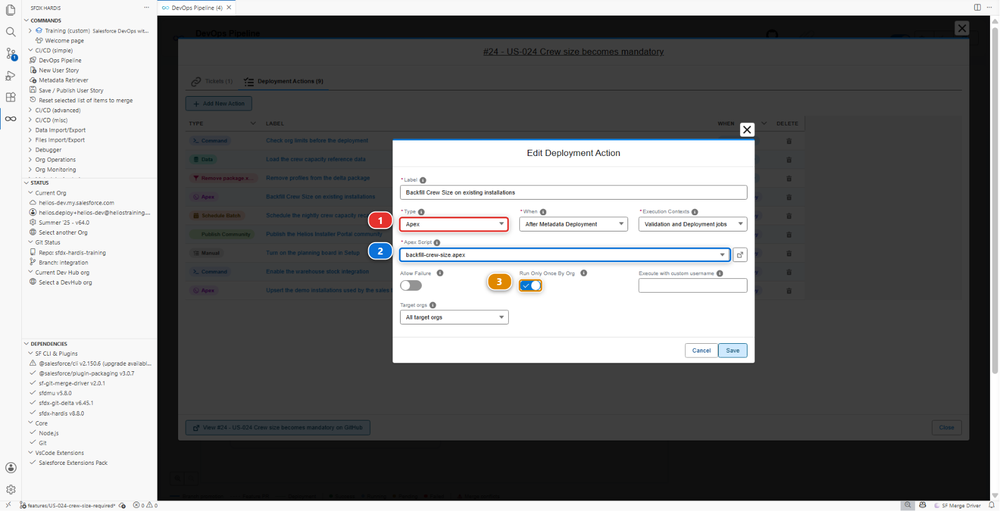
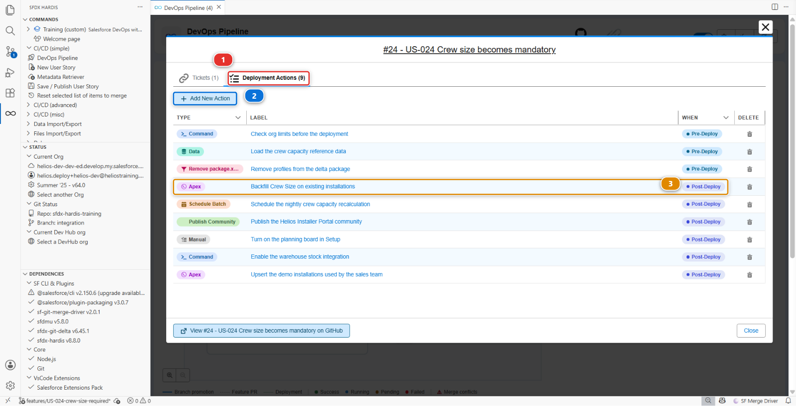

# Lab 2 - US-024: green deployment, broken records

**Level**: 2 Contributor advanced
**Time**: ~60 min
**You will**: hit a failure that no amount of metadata fixing solves, and learn the tool that exists
for it: a deployment action.

## The situation

> **US-024 - Crew size becomes mandatory**
>
> As a planner, I want Crew Size to be mandatory on every installation, so that no job is scheduled
> without a crew.
>
> Acceptance criteria:
>
> - Crew Size is required
> - Existing records are backfilled with the default of 2

One checkbox in Setup. Then two things happen, and the second one is the one that matters.

The deployment fails, for a reason that has nothing to do with your data. You fix that in a minute.
The deployment then goes green, and you have quietly broken thirty installation records for
everybody, with nothing anywhere telling you.

This lab is about the gap between a green deployment and a safe one.

## Before you start

- [ ] Lab 1 finished and merged
- [ ] `helios-dev` level with `integration`

## Steps

### 1. Take the story and do the obvious thing

**New User Story**, branch `US-024-crew-size-required`, target `integration`, org `helios-dev`.

In `helios-dev`: **Setup > Object Manager > Installation > Fields & Relationships > Crew Size >
Edit**, tick **Required**, **Save**.

If your own org has records without a crew size, Salesforce refuses here too. Fill them in by hand
for now, or note that it already refused: either way you have just met the problem one org early.

Publish, push, open the Pull Request.

### 2. Read the first failure

```
Helios_Delivery_Crew     Cannot deploy to a required field: Installation__c.Crew_Size__c
Helios_Delivery_Manager  Cannot deploy to a required field: Installation__c.Crew_Size__c
```

Not a word about your data. The problem is the permission sets.

A **universally required** field has no field level security to grant: it is visible and mandatory
for everyone, by definition. So the moment the field becomes required, every `fieldPermissions`
entry that mentions it becomes invalid, and the deployment refuses the permission sets rather than
the field.

The fix takes a minute. In `helios-dev`, the entries disappear from the permission sets on their own
once the field is required, so re-publish and let `hardis:work:save` pick up the new versions. If you
are editing the XML directly, delete the two `<fieldPermissions>` blocks naming
`Installation__c.Crew_Size__c`.

!!! note "This is a good error"
    It is precise, it names both offending components, and the fix is obvious once you know the rule.
    Most Salesforce deployment errors are like this: they sound like they are about the thing you
    changed, and they are about something that referenced it.

### 3. Watch it go green, and understand why that is the problem

Push the fix. The check passes. Merge. The deployment to `helios-integration` succeeds.

Now open `helios-integration`, find an installation, change anything at all on it, and save.

```
Required fields are missing: [Crew_Size__c]
```

**Salesforce enforces a required field on save, not on the data that is already there.** The
deployment was perfectly happy to make the field required while thirty installations had it empty.
Those thirty records are now unsaveable: not just for you, for everybody, for any edit, until
somebody puts a crew size on them.

Nothing failed. No check went red. The first person to find out is a planner who cannot save a
record.

**Anything you have to do by hand in one org, you will have to do in every org.** That is what a
deployment action is for.

### 4. Split the story into two moves

The shape of the fix, and it is the shape of most "the data is in the way" problems:

1. Make the data valid
2. Make the field required

Both can travel in the same Pull Request, as long as the tool knows to run them in that order. That
is exactly what a **pre-deploy action** is.

### 5. Write the backfill script

In your repository, create `scripts/apex/backfill-crew-size.apex`:

```apex
// Gives every installation without a crew the default crew of two, so that
// Crew_Size__c can be made mandatory in the next deployment.
List<Installation__c> toFix = [SELECT Id FROM Installation__c WHERE Crew_Size__c = null LIMIT 10000];
for (Installation__c installation : toFix) {
    installation.Crew_Size__c = 2;
}
update toFix;
System.debug('Backfilled ' + toFix.size() + ' installations');
```

Two things worth noticing, because they are what makes a script like this safe to run in
production:

- It only touches records that are actually wrong (`WHERE Crew_Size__c = null`)
- It says how many it changed, so the deployment log is readable afterwards

### 6. Declare it as a deployment action

Open the **DevOps Pipeline** panel and find your Pull Request: your feature branch **(1)**, and on
the arrow leaving it the numbered badge **(2)**. Click the badge.



The Pull Request opens on its **Deployment Actions** tab. Click **Add New Action**, and in the
**Edit Deployment Action** dialog set the **Type** **(1)** to **Apex**.



Fill it in:

| Field                | Value                                          |
|----------------------|------------------------------------------------|
| Label                | `Backfill Crew Size on existing installations` |
| When                 | **After Metadata Deployment**                  |
| Apex Script          | `backfill-crew-size.apex`                      |
| Execution Contexts   | **Validation and Deployment jobs**             |
| Target orgs          | **All target orgs**                            |
| Run Only Once By Org | **yes**                                        |

**Apex Script** **(2)** is a dropdown of what it found under `scripts/apex/`, not a free text path,
so the file has to exist in your branch before it appears. **Run Only Once By Org** **(3)** is the
toggle below it.

**Save**. The action joins the list on the **Deployment Actions** tab, whose counter **(1)** goes up
by one. **Add New Action** **(2)** stays there for the next one, and your row **(3)** carries a
**Post-Deploy** chip in the **WHEN** column.



!!! tip "Run Only Once By Org"
    Tick it whenever the script is a one-time correction rather than something that should happen on
    every deployment. sfdx-hardis records what it has run in each org, so the backfill fires once in
    integration, once in UAT, once in production, and never again. Leave it unticked for a script
    that is genuinely idempotent and should re-run.

### 7. Order it correctly

If the action runs **after** the deployment, the field is already required by the time the backfill
runs, and every one of those thirty updates is refused for the very reason you are trying to fix.
The backfill has to run **first**.

Open the action again from its row in the list and set its **When** to
**Before Metadata Deployment**. The chip in the **WHEN** column flips from **Post-Deploy** to
**Pre-Deploy**. Now the order is: fill in the crew sizes, then make the field required, and nothing
is ever in an invalid state.

!!! tip "How to decide pre or post, every time"
    Ask what the action needs to already exist. Data that has to be valid **before** a constraint
    lands is pre-deploy. Reference records that need an object that does not exist yet are
    post-deploy, which is Lab 3. The answer is never a habit, it is that question.

### 8. Watch it run

Push and watch the check. In the job log you will see the action fire before the deployment starts,
with the `System.debug` line reporting how many records it fixed.

Merge. The deployment job to integration runs the action there too, for real, and the field becomes
required in `helios-integration` without anyone opening Setup.

<details markdown="1"><summary>Under the hood: where the action is stored and how it runs</summary>

The editor wrote a YAML file next to your Pull Request, under `scripts/actions/`:

    commandsPreDeploy:
      - id: backfill-crew-size
        label: Backfill Crew Size on existing installations
        apexScript: scripts/apex/backfill-crew-size.apex
        context: all
        runOnlyOnceByOrg: true

`sf hardis:project:deploy:smart` reads it, and around the Salesforce deployment it:

1. Collects the actions of every Pull Request included in this deployment
2. Runs the `commandsPreDeploy` ones, in order
3. Deploys the metadata
4. Runs the `commandsPostDeploy` ones
5. Records in the target org which `runOnlyOnceByOrg` actions have already fired, so the next
   deployment skips them

`context` decides which jobs run it: `all` for both the validation job and the deployment job, or
`check-deployment-only` / `process-deployment-only` for one of the two. Which orgs it runs in is a
separate pair of keys, `includeTargetBranches` and `excludeTargetBranches`. Leave them out and the
action runs against every target, which is what a data correction usually wants. A "reset the
sandbox integration user" script usually names its branches.

Because the actions live in the repository and travel with the Pull Request, the same sequence
replays in UAT and in production months later, without anybody remembering it existed. That is the
whole value: **the knowledge is in the repository, not in someone's head.**

</details>

## What you should see

- The Pull Request comment listing the deployment action it ran, above the deployment result
- `Crew Size` required in `helios-integration`, with all thirty installations carrying a value
- An installation you can still save, which is the whole point
- No manual step performed by anybody in any org

## If it goes wrong

**The action does not appear in the Deployment Actions tab.**
The panel reads the Pull Request from your fork. If the Pull Request was opened against the original
repository, it cannot see it. Close it and reopen it with the right base.

**The Apex script fails with `Too many DML rows`.**
Raise the `LIMIT` carefully, or convert the script to a batch. Thirty records is nowhere near the
limit, so if you see this you are running against an org with far more data than the training one.

**The deployment still fails on the permission sets.**
They still carry `fieldPermissions` for `Installation__c.Crew_Size__c`. A required field cannot have
any. Re-publish from an org where the field is already required, or delete the two blocks by hand.

**The backfill updated nothing, and records are still unsaveable.**
The action ran after the deployment, so every update hit the constraint it was meant to prevent.
Change **When** to **Before Metadata Deployment** and run it again.

**The action ran but nothing changed.**
`runOnlyOnceByOrg` is ticked and it already ran in that org during an earlier attempt. That is
correct behaviour. Untick it temporarily if you need to re-run while experimenting.

## Check your work

Welcome page > **Training** > **Check my work**, then pick level 2 and lab 2.

## Go deeper

- [Deployment actions](https://sfdx-hardis.cloudity.com/salesforce-devops-work-on-user-story-deployment-actions/)

[Next: Lab 3 - US-026, reference data and a batch must follow](lab-03-deployment-actions-data.md){ .md-button .md-button--primary }
