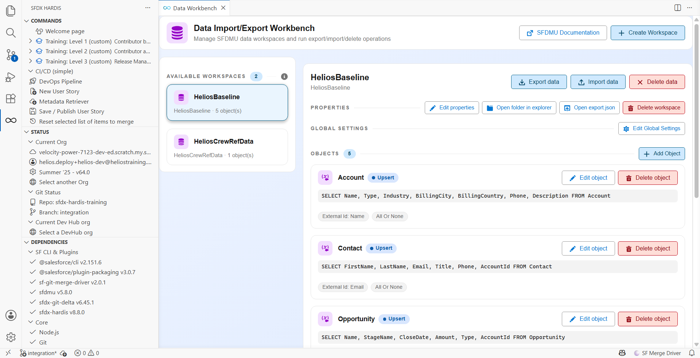
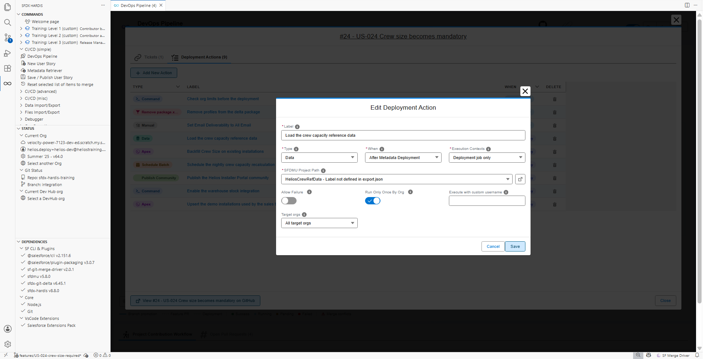
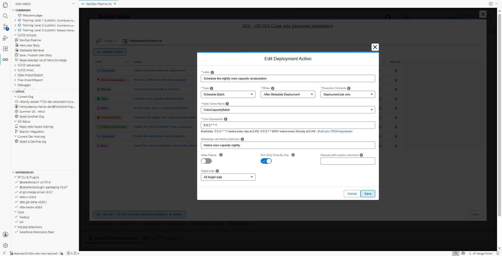
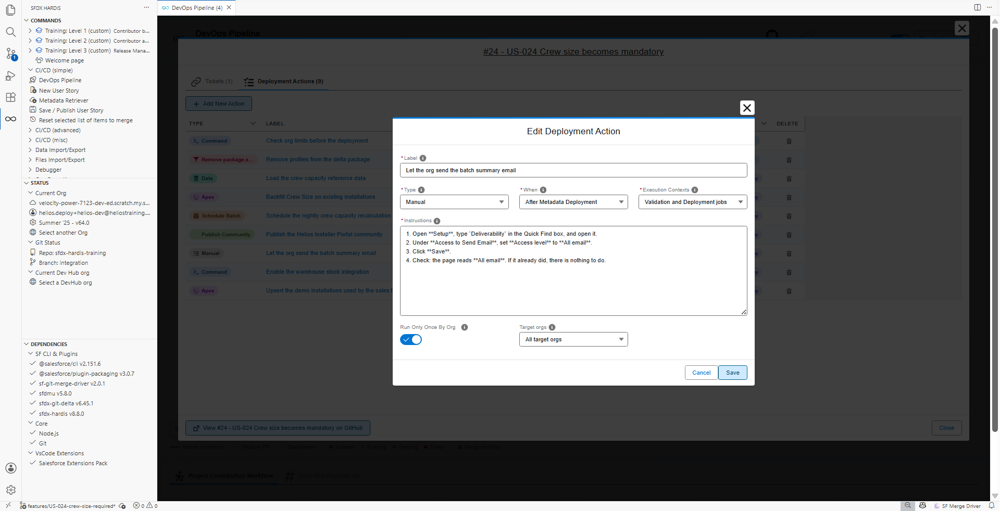

# Lab 3 - US-026: reference data and a batch must follow

**Level**: 2 Contributor advanced
**Time**: ~55 min
**You will**: meet the worst kind of failure, the one where nothing fails, and fix it with three
deployment actions of three different kinds.

## The situation

> **US-026 - Crew capacity reference data and nightly recalculation**
>
> As a planner, I want capacity rules per crew type and a nightly job that recalculates them, so
> that the planning board is right every morning.
>
> Acceptance criteria:
>
> - 12 Crew Capacity records exist in every org
> - The batch is scheduled nightly
> - The planning board setting is on

You build it, the deployment is green, everyone signs it off, and three weeks later a planner says
the board has never updated. The metadata arrived. Nothing else did.

**A deployment carries metadata. It does not carry records, it does not carry scheduled jobs, and
it does not carry anything a human had to click in Setup.** Every one of those has to be declared,
or it happens once in your org and nowhere else, forever.

## Before you start

- [ ] Lab 2 finished and merged
- [ ] `helios-dev` level with `integration`

## Steps

### 1. Take the story and build the metadata

**New User Story**, branch `US-026-crew-capacity-data`, target `integration`, org `helios-dev`.

In `helios-dev`, create:

- A custom object **Crew Capacity** (`Crew_Capacity__c`), with:
  - `External_Id__c`, Text 40, **External Id**, **Unique**
  - `Crew_Type__c`, Picklist: `Roof`, `Ground`, `Electrical`
  - `Roof_Type__c`, Picklist: `Tile`, `Slate`, `Flat`, `Metal`
  - `Panels_Per_Day__c`, Number 3,0
- An Apex class `CrewCapacityBatch` implementing `Database.Batchable<SObject>` and `Schedulable`,
  which recomputes `Total_Capacity_kW__c` on planned installations. Keep it simple: what it does
  matters less here than the fact that it has to be scheduled
- A test class `CrewCapacityBatchTest`, because the deployment will run tests and the coverage
  threshold is 75%

Then create 12 Crew Capacity records in your org, one per crew type and roof type combination that
Helios supports.

### 2. Publish and watch nothing fail

Publish, push, Pull Request. The check is green. Merge. The deployment is green.

Now open `helios-integration` and look:

- `Crew_Capacity__c` exists, **with zero records**
- `CrewCapacityBatch` exists, **scheduled nowhere**
- The planning board setting is off

The feature is in the org and completely inert. This is worse than a failure, because a failure
tells you.

### 3. Build a data workspace for the reference records

Open the **Data Workbench** panel.

Create a new workspace named `HeliosCrewRefData`:

1. **Create Workspace**, or **Create Your First Workspace** if you have none yet, and name it
   `HeliosCrewRefData`
2. Add the object `Crew_Capacity__c`
3. Operation: **Upsert**
4. External id: `External_Id__c`
5. Fields: the four you created

Then **Export data**, pointing at `helios-dev`. The panel pulls your 12 records into CSV files
under `scripts/data/HeliosCrewRefData/`.

Open `scripts/data/HeliosCrewRefData/Crew_Capacity__c.csv` and read it. Twelve rows, one column per
field, each with a stable external id. That file is now versioned, reviewed and deployed like any
other source.

!!! tip "Why the external id is not optional"
    `Upsert` on `External_Id__c` means running the import twice updates the same twelve records
    instead of creating twelve more. Without a stable external id the import is not repeatable, and
    an import that is not repeatable cannot be part of a pipeline.

### 4. Declare the three actions

Open your Pull Request in the **DevOps Pipeline** panel, **Deployment Actions** tab, and add three.

**One: load the reference data.**

| Field              | Value                               |
|--------------------|-------------------------------------|
| Type               | **Data**                            |
| Label              | `Load crew capacity reference data` |
| When               | After Metadata Deployment           |
| SFDMU Project Path | `scripts/data/HeliosCrewRefData`    |
| Execution Contexts | Validation and Deployment jobs      |
| Target orgs        | All target orgs                     |

**Two: schedule the batch.**

| Field                         | Value                                              |
|-------------------------------|----------------------------------------------------|
| Type                          | **Schedule Batch**                                 |
| Label                         | `Schedule the nightly crew capacity recalculation` |
| Apex Class Name               | `CrewCapacityBatch`                                |
| Cron Expression               | `0 0 2 * * ?` (every night at 02:00)               |
| Scheduled Job Name (Optional) | `Helios crew capacity nightly`                     |
| Run Only Once By Org          | yes                                                |

**Three: the one nobody can automate.**

Some things have no API. The planning board setting is one of them: it is a toggle in a managed
package's Setup screen, and no deployment will ever touch it.

| Field        | Value                                                                                                                                                      |
|--------------|------------------------------------------------------------------------------------------------------------------------------------------------------------|
| Type         | **Manual**                                                                                                                                                 |
| Label        | `Turn on the planning board in Setup`                                                                                                                      |
| Instructions | `Setup > Installed Packages > Helios Planning > Configure > tick "Use crew capacity rules" > Save. Takes about a minute, and has to be done in every org.` |
| Target orgs  | All target orgs                                                                                                                                            |

A manual step does not do anything. It **appears in the Pull Request comment and in the deployment
report**, so the person releasing to production is told, in the release itself, that there is a
click to make. That is the difference between a manual step that gets done and one that lives in a
Confluence page nobody opens.

### 5. Read the Pull Request comment

Push. When the check finishes, the sfdx-hardis comment now has a **Deployment actions** section
listing all three, with what each will do and in which orgs.

Merge, and watch the deployment job: the data import runs, the batch gets scheduled, and the manual
step is reported as pending.

### 6. Verify in the integration org

- **Crew Capacity** has 12 records
- **Setup > Scheduled Jobs** lists `Helios crew capacity nightly`
- The manual step is listed as still to do, because you have not done it

Do the manual step by hand in `helios-integration`. That is the point: you did it **because the
pipeline told you to**, not because you remembered.

Under the hood: the three action types

All three are entries in the same YAML file under `scripts/actions/`:

    commandsPostDeploy:
      - id: load-crew-capacity
        label: Load crew capacity reference data
        command: sf hardis:org:data:import --path scripts/data/HeliosCrewRefData
        context: all
      - id: schedule-crew-capacity
        label: Schedule the nightly crew capacity recalculation
        className: CrewCapacityBatch
        cronExpression: "0 0 2 * * ?"
        jobName: Helios crew capacity nightly
        runOnlyOnceByOrg: true
      - id: planning-board-setting
        label: Turn on the planning board in Setup
        manual: true
        instructions: |
          Setup > Installed Packages > Helios Planning > Configure ...

The data import runs SFDMU through `sf hardis:org:data:import`, the same command the Training menu
uses to seed your org. The schedule action runs anonymous Apex that calls `System.schedule`. The
manual action runs nothing at all and only produces text.

Note what they have in common: **they are files in the repository, reviewed in a Pull Request,
replayed identically in every org.** A colleague can read the diff and see that this story needs
data, a job and a click, which is information that otherwise exists only in the head of whoever
built it.

## What you should see

- Twelve Crew Capacity records in `helios-integration`
- `Helios crew capacity nightly` in **Setup > Scheduled Jobs**
- The manual step listed in the deployment report, ticked off by you

## If it goes wrong

**The data import fails on field level security.**
The CI user cannot write the fields. Add them to `Helios_Delivery_Manager` and redeploy: a
deployment grants no field permissions to anybody by itself.

**The import creates duplicates every run.**
The operation is `Insert`, not `Upsert`, or the external id is not set. Both are in
`scripts/data/HeliosCrewRefData/export.json`.

**The schedule action fails with `Invalid cron expression`.**
Salesforce cron has seconds and a day-of-week field: `0 0 2 * * ?`, not `0 2 * * *`.

**The batch is scheduled twice.**
`runOnlyOnceByOrg` is unticked and the deployment ran twice. Delete the duplicate in **Setup >
Scheduled Jobs** and tick it.

## Check your work

Welcome page > **Training** > **Check my work**, then pick level 2 and lab 3.

## Go deeper

- [Data workspaces with SFDMU](https://sfdx-hardis.cloudity.com/salesforce-devops-agent-data-workspaces/)
- [Deployment actions](https://sfdx-hardis.cloudity.com/salesforce-devops-work-on-user-story-deployment-actions/)

[Next: Lab 4 - US-027 fails the quality gate and the tests](lab-04-quality-and-tests.md){ .md-button .md-button--primary }
