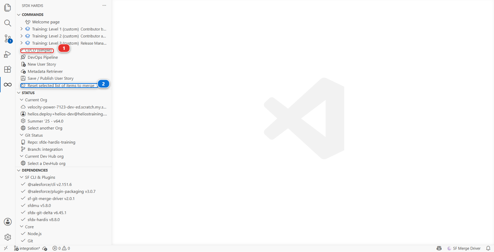

# Lab 7 - You committed the wrong things: recover

**Level**: 2 Contributor advanced
**Time**: ~30 min
**You will**: deliberately over-select at publish time, see what that does to a Pull Request, and
learn the two recovery paths.

## The situation

It is late, the selection screen has ninety entries, and **Select all** is right there. You click
it, you publish, and your Pull Request now proposes to change eighty things you have never looked
at.

Nobody can review that. Worse, some of those eighty are other people's work as it existed in your
org before you refreshed, which means merging your Pull Request would quietly roll them back.

This lab is short and it is the one you will actually use.

## Before you start

- [ ] Lab 6 finished and merged
- [ ] A clean working tree

## Steps

### 1. Make the mess on purpose

**New User Story**, branch `US-038-installation-notes-tidy`, target `integration`, org
`helios-dev`.

In `helios-dev`, make one small real change: on the Installation layout, move `Crew Size` above
`Install Date`.

Now publish, and at the selection screen click **Select all**. Confirm. Push.

### 2. Look at what you did

Open `manifest/package.xml`. It is long. Open the Pull Request: dozens of files changed, most of
them metadata you have never opened.

Read three of them in the diff. You will find at least one that is not an addition but a
**deletion** or a downgrade: something that exists on `integration` and not in your org, because
your org is a few days behind.

That is the real damage. An over-wide selection does not just add noise, it proposes to undo work.

### 3. Recover: reset the selection

Everything else in this course is a card in a panel. This one is not: it has no card, and the only
way to reach it is the **SFDX HARDIS** view in the left bar, which lists every sfdx-hardis command
whether or not a panel exposes it.

Open it, then **CI/CD (simple)** **(1)**, then **Reset selected list of items to merge** **(2)**.



It does more than its name suggests, and knowing exactly what saves you from undoing it twice. In
one pass it:

1. **Soft resets every commit** your branch has made since it left `integration`. The commits go,
   the changes stay, sitting in your working tree as if you had never committed them
2. **Unstages** all of it, so nothing is queued
3. **Restores `manifest/package.xml` and `manifest/destructiveChanges.xml`** to the versions on the
   branch point, which is what actually clears the selection
4. Sets `canForcePush`, because your branch no longer matches what you pushed

It asks you to confirm the reset first, and it refuses outright if you are standing on a major
branch.

So after this one command, your eighty-file commit is gone and the layout move is back in your
working tree, uncommitted. Nothing of yours is lost: the change is in Salesforce, and the file is
still in front of you.

### 4. Deal with what you already pushed

Locally you are clean. The branch on GitHub is not: it still carries the eighty-file commit, because
a soft reset only moved your own copy.

**Nobody has reviewed it** (the normal case): push the corrected branch over it once you have
re-published in the next step. That is what `canForcePush` was set for, and the publish will offer
it. The mistake disappears from the history as though it never happened, which on your own feature
branch before review is exactly what you want.

**Somebody has already reviewed it**, or the branch is shared: do not force push. Rewriting history
under a reviewer is how a review comment ends up attached to a commit that no longer exists. Commit
the corrected state as a new commit instead, so the diff shows the mistake and its correction, both
visible.

!!! danger "Force pushing is for a branch only you have touched"
    The rule is not about git, it is about people. Ask one question: has anyone else pulled this
    branch, or commented on it? If yes, the history is shared and you add to it. If no, it is yours
    and you can tidy it.

### 5. Publish again, properly

In the **DevOps Pipeline** panel, click **Save / Publish** again. This time the selection screen is
empty, and you tick exactly one thing: the **Layout**.

`manifest/package.xml` now has one entry. Push, and the Pull Request diff is one file.

### 6. The habit that prevents this

Three checks, each about ten seconds, before every push:

1. **Read `manifest/package.xml`.** If it has entries you cannot explain, stop
2. **Count the files in the Source Control panel.** A one-field story is two to four files. Eighty
   is never right
3. **Skim the diff for deletions.** Additions are usually yours. Deletions are usually somebody
   else's

### 7. Write it down

In `MY-PIPELINE.md`, under Level 2:

```markdown
- **Lab 7, resetselection**: I had selected the whole org. Reset selected list of items to merge
  cleared the selection, git reset --hard origin/integration dropped the commit, and the org kept
  my actual change.
```

<details markdown="1"><summary>Under the hood: what the selection actually is</summary>

The command behind the menu entry is:

    sf hardis:work:resetselection

The selection is not a git concept. `hardis:work:save` records what you ticked in your **user
configuration**, `config/user/.sfdx-hardis.<your-username>.yml`, which is git-ignored. On the next
publish it pre-ticks the same items, which is convenient when you are iterating on one story and
poisonous when you have moved on.

`resetselection` empties that record. Nothing else: no git operation, no org operation. It is
deliberately small, which is why it is safe to run whenever you are unsure.

The reason an over-wide selection produces deletions is worth stating plainly. `hardis:work:save`
builds `manifest/package.xml` from the **git diff between your branch and the target branch**. If
your org is behind `integration` and you retrieve everything from it, the retrieved files are older
than what is on `integration`, and the diff reads as "remove what they added". A backpromote before
starting (Lab 0) is what prevents this, and it is why `hardis:work:new` offers it.

</details>

## What you should see

- `manifest/package.xml` with a single `Layout` entry
- A Pull Request diff of one file
- Your layout change still present in `helios-dev`

## If it goes wrong

**`git reset --hard` says you have local changes.**
Commit or stash them first. `--hard` discards them without asking, which is fine here and a habit
worth not forming.

**After the reset, the publish still pre-ticks everything.**
You reset the branch but not the selection. Run **Reset selected list of items to merge** too.

**You already merged the bad Pull Request.**
Revert it on `integration` with the **Revert** button GitHub offers on a merged Pull Request, then
redo the story properly. Do not try to fix `integration` by hand.

## Check your work

Welcome page > **Training** > **Check my work**, then pick level 2 and lab 7.

## Go deeper

- [Publish your User Story](https://sfdx-hardis.cloudity.com/salesforce-devops-publish-user-story/)
- [Clean a repository by hand](https://sfdx-hardis.cloudity.com/salesforce-devops-manual-repo-clean/)

[Next: Capstone - Deliver US-041](lab-08-capstone.md){ .md-button .md-button--primary }
