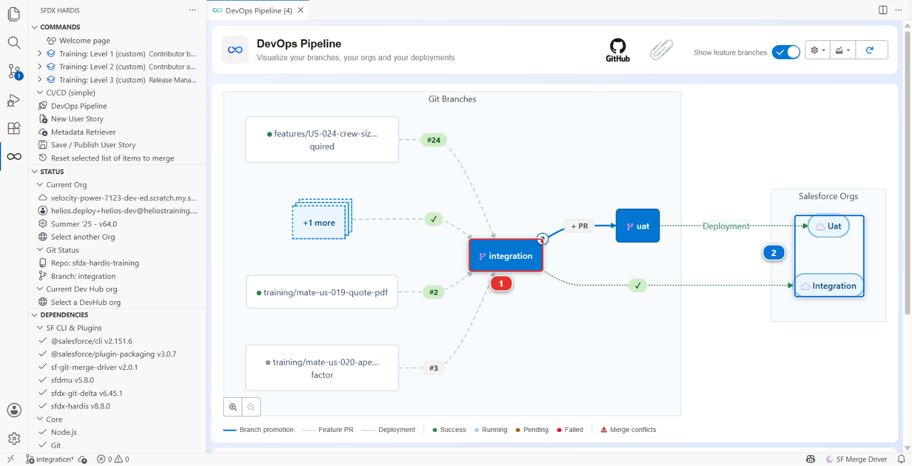
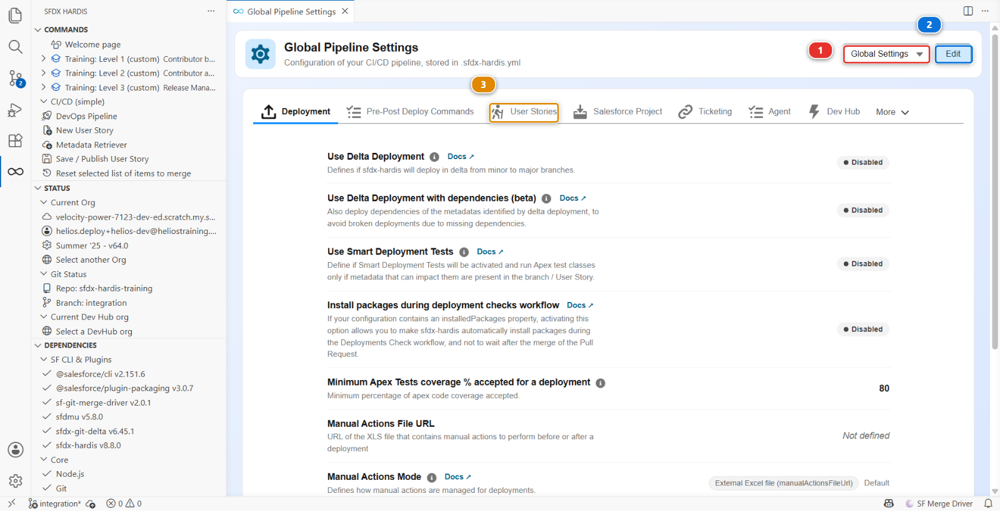
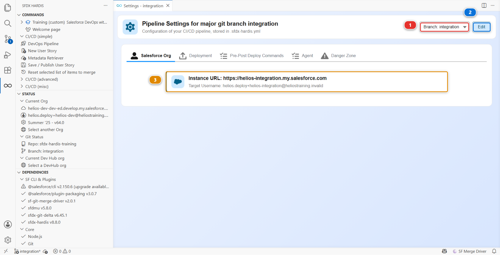
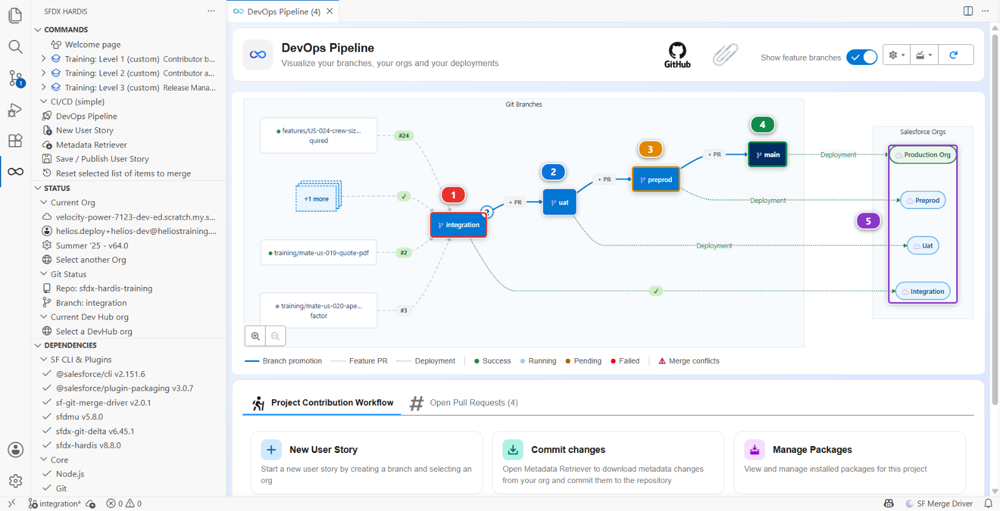

# Lab 3.1 - Configure the CI/CD pipeline up to production

**Level**: 3 Release Manager

**Time**: ~35 min

**You will**: turn a two-stage pipeline into a four-stage one that reaches production, and
understand every line of configuration you add.

## The situation

Open the **DevOps Pipeline** panel and look at what Sofia left.



`integration` **(1)** and `uat`, each with its org **(2)**, and the feature branches your teammates
have in flight. Work reaches the business testers, and then it stops. The `preprod` and `main`
branches exist in git, and nothing here knows about them: no org, no merge path, no deployment job.
A branch is only part of a pipeline once somebody writes down which org it deploys to, and for those
two nobody has.

So every release so far reached production by hand, which is exactly the kind of release nobody can
say anything about afterwards. That is your first week, and this lab is the first half of it. The
second half is the next lab: the credentials that let a job reach an org it is trusted with.

None of this is unusual. Most projects start with the stages they need on day one, and finishing the
pipeline gets postponed until the day somebody needs to release properly.

## Before you start

- [ ] Levels 1 and 2 finished
- [ ] `helios-prod` still connected in **Orgs Manager**. It is the Developer Edition org you signed
      up for in Level 1, and the Dev Hub of your scratch orgs. From this lab on, it is also
      production
- [ ] One more free Developer Edition org, signed up at
      [developer.salesforce.com/signup](https://developer.salesforce.com/signup) exactly like the
      first one, and connected in **Orgs Manager** with the alias `helios-preprod`
- [ ] Both seeded: Welcome page > **Training: Level 3** > **Set up one of my training orgs**, once
      for `helios-preprod` and once for `helios-prod`

## Steps

### 1. Start a story for it, then decide the shape

Configuration is work like any other, and it reaches `integration` the same way. Start its story
before you change a single file: **New User Story**, name `US-050-pipeline-to-production`, and
answer **I'm hardcore, I don't need an org**, because everything this lab changes is a file.
Starting the story afterwards does not work: **New User Story** begins its branch clean, and puts
everything uncommitted aside in a stash.

Then four questions, and their answers are the whole pipeline:

| Question                                                                     | Helios answer                                                                            |
|------------------------------------------------------------------------------|------------------------------------------------------------------------------------------|
| Which branches are **major**, meaning they have an org and a deployment job? | `integration`, `uat`, `preprod`, `main`                                                  |
| Which branch can merge into which?                                           | `integration` into `uat`, `uat` into `preprod`, `preprod` into `main`. Nothing skips one |
| Which branch is production?                                                  | `main`                                                                                   |
| Where does an urgent fix start?                                              | From `preprod`, so it never carries the work still waiting in `integration` and `uat`    |

Write those four lines in `MY-PIPELINE.md` now, before you configure anything. If you cannot state
them in one sentence each, configuring them will not help.

`preprod` earns its place in two ways. It is the last rehearsal before production, an org that holds
what production holds and that nobody works in, so a release that deploys there cleanly has very few
surprises left. And it is where hotfixes start, which Lab 3.8 is about.

### 2. Let contributors start a hotfix

Open the **DevOps Pipeline** panel, then its settings menu at the top right, and **Pipeline
Settings**. The page title reads **Global Pipeline Settings**, and the configuration scope selector
**(1)** reads **Global Settings**.



The panel is read-only until you click **Edit** **(2)**, so click it first. Then open the **User
Stories** tab **(3)**, one of the ten tabs of the global scope, where the contribution settings live.

Two fields matter here, and they are **two separate text boxes, one value per line**:
**Available PR/MR target branches** and **Labels for available PR/MR target branches**. Nothing
pairs them except their order, so line 2 of one belongs to line 2 of the other. Get the order wrong
and contributors see the wrong description next to the right branch, with no error anywhere.

| Line | Branch      | Label                                                                 |
|------|-------------|-----------------------------------------------------------------------|
| 1    | integration | `The shared integration org, where every contributor merges`          |
| 2    | preprod     | `Hotfixes on the production version, agreed with the release manager` |

The label is what a contributor reads next to the branch name when the question is asked, so it
says what the branch is for rather than repeating what it is called.

`uat` and `main` are not in that list, on purpose. Nobody builds a User Story against them: work
reaches `uat` by promotion from `integration`, and reaches `main` by promotion from `preprod`.

**Save**.

!!! note "Looking for the production branch?"
    You will not find it on this screen. `productionBranch` has no field in the settings panel,
    and this project already carries it:

    ```yaml
    productionBranch: main
    ```

    Open `config/.sfdx-hardis.yml` and read the Pipeline block to see it. A panel that covers most
    of a configuration and not all of it is normal, and it is why the under the hood sections of
    this course keep showing you the file. The file is the truth; the panel is a convenience over
    it.

### 3. Give preprod and main their orgs

Refresh the pipeline diagram and `preprod` and `main` are still not on it. Declaring `preprod` as a
target branch told the contribution screen it exists. It did not make it a major branch.

**A branch becomes major by having a file in `config/branches/`, and no screen creates the first
one.** The scope selector only lists branches that already have such a file, so `Branch: preprod` is
not in it yet, and the panel cannot bootstrap itself out of that.

So write the two files by hand, next to the `integration` and `uat` ones Level 1 wrote for you:

    config/branches/.sfdx-hardis.preprod.yml
    config/branches/.sfdx-hardis.main.yml

with two keys each. Get the usernames from **Orgs Manager**, and check them twice: pointing `main`
at the wrong org is the single most expensive mistake available in this lab.

| Branch  | `targetUsername`                  | `instanceUrl`                  |
|---------|-----------------------------------|--------------------------------|
| preprod | the `helios-preprod` org username | `https://login.salesforce.com` |
| main    | the `helios-prod` org username    | `https://login.salesforce.com` |

Open the `integration` file next to them and compare: it says `https://test.salesforce.com`. A
scratch org logs in the way a sandbox does, and a Developer Edition org the way production does.

Now reopen **Pipeline Settings**. The scope selector **(1)** offers `Branch: preprod` and
`Branch: main`, and picking one changes the title to **Pipeline Settings for major git branch**
followed by its name. The **Salesforce Org** tab opens on a read-only summary card **(3)** carrying
the two values you just wrote, and **Edit** **(2)** is what turns it into fields. The picture below
is that panel on `integration`, which already had its file since Level 1:



One summary card rather than two boxes is the view mode, not a missing setting. Click **Edit** and
the card becomes **Instance URL** **(1)** and **Target Username** **(2)**, with **Save** **(3)**
where the **Edit** button was:


Check both branches this way. `preprod` and `main` read `https://login.salesforce.com`, and only
`integration` and `uat` read `https://test.salesforce.com`.

The next lab writes these same two keys for you, as a side effect of configuring CI authentication.
Doing it by hand once is how you know what it wrote.

### 4. Declare the merge path

Still in the branch settings, on the **Deployment** tab of the same panel, set **Merge target
branches**, one value per line:

| Branch      | Merge targets                              |
|-------------|--------------------------------------------|
| integration | `uat`, already there since Level 1         |
| uat         | `preprod`. It was empty: `uat` was the end |
| preprod     | `main`                                     |
| main        | none                                       |

**Save**.

This is what stops a contributor opening a Pull Request straight from a feature branch into
production. It is not a permission, it is a guardrail, and it exists because the alternative is
someone doing it at 18:00 on a Friday.

### 5. Protect preprod and main

A merge path says where work may go. It does not stop anybody merging a Pull Request whose check is
red, and on a production branch that is the one merge you cannot afford. Since Lab 1.2, `integration`
and `uat` refuse it: setting up the environment protected them. `preprod` and `main` are yours to
protect, and a release manager does it the day the branches join the pipeline, not after the first
bad merge.

This is a GitHub setting, not an sfdx-hardis one, so it happens on GitHub. Open your fork, click
**Settings** **(1)**, then **Branches** **(2)** in the left menu. The two rules **(4)** are the ones
setting up your environment created in Lab 1.2. Click **Add rule** **(3)**.


The form is long, and four things on it matter. The picture is the `integration` rule, opened from
the list above, so it shows the values you are about to type:


1. **Branch name pattern** **(1)**: `preprod`
2. Tick **Require status checks to pass before merging** **(2)**. A search box appears under it
3. Type `Simulate` in that box and pick **Simulate Deployment to Major Org**, then type `Mega` and
   pick **Mega-Linter**. Both land in **Status checks that are required** **(3)**: they are the two
   checks every Pull Request of this course runs
4. Tick **Do not allow bypassing the above settings** **(4)**. Without it, the owner of the
   repository, you, still gets a checkbox to merge on red
5. Leave everything else unticked, **Require a pull request before merging** included: you work
   alone here, and GitHub never lets you approve your own Pull Request
6. Click **Create** at the bottom. On an existing rule the same button reads **Save changes** **(5)**

Then **Add rule** again, for `main`, with the same four settings. Back on the list: four rules,
`integration`, `uat`, `preprod` and `main`.

The search box only suggests checks that ran on this repository in the last seven days. Both ran on
your Level 2 Pull Requests, so they are there unless you took a long break: in that case open any
Pull Request into `integration` first, and its checks put them back in the list.

<details markdown="1"><summary>Under the hood: what the rule enforces</summary>

A required check is matched by **its job name**, not by the workflow file. `Simulate Deployment to
Major Org` is the job of `.github/workflows/check-deploy.yml`, which runs on every Pull Request into
the four major branches. `Mega-Linter` is the job of `.github/workflows/megalinter.yml`, which runs
on every push, so on the last commit of every Pull Request opened from a branch of your fork.

A workflow that only runs when some files change, like `link-check.yml` here, must never be
required: a Pull Request that does not touch those files waits for it forever, and GitHub shows it
as **Expected**, never as failed.

The same rule, set through the GitHub API, is what **Set up my training environment** did for
`integration` and `uat`:

    gh api -X PUT repos/<your-handle>/sfdx-hardis-training/branches/preprod/protection \
      -f "required_status_checks[contexts][]=Simulate Deployment to Major Org" \
      -f "required_status_checks[contexts][]=Mega-Linter" \
      -F "required_status_checks[strict]=false" -F enforce_admins=true \
      -F required_pull_request_reviews=null -F restrictions=null

`strict=false` is a choice: `true` would also require every Pull Request to be up to date with its
target before merging, which on a busy `integration` means updating every open branch after every
merge. GitLab, Azure DevOps and Bitbucket have the same setting under other names: protected
branches, branch policies, merge checks.

</details>

### 6. Look at the diagram again

Refresh the panel. Four columns, each with its org, connected by arrows in one direction.

That diagram is now the truth about this project, and it is the thing you will point at in every
conversation with a stakeholder who asks "so where is it".

<details markdown="1"><summary>Under the hood: the files you just wrote</summary>

`config/.sfdx-hardis.yml` gained:

    availableTargetBranches:
      - integration
      - preprod
    availableTargetBranchesLabels:
      - "The shared integration org, where every contributor merges"
      - "Hotfixes on the production version, agreed with the release manager"
    productionBranch: main

and `config/branches/` now holds four files, each with `targetUsername`, `instanceUrl` and
`mergeTargets`.

**A major branch is not declared anywhere as "major".** It becomes one by having a branch
configuration file with an org in it. That is the whole mechanism, and knowing it means you can read
any sfdx-hardis project in two minutes by listing `config/branches/`. It is also why step 3 started
in a text editor: every screen that reads major branches, the pipeline diagram and the scope
selector included, is reading that folder, so none of them can show you a branch that has no file
there yet.

One more thing worth knowing about the panel: at branch scope it only writes what differs from the
global configuration. A value you type that happens to equal the global one is silently not written,
and you get a file that looks like it lost your edit.

### What `sf hardis:project:create` would have done

Had Helios started today, the skeleton would have been generated rather than assembled:

    sf hardis:project:create

which asks for the type of development orgs, the project name, **one** development branch and the
cleaning types, connects a DevHub, runs `sf project generate`, then copies the default CI files over
the result: the workflows for **every** git provider at once, `manifest/package-no-overwrite.xml`,
`.mega-linter.yml` and friends. It writes `projectName`, `developmentBranch` and `autoCleanTypes`
into `config/.sfdx-hardis.yml`.

It does **not** write a single `config/branches/` file, and it never asks for an org other than the
DevHub. The branch files are the next lab's command, or your text editor. So generating the project
would have saved you the skeleton and left you exactly the work you have just done.

The other command worth knowing about is `sf hardis:org:retrieve:sources:dx`, which takes an
existing org with no repository at all and produces the initial commit. That is the real starting
point of most projects: not an empty repository, but a two-year-old org nobody has ever versioned.

</details>

### 7. Commit the configuration

This is configuration, so it goes through the same pipeline as everything else, and through the same
buttons Level 1 used. The picture below was taken in Level 1, which is why its diagram still has two
columns. The cards under the diagram are the part this step is about, and they do not change.


Under **Project Contribution Workflow** **(1)**, the story you started in step 1 is the branch you
are on, the one **New User Story** **(2)** made. Commit the files from **Source Control**, then
**Save / Publish**, then **Create Pull Request** in the reports bar at the end of it. Get the check
green and merge.

There is nothing to retrieve here: you edited configuration files, not an org.

Yes, even as the release manager. Especially as the release manager.

## What you should see

Open the **DevOps Pipeline** panel and click **Refresh**. This is the pipeline you built:



1. **`integration`** **(1)**, where contributors merge, with the promotion arrow leaving it
2. **`uat`** **(2)**, where the business signs off
3. **`preprod`** **(3)**, the rehearsal of production, and where hotfixes start
4. **`main`** **(4)**, production
5. The four orgs **(5)**, one per branch, in the order the work travels through them

The **+ PR** buttons on the arrows are the promotion Pull Requests, and Lab 3.6 is the first time you
click one.

Also true, and worth checking:

- `config/branches/` holding four files
- Four branch protection rules in your fork's **Settings** > **Branches**, one per major branch
- A merged Pull Request carrying the configuration change

## If it goes wrong

**The preprod column appears with no org even after saving.**
The file was written for a different branch name. Check `config/branches/` for a typo: the file name
has to match the branch exactly.

**The pipeline diagram does not refresh.**
Click **Refresh pipeline data** in the panel. It caches the git state.

**You pointed a branch at the wrong org.**
Fix the branch configuration in **Pipeline Settings** and publish again. Nothing has deployed yet,
so nothing is broken.

**The check you want to require is not suggested.**
GitHub only lists checks that reported on this repository in the last seven days. Open a Pull
Request into `integration`, let its checks run, and come back to the rule.

**A merge into `preprod` or `main` is still allowed on a red check.**
**Do not allow bypassing the above settings** is not ticked, and as the owner of the fork you are
let through. Edit the rule and tick it.

**Set up one of my training orgs fails on `helios-prod`.**
It is the org that created your scratch orgs, and it is a normal Developer Edition org apart from
that. The usual cause is an expired connection: reconnect it in **Orgs Manager** under the same
alias, and run it again.

## Check your work

Welcome page > **Training: Level 3** > **Check my work**, then pick Lab 3.1.

## Go deeper

- [Setup Guide](https://sfdx-hardis.cloudity.com/salesforce-devops-setup-home/)
- [Initialize the SFDX project](https://sfdx-hardis.cloudity.com/salesforce-devops-setup-init-project/)
- [Retrieve an existing org](https://sfdx-hardis.cloudity.com/salesforce-devops-setup-existing-org/)

[Next: Lab 3.2 - Set up CI authentication with JWT for four orgs](3-2-ci-authentication-with-jwt.md){ .md-button .md-button--primary }
