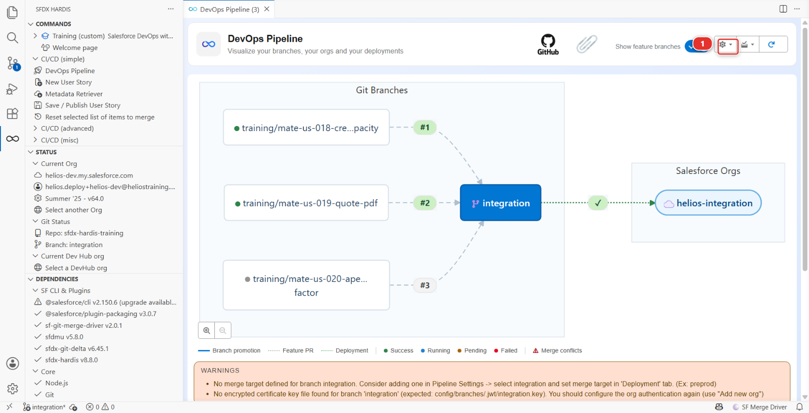
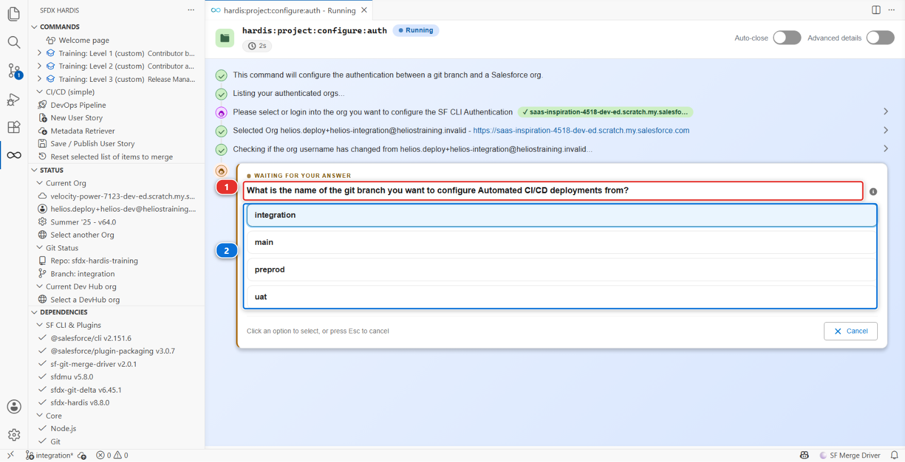
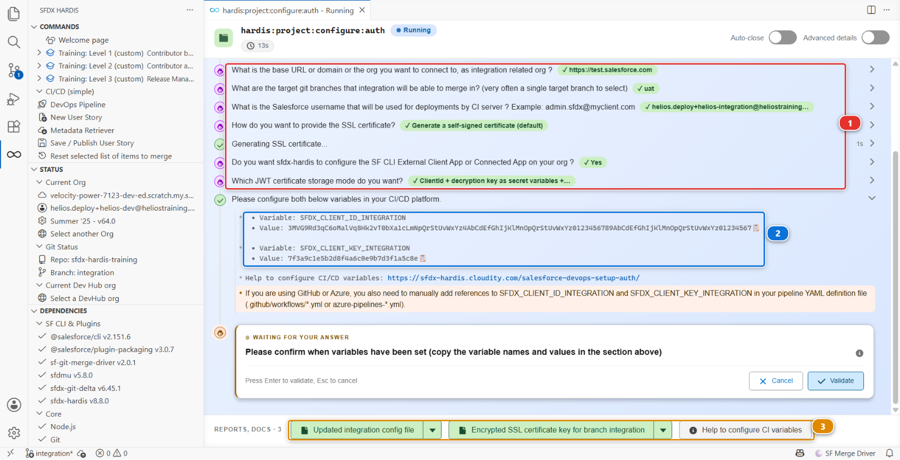
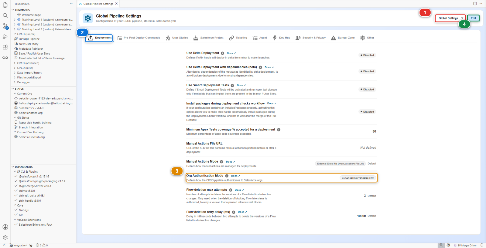

# Lab 3.2 - Set up CI authentication with JWT for four orgs

**Level**: 3 Release Manager

**Time**: ~40 min

**You will**: replace the shortcut Level 1 gave you with the credential a real project uses, for all
four orgs, and delete the shortcut.

## The situation

Your CI reaches `helios-integration` and `helios-uat` through `SFDX_AUTH_URL_INTEGRATION` and
`SFDX_AUTH_URL_UAT`, two secrets containing long-lived OAuth refresh tokens. Level 1 told you they
were a deliberate exception for throwaway scratch orgs and that you would fix them here.

This is here.

Three things are wrong with an auth URL on a real project, and they are worth being able to say out
loud because somebody will ask you why you are spending an hour on this:

1. **It cannot be rotated.** Changing it means authenticating interactively again, as a human, in a
   browser. There is no unattended rotation
2. **It is a bearer credential with no scope.** Anyone who reads the secret has everything that user
   has, from anywhere, until it is revoked
3. **It is tied to a person.** When that person leaves or their password policy resets their token,
   the pipeline stops, and nobody knows why

The alternative is a **JWT flow through an External Client App**: a certificate you hold, a
pre-authorised user, no password anywhere, and revocation by deleting one app.

## Before you start

- [ ] Lab 3.1 finished: four major branches with their orgs
- [ ] `helios-integration`, `helios-uat`, `helios-preprod` and `helios-prod` connected in
      **Orgs Manager**
- [ ] A story started for it, like in Lab 3.1: **New User Story**, name `US-051-ci-authentication`,
      and answer **I'm hardcore, I don't need an org**. The command writes files and never commits
      them, and a story started afterwards would put them aside in a stash
- [ ] Nothing else. The command generates the certificate itself, using `openssl`, which came with
      Git when you installed it in Level 1

!!! note "This lab is about the CI, not your workstation"
    Your own connection to these orgs already exists and is not changing. Orgs Manager keeps
    working exactly as before. What you are setting up is how a **GitHub runner**, which is not you
    and has no browser, reaches the org.

## Steps

### 1. Run the configuration command for integration

In the **DevOps Pipeline** panel, click the gear **(1)** at the top right and choose
**Add/Configure Org**.



The command runs in a panel rather than a terminal, and asks one question at a time **(1)**, with
the answers to click below it **(2)**. Here it is at the second question, with `helios-integration`
already chosen.



It asks a dozen questions, not three, and the order is not the one you would guess:

1. **Please select or login into the org you want to configure the SF CLI Authentication** -
   `helios-integration`. The command makes it your default org and, because that changed, VS Code
   starts the same command again. Pick `helios-integration` a second time in the new panel and carry
   on from there
2. **What is the name of the git branch you want to configure Automated CI/CD deployments from?** -
   `integration`. The list is built from your **remote** branches, and branches whose name contains
   a `/` are filtered out of it, which is why no feature branch is offered
3. **What is the base URL or domain or the org you want to connect to, as integration related
   org ?** Pick **🧪 Sandbox or Scratch org (test.salesforce.com)**. `helios-integration` is a scratch
   org, and a scratch org logs in like a sandbox. The highlighted answer is the one above it,
   **📝 Custom login URL**, so read this list rather than pressing Enter. It is also the wrong answer
   for `preprod` and `main` in step 5, which are Developer Edition orgs
4. **What are the target git branches that integration will be able to merge in?** - `uat`. This
   writes `mergeTargets` again, on top of what you set in Lab 3.1, so give the same answer
5. **What is the Salesforce username that will be used for deployments by CI server ?** - the
   `helios-integration` username, which it offers you already filled in
6. **How do you want to provide the SSL certificate?** - **Generate a self-signed certificate
   (default)**. The other answer, CA-signed, generates nothing at all and only prints instructions
7. **Do you want sfdx-hardis to configure the SF CLI External Client App or Connected App on your
   org ?** - yes
8. **Which JWT certificate storage mode do you want?** - **ClientId + decryption key as secret
   variables + encrypted certificate as file (default)**. The other mode puts the certificate itself
   in a third secret, `SFDX_CLIENT_CERT_INTEGRATION`, and deletes the file
9. **Please confirm when variables have been set.** This one is a stop, and step 3 is what it is
   waiting for. Do not click **Validate** yet
10. Then, after you confirm: the **name** of the External Client App, a **contact email**, and the
    **profile to pre-authorise** (`System Administrator`). The list shows the profile names in the
    language of the org's user, so an org set to French lists `Administrateur système` instead

### 2. Read what it produced, and copy the two values

The panel keeps every question you answered **(1)**, so you can check what you told it without
starting again. Just above question 9 it prints the two values you are about to store **(2)**, each
with a copy button. Nothing prints them again, so do not close the panel. The files it wrote are
listed in the reports bar at the bottom **(3)**.



What it writes, and where:

| What                              | Where                                                                   | What it is                                                     |
|-----------------------------------|-------------------------------------------------------------------------|----------------------------------------------------------------|
| An encrypted private key          | `config/branches/.jwt/integration.key`                                  | The credential itself, meant to be committed                   |
| A certificate                     | `integration.crt` in your home directory, deleted after the app deploys | What is uploaded into the org                                  |
| An External Client App definition | deployed into the org by the command                                    | What Salesforce authenticates against                          |
| Branch configuration              | `config/branches/.sfdx-hardis.integration.yml`                          | `targetUsername`, `instanceUrl` and `mergeTargets`             |
| Two values to store as secrets    | printed in the command panel                                            | `SFDX_CLIENT_ID_INTEGRATION` and `SFDX_CLIENT_KEY_INTEGRATION` |

The consumer key is **not** written to the branch configuration. It lives in the org and in your
secret, and nowhere else in the repository.

The private key committed to the repository is **encrypted**, with a passphrase the command
generates at random and holds as `SFDX_CLIENT_KEY_INTEGRATION`. The repository alone is not enough
to authenticate, which is what makes committing it acceptable.

### 3. Store the secrets in your fork

Do this now, while question 9 is still waiting.

In your fork: **Settings > Secrets and variables > Actions > New repository secret**, twice:

| Name                          | Value                                |
|-------------------------------|--------------------------------------|
| `SFDX_CLIENT_ID_INTEGRATION`  | the consumer key the command printed |
| `SFDX_CLIENT_KEY_INTEGRATION` | the passphrase the command printed   |

The `<ALIAS>` suffix is **the branch name in upper case**. That is the entire convention, and it is
why the names are not arbitrary.

!!! note "The orange warning about your pipeline YAML"
    Under the two values, the panel warns that on GitHub and Azure a secret also has to be passed to
    the job in `.github/workflows/*.yml`. It is right, and it is the step people forget: a secret
    GitHub holds and the workflow never reads is a secret the job does not have. This course's
    workflows already pass all eight, `SFDX_CLIENT_ID_*` and `SFDX_CLIENT_KEY_*`, for the four
    branches. Open `.github/workflows/process-deploy.yml` and read the `env:` block once, because on
    your own project that block is yours to write.

Now click **Validate** on question 9, and let the command create the app.

### 4. Check the org authorisation it did for you

The step everybody warns you about, pre-authorising the app, is the one the command already did.

The External Client App it deploys carries `Admin approved users are pre-authorized` and the profile
you named at the last question, which is why that question exists. Go and look at it once, so you
know where it is when it matters:

In `helios-integration`: **Setup > External Client App Manager**, open the app you named at the last
question, then **Policies**. The name it offered you was `sfdxhardisintegration`, built from
`sfdxhardis` plus the branch. Permitted Users reads *Admin approved users are pre-authorized*, and
the profile is listed.

It matters because of the one path where it is **not** done for you: if the app deployment fails and
the command falls back to printing manual instructions, those instructions stop at uploading the
certificate. They say nothing about permitted users or profiles. Follow them literally and the first
CI login fails with `user hasn't approved this consumer`, which is an accurate message that reads
like a bug.

### 5. Do the same for uat, preprod and main

Same gear button, **Add/Configure Org** three more times, once for each branch and its org. `uat` is
a scratch org like `integration`, so it takes the same sandbox answer. `preprod` and `main` are
Developer Edition orgs, so at the base URL question they take **☢️ Other: Dev org, Production org or
DevHub org (login.salesforce.com)**. At the merge targets question, `uat` merges into `preprod` and
`preprod` into `main`, as in Lab 3.1. `main` is production and merges into nothing: tick nothing.

Store six more secrets:

- `SFDX_CLIENT_ID_UAT`, `SFDX_CLIENT_KEY_UAT`
- `SFDX_CLIENT_ID_PREPROD`, `SFDX_CLIENT_KEY_PREPROD`
- `SFDX_CLIENT_ID_MAIN`, `SFDX_CLIENT_KEY_MAIN`

The command pre-authorises each app as it creates it, so there is nothing to do in Setup unless a
deployment failed.

Eight secrets, four External Client Apps, four certificates. Tedious once, then never again.

### 6. Delete the shortcut, before anything proves anything

In your fork: **Settings > Secrets and variables > Actions**, find `SFDX_AUTH_URL_INTEGRATION` and
`SFDX_AUTH_URL_UAT`, and delete both.

Do it now, before the Pull Request of step 9, and not after. The authentication step of every job
looks for `SFDX_AUTH_URL_<BRANCH>` first and stops there when it finds one. While the two secrets
exist, a green job proves nothing about your certificates: it logged in the old way. Once they are
gone, the only way in is the JWT one, so the next green job is the proof.

### 7. Tell the panel what the project now uses

One line of configuration is still describing the old world.

`config/.sfdx-hardis.yml` carries `orgAuthenticationMode: secretsOnly`, put there when the course
handed you the auth URL shortcut. It is how the DevOps Pipeline panel knows not to look for
certificate key files, and not to warn you when there are none. There are certificates now, so that
line is a lie, and a panel told a lie stops being able to warn you about anything.

In the **DevOps Pipeline** panel, **gear menu > Pipeline Settings**. Check the scope reads **Global
Settings** **(1)**, because this one belongs to the project and not to a branch, and stay on the
**Deployment** tab **(2)**.



**Org Authentication Mode** **(3)** reads *CI/CD secrets variables only*. Click **Edit** **(4)**,
change it to *Encrypted certificate key files*, and **Save**.

From now on the panel checks `config/branches/.jwt/<branch>.key` for every major branch and says so
when one is missing. That is the check you want switched on: a key file that never made it into a
commit is exactly the failure that only shows up in a job, at the worst moment.

### 8. Write down why

In `MY-PIPELINE.md`, under Level 3, replace the Lab 3.2 line with what you did:

```markdown
- **Lab 3.2, CI authentication**: deleted the SFDX_AUTH_URL_INTEGRATION and SFDX_AUTH_URL_UAT
  secrets on <the date>. They carried long-lived refresh tokens that could not be rotated, were not
  scoped, and were tied to one person. All four orgs now authenticate with JWT through an External
  Client App.
```

The badge audit looks for that line. More to the point, it is the answer to the question the next
release manager will ask.

### 9. Commit, and let the Pull Request prove it

Same buttons as Lab 3.1. **Source Control** lists what this lab wrote: the four
`config/branches/.jwt/*.key` files, the branch files the command touched, `config/.sfdx-hardis.yml`
and `MY-PIPELINE.md`. Commit them, then **Save / Publish**, then **Create Pull Request** into
`integration` from the reports bar.

The check job of that Pull Request logs into `helios-integration`, and there is no auth URL secret
left for it to use. Open it from the **Checks** tab of the Pull Request, expand **Login & Simulate
deployment** and look for `sf org login jwt`: that line, and a green job, are your certificate
working. Merge, and the deployment job on `integration` logs in the same way.

`uat`, `preprod` and `main` prove themselves the first time a Pull Request goes into them: the
promotion to `uat` in Lab 3.6, then `preprod` and `main` in Lab 3.7. Their check jobs log in with
their own key and secrets, the same way.

<details markdown="1"><summary>Under the hood: what the JWT flow actually does</summary>

The command ran:

    sf hardis:project:configure:auth

and the CI job now runs, before anything else:

    sf org login jwt \
      --client-id $SFDX_CLIENT_ID_INTEGRATION \
      --jwt-key-file <decrypted key> \
      --username <targetUsername from the branch config> \
      --instance-url <instanceUrl from the branch config> \
      --alias integration

The private key is decrypted at the start of the job with `SFDX_CLIENT_KEY_INTEGRATION`, used, and
never written anywhere persistent.

**How the authentication hook chooses.** For a branch `<B>`, it looks for `SFDX_AUTH_URL_<B>` first,
in that spelling and then upper-cased. If it finds one, it uses it and returns, before the JWT
variables are even read. Only if there is none does it go on to `SFDX_CLIENT_ID_<B>` plus the
certificate. That order is why step 6 comes before the Pull Request: while the auth URL secret existed, the JWT
path was never being exercised.

One detail worth knowing before you debug this on a real project: the JWT lookup also accepts a
plain `SFDX_CLIENT_ID` with no suffix, as a last resort and with a warning in the log. A single
unsuffixed secret left over from an old setup will answer for every branch.

`orgAuthenticationMode` in `config/.sfdx-hardis.yml` is **not** written by this command, and no CLI
command reads it. It only tells the VS Code pipeline panel which shape to expect, so that it can
warn you when a major org is not configured the way the project declared. `secretsOnly` means the
credentials live entirely in CI secrets and there is no key file to look for; `encryptedCert`, the
default and what step 7 sets, means every major branch should have one committed.

</details>

## What you should see

- Eight secrets in your fork, none of them an auth URL
- Four `config/branches/.jwt/*.key` files, encrypted
- `SFDX_AUTH_URL_INTEGRATION` and `SFDX_AUTH_URL_UAT` gone
- A green check job on your `US-051` Pull Request into `integration`, with `sf org login jwt` in its
  log, and `integration` deploying green after the merge
- The DevOps Pipeline panel quiet: no warning about a missing key file, on any of the four branches

## If it goes wrong

**`user hasn't approved this consumer`.**
Step 4. The External Client App exists but the user is not pre-authorised.

**`invalid_grant: audience is invalid`.**
The instance URL does not match the org type. A scratch org uses `https://test.salesforce.com`, and a
Developer Edition org uses `https://login.salesforce.com`. Check the branch file of the job that
failed.

**The job cannot decrypt the key.**
`SFDX_CLIENT_KEY_<ALIAS>` is wrong or was copied with a trailing newline. Recreate it.

**The job says it cannot find `config/branches/.jwt/<branch>.key`.**
The key file never reached the branch the job runs on. Check that the `.jwt` folder is in your
commit: it starts with a dot, and some tools hide such folders.

**Everything passes even with the JWT secrets missing.**
An auth URL secret is still there and still winning. That is exactly what step 6 removes.

## Check your work

Welcome page > **Training: Level 3** > **Check my work**, then pick Lab 3.2.

## Go deeper

- [Configure CI authentication](https://sfdx-hardis.cloudity.com/salesforce-devops-setup-auth/)
- [GitHub Actions authentication](https://sfdx-hardis.cloudity.com/salesforce-devops-setup-auth-github/)

[Next: Lab 3.3 - Review and merge a contributor Pull Request](3-3-review-a-contributor-pull-request.md){ .md-button .md-button--primary }
