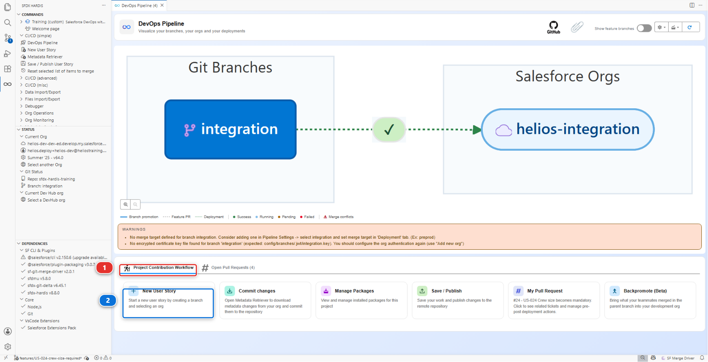
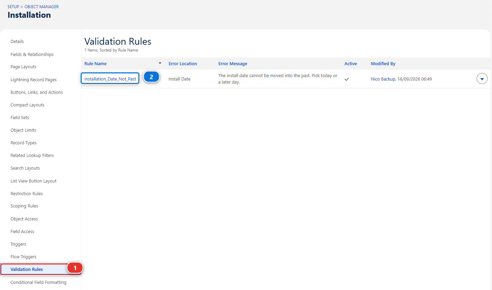
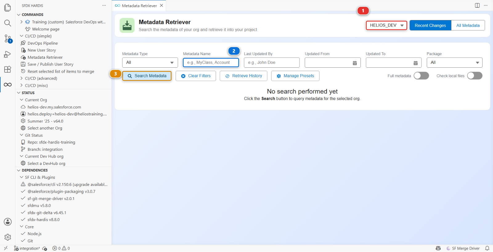

# Lab 3.8 - Production is broken: hotfix and retrofit

**Level**: 3 Release Manager

**Time**: ~35 min

**You will**: ship a fix straight to production without breaking the pipeline, then bring back a
change an admin made by hand.

## The situation

Two problems, and they arrive in the order they always do.

**17:40 on a Friday.** Planners close the week by cancelling the installations the crews could not
reach and back-dating them to the day it was called off. Every one of those saves is refused. The
`Installation_Date_Not_Past` validation rule exempts installations that are `Completed` and says
nothing about the ones that are `Cancelled`, so a job that will never happen is held to a rule about
scheduling it. Waiting for the normal path means the week does not close until Monday.

**Monday morning.** While fixing the incident, an admin added a picklist value directly in
production, because that was the fastest way to unblock people. It works. It is in production and in
no branch, and the next deployment will silently remove it.

Both are normal. Handling them badly is what turns a normal week into a bad quarter.

## Before you start

- [ ] Lab 3.7 finished: the release is in production
- [ ] `helios-preprod` and `helios-prod` connected in **Orgs Manager**

## Part 1: the hotfix

### 1. Decide that it is a hotfix

A hotfix skips the pipeline. That is its point, and its cost. Use it when **all three** are true:

1. Production is broken for real users right now
2. The fix is small and you can describe its blast radius in one sentence
3. Waiting for `integration` to `uat` to `preprod` to `main` is genuinely not acceptable

If any one is false, it is an ordinary story that happens to be urgent. Most things called hotfixes
are ordinary stories.

### 2. Branch from preprod, not from integration

This is the part people get wrong, and it produces an incident on top of an incident.

`integration` carries next week's work. Branch a hotfix from it and you ship next week's work to
production tonight. `preprod` carries exactly what production runs, which is why Lab 3.1 made it the
branch a hotfix starts from.

In VS Code, **New User Story** **(2)**, under **Project Contribution Workflow** **(1)**:



Answer:

| Question      | Answer                                                                   |
|---------------|--------------------------------------------------------------------------|
| Target branch | **`preprod`**, described as the hotfix branch                            |
| Type          | **Fix: correct something that is broken**, which names the branch `fix/` |
| Name          | `US-045-installation-date-hotfix`                                        |
| Org           | **I'm hardcore, I don't need an org**: you will work in `helios-preprod` |

The org question only lists development orgs, and `helios-preprod` is a major org, rightly kept out
of that list. You still reproduce and fix in it, because it holds what production holds and nobody
works in it: open it from **Orgs Manager** when step 3 asks.

### 3. Fix it

In `helios-preprod`: **Setup > Object Manager > Installation > Validation Rules** **(1)**, then open
`Installation_Date_Not_Past` **(2)**.



Read what is there before you change anything:

```
AND(
  ISCHANGED(Install_Date__c),
  Install_Date__c < TODAY(),
  NOT(ISPICKVAL(Status__c, "Completed"))
)
```

Three conditions, and two of them are already doing their job. `ISCHANGED` is why an old record can
still be saved as long as nobody touches the date, and the `Completed` exemption is why a finished
job can be dated when it actually happened. Whoever wrote this thought about it.

The gap is the fourth condition that is not there. Add it:

```
AND(
  ISCHANGED(Install_Date__c),
  Install_Date__c < TODAY(),
  NOT(ISPICKVAL(Status__c, "Completed")),
  NOT(ISPICKVAL(Status__c, "Cancelled"))
)
```

A cancelled installation is finished work, exactly like a completed one, and the rule's own
description says finished work is exempt. This is the shape most production incidents have: not a
rule that is wrong, a rule whose list of exceptions was written before somebody invented a new way
of being an exception.

### 4. Publish and ship

Retrieve the validation rule and nothing else, from `helios-preprod`, commit it, and publish. The
Pull Request targets **`preprod`**.

Green. Merge. The fix is already in `helios-preprod`, because you made it there, so this deployment
changes nothing and proves the branch and the org agree.

Then a second Pull Request, from `preprod` into `main`. Its check deploys against production in
validation mode, which is exactly what you want at 17:40: the same gate, on the real org, taking two
minutes. Green. Merge. Watch the deployment. Confirm with a planner, or by saving a record
yourself.

### 5. Put the fix back into the pipeline

Production and `preprod` now have a fix that `uat` and `integration` do not. Leave it there and the
next release overwrites it.

Open a second Pull Request, from your hotfix branch into `integration`. Same content, ordinary path.
Merge it, and the fix flows back up to `uat` on the next promotion.

**A hotfix goes two ways.** Up to production, through `preprod`, and back down into the pipeline.
Doing only the first is how a fix gets shipped twice and regressed once.

## Part 2: the retrofit

### 6. Find what production has that the repository does not

Monday morning first. **Training: Level 3 > Simulate my teammates**, and pick **Monday morning: an
admin adds a picklist value in production**. It plays the admin: it adds a `Needs Reinspection` value
to `Installation__c.Status__c`, live, in `helios-prod`, and touches nothing in your repository.

Production now has something the repository does not, and the next deployment that touches that
field will quietly remove it. That is why the course makes the change now rather than when you set
`helios-prod` up: your Lab 3.7 release deployed that field, and would have removed it already.

There used to be a command that swept an org for every such difference and put them all on a branch.
It is deprecated, deliberately: the command name still exists, and running it now prints an error,
does nothing and exits non-zero. The reason is worth understanding before you reach for anything
automatic: **a sweep cannot tell you whether a difference means production is ahead or behind.** It
reports both the same way, and the second kind, accepted, rolls the repository back.

So you recover the change the way you would build it: as an ordinary User Story, retrieving exactly
what you know changed.

Start a User Story targeting `integration`, and answer **I'm hardcore, I don't need an org** to the
org question: the org you read from is production, and nobody builds in production. Then open the
**Metadata Retriever** from the Welcome page.



1. Check the org it reads from **(1)**. It opens on your default org and then goes its own way, so it
   has to say `helios-prod`, not the dev org you were last in. This is the field people get wrong,
   and retrieving the wrong org is how a retrofit puts yesterday's dev work into the repository
2. Type `Status__c` in **Metadata Name** **(2)**
3. **Search Metadata** **(3)**, then tick the field in the results and retrieve it

The panel opens in **Recent Changes** mode, which is what you want: you are looking for something
somebody touched this week. If the field does not come back, switch to **All Metadata** and search
again rather than assuming the change is not there.

One component, chosen by you, from an org you named.

### 7. Read the diff before you keep any of it

Open the Source Control panel and read what landed.

You asked for one field and you will usually get more than the picklist value: an API version bump,
a reordered block, a `<fullName>` that differs in case. A retrieve returns the org's current
serialisation of the whole component, not just the part that changed.

Three kinds of difference, and only one of them is yours to keep:

| What you see in the diff                             | What to do                                                                |
|------------------------------------------------------|---------------------------------------------------------------------------|
| The picklist value an admin added to fix an incident | **Keep it.** It is real, it is needed, and it has to be in the repository |
| Noise: API version, attribute order, whitespace      | **Discard it.** Stage the hunks you want, not the file                    |
| Something that differs because production is behind  | **Discard it.** That is the pipeline's job, not yours                     |

The third one is the trap, and it is why this step is manual. Production being behind looks exactly
like production being ahead in a file diff. You are the one who knows which it is, because you know
what you went looking for.

Stage the picklist hunk. Leave the rest.

### 8. Bring it in, through the pipeline

Publish and open a Pull Request into `integration`, like any other story. Review it, merge it.

It flows to `uat`, then to `preprod` and `main` on the next release, at which point production and
the repository agree again.

That last sentence is the whole point: **not to change production, but to stop production being
changed back.**

### 9. Write both down

```markdown
- **Lab 3.8, hotfix**: US-045 shipped through preprod to main, then merged back into integration so the
  next release does not regress it.
- **Lab 3.8, retrofit**: took the Needs Reinspection picklist value an admin added in production, put
  it through the pipeline from integration.
```

<details markdown="1"><summary>Under the hood: the two commands and the two configuration keys</summary>

**The hotfix** used nothing special. `hardis:work:new` with `preprod` as the target branch produces a
branch from `preprod`, and `hardis:work:save` computes the package against `preprod`. The pipeline
treats `preprod` as any other major branch. What makes it a hotfix is the target, not a mode.

The branch prefix is worth a second of thought, for a reason beyond tidiness: the DORA **rework
rate** in Lab 3.7 counts hotfix Pull Requests, and it recognises one by a `hotfix/`, `fix/` or
`bugfix/` branch prefix. This project calls its fix branches `fix/`, so this hotfix counts. A
project that spells the prefix differently gets a rework rate of zero and no warning, which is the
sort of thing to check before quoting a number at anybody.

**The retrofit** used the Metadata Retriever, which runs a plain targeted retrieve:

    sf project retrieve start --metadata "CustomField:Installation__c.Status__c" --target-org <the org username> --json

and nothing else. No branch is created for you, no comparison is made on your behalf, and that is
the point. Two details if you ever read the command it ran: `--target-org` gets the org's username
rather than its alias, and the **Full metadata** toggle swaps the whole thing for
`sf hardis mdapi read`, which reads through the Metadata API instead.

There is an older command, `sf hardis:org:retrieve:sources:retrofit`, that swept the org for every
difference in a declared list of types and put them all on a branch. **It is deprecated.** Not
discouraged: the command still exists, and its entire body is now an error message and a non-zero
exit. It automated the easy half of the job, finding differences, and left the half that actually
matters, deciding what each difference means, to whoever read the branch afterwards. In practice
nobody read it carefully every week, and a sweep accepted wholesale eventually reverts something.

Its three configuration keys, `retrofitBranch`, `sourcesToRetrofit` and `retrofitIgnoredFiles`, are
still in the JSON schema and will still autocomplete in a `.sfdx-hardis.yml`. Nothing reads them any
more.

What replaces it is not a command, it is a habit, and it belongs to Lab 3.9: **put the org under
monitoring.** Monitoring tells you a manual change happened, on the day it happened, and who made
it. Then you retrieve that one thing, knowingly. Detection is automatic, the judgement is not.

</details>

## What you should see

- The validation rule fixed in `helios-prod`, through a Pull Request into `preprod` and then one into
  `main`
- The same fix merged into `integration`
- `Needs Reinspection` present on `integration`, in
  `force-app/main/default/objects/Installation__c/fields/Status__c.field-meta.xml`
- Two lines in `MY-PIPELINE.md`

## If it goes wrong

**The hotfix Pull Request wants to bring next week's work with it.**
You branched from `integration`. Start again, with `preprod` as the target branch.

**The retrieve brought back far more than the picklist value.**
Expected. A retrieve returns the org's whole current version of the component. Stage the hunk you
came for and discard the rest, rather than committing the file.

**The diff wants to remove things.**
Production is behind the repository for those components. Do not keep them: that is a deployment
problem, not a retrofit one.

**The picklist value disappears again after the next release.**
It reached the repository on a branch that never got merged. Check that it is really on
`integration`.

## Check your work

Welcome page > **Training: Level 3** > **Check my work**, then pick Lab 3.8.

It wants the hotfix in the history of `preprod` or `main`, and `Needs Reinspection` on
`integration`, which is where step 8 put it.

!!! note "The badge asks for a little more"
    **Everything in level 3**, and the badge audit, want `Needs Reinspection` on `main`. The retrofit
    is not finished until production and the repository agree, and they agree once the next release
    carries it up, which is the capstone. Nothing to do about it here.

## Go deeper

- [Hotfixes](https://sfdx-hardis.cloudity.com/salesforce-devops-hotfixes/)
- [Retrofit](https://sfdx-hardis.cloudity.com/salesforce-devops-retrofit/)

[Next: Lab 3.9 - Monitor your production org](3-9-monitor-your-production-org.md){ .md-button .md-button--primary }
