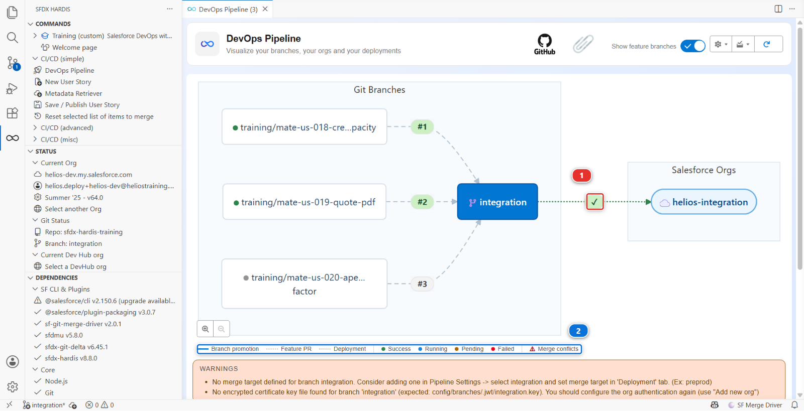

# Lab 3 - Deploy to integration and read what happened

**Level**: 3 Release Manager
**Time**: ~40 min
**You will**: read a deployment log properly, and understand why what was deployed is smaller than
what changed.

## The situation

Merging Marco's Pull Request started a deployment job. Most people watch the colour and move on.

A release manager reads it, because the deployment log is the only place that says what actually
reached the org, and the difference between that and what you thought you were shipping is where
incidents come from.

## Before you start

- [ ] Lab 2 finished: US-018 merged into `integration`

## Steps

### 1. Open the job

**Actions** tab of your fork, the **Deploy to integration** run that started when you merged.

Or from VS Code: the **DevOps Pipeline** panel puts the job on the arrow between `integration` and
its org **(1)**, coloured with its status, and the legend under the diagram **(2)** says what each
colour means. Click the marker to open the run.



### 2. Read it in five parts

A sfdx-hardis deployment log has the same shape every time:

**One: authentication.** Which org, which mechanism. After Lab 1 this says JWT. If it ever says
something else, something changed that you did not change.

**Two: what to deploy.** The package it computed, and where from. This is the interesting part and
step 3 is about it.

**Three: pre-deploy actions.** Anything declared to run before, with its result.

**Four: the Salesforce deployment.** Components deployed, tests run, coverage, duration.

**Five: post-deploy actions**, then the notification.

### 3. Understand why the package is smaller than the diff

Marco changed a flow, a permission set, a field and a layout: four components.

The deployment sent fewer than the repository holds, and on a real project it would send fewer
still. Two mechanisms decide that, and they are different:

**Delta deployment.** Instead of sending the whole repository, sfdx-hardis computes what changed
between the commit already deployed to this org and the new one, and sends only that. A full
Salesforce deployment of a mature project takes 40 minutes; a delta takes 3. The trade is that the
org has to genuinely be at the commit the pipeline thinks it is at.

!!! note "This project has delta off, on purpose"
    `useDeltaDeployment` is absent from `config/.sfdx-hardis.yml`, so every deployment in this
    course sends the full package. Read it in **Pipeline Settings**, **Deployment** tab: **Use Delta
    Deployment** shows **Disabled**.

    The Helios app is 30 components, so a full deployment costs a minute and delta would save
    nothing while adding a way for the course to fail confusingly on a missing dependency. Turn it
    on when a deployment starts costing you real time, which on a real project is soon. There is a
    second key for promotions between major branches,
    `enableDeltaDeploymentBetweenMajorBranches`, and it is off by default for the same reason:
    a promotion carries more, and is the riskiest place to send less.

**Automated cleaning.** The rules in `config/.sfdx-hardis.yml` remove things from the package before
it is sent: profile permissions that belong on permission sets, flow element positions, list view
scopes.

Look at the log and identify at least one component that was in the diff and not in the deployment.
Then find which of the two mechanisms removed it.

### 4. Find what Smart Deploy skipped, and why

Further down, the log lists components it decided not to send because the target org already has
them identical. That is not cleaning and not delta: it is Smart Deploy comparing with the org.

This is what stops a deployment from touching a hundred components to change one, which matters
because every touched component is a chance to fail on something unrelated.

### 5. Verify in the org, not in the log

Open `helios-integration` from **Orgs Manager** and check Marco's change is actually there: the cap
in the flow, the field on the layout.

A log is a claim. The org is the fact. On a real project you check the org after every deployment to
a major environment, and it takes thirty seconds.

### 6. Write down what you read

In `MY-PIPELINE.md`, under Level 3:

```markdown
- **Lab 3, Smart Deploy**: the deployment sent N of the M components in the diff. X was removed by
  cleaning, Y was skipped because integration already had it identical.
```

<details markdown="1"><summary>Under the hood: the three filters, in order</summary>

The job ran:

    sf hardis:project:deploy:smart

and the package it finally sent went through three filters, in this order:

1. **Delta.** If `useDeltaDeployment` is on, `sfdx-git-delta` computes the changed components
   between the last deployed commit and `HEAD`. `enableDeltaDeploymentBetweenMajorBranches`
   controls whether the same applies to a major-to-major deployment, which is off by default
   because a promotion to production is the worst possible place to discover that the org drifted
2. **Cleaning.** The `autoCleanTypes` rules rewrite or drop parts of the package
3. **Smart Deploy.** What survives is compared with the target org, and identical components are
   dropped

The order matters when you are debugging. "Why is my component not deployed" is answered by walking
those three in sequence, and the log prints each one.

Two failure modes worth recognising:

- **The org drifted.** Somebody changed something in the org by hand, so Smart Deploy compares your
  component with something unexpected. Level 3 lab 7 is about that
- **Delta lost a dependency.** Your change needs a component that did not change, so the delta does
  not carry it, and the deployment fails on a reference. The fix is not to disable delta: it is to
  include the dependency, which `manifest/package.xml` is for

</details>

## What you should see

- A green **Deploy to integration** run
- A log where you can name what was deployed, what was cleaned and what was skipped
- The change present in `helios-integration`

## If it goes wrong

**The deployment failed after the check passed.**
Something changed between the two: the org, or another deployment landing first. Read the error, and
check whether somebody deployed by hand.

**The log says "nothing to deploy".**
The delta found no change, which usually means the merge commit carried nothing, or the org is
already at that commit.

**The job never started.**
The workflow only triggers on pushes to major branches. Check that the merge really landed on
`integration`.

## Check your work

Welcome page > **Training** > **Check my work**, then pick level 3 and lab 3.

## Go deeper

- [Deploy to major orgs](https://sfdx-hardis.cloudity.com/salesforce-devops-deploy-major-branches/)
- [Smart Deploy internals](https://sfdx-hardis.cloudity.com/salesforce-devops-smart-deployment/)

[Next: Lab 4 - Three Pull Requests collide](lab-04-overwrite-cleaning.md){ .md-button .md-button--primary }
