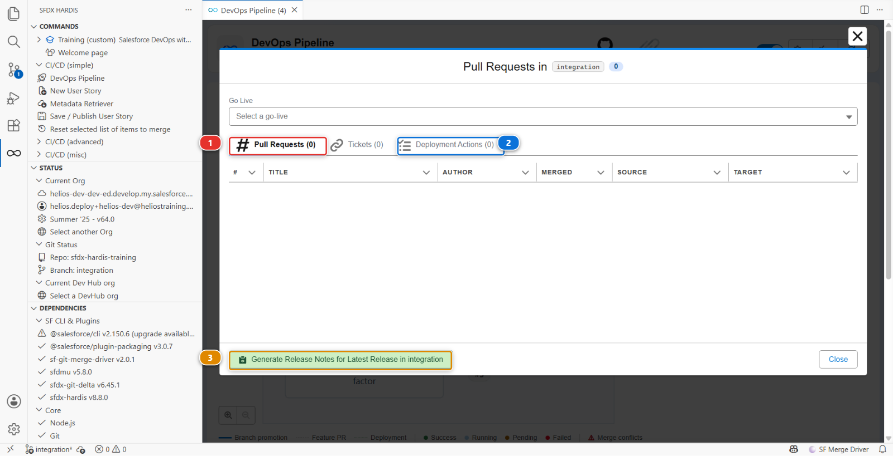

# Lab 5 - Promote integration to UAT and write the release notes

**Level**: 3 Release Manager
**Time**: ~50 min
**You will**: make your first promotion between two major branches, read the deployment actions it
carries, and produce the document the business actually reads.

## The situation

Everything the team built this week is in `integration`. The business testers work in UAT. Monday
morning they expect to find this week's work there, with a note saying what changed.

A promotion between major branches is not a contributor Pull Request. It carries several stories at
once, it may carry deployment actions declared weeks ago by different people, and the org it
deploys to has real testers in it.

## Before you start

- [ ] Lab 4 finished: US-018 and US-019 merged into `integration`
- [ ] `helios-uat` connected, seeded, and configured as the `uat` org in Lab 0
- [ ] JWT authentication working for `uat` (Lab 1)

## Steps

### 1. See what you are about to ship

Open the **DevOps Pipeline** panel and click the `integration` node in the diagram. A window opens
on that branch.

**Pull Requests** **(1)** is the list that matters: every Pull Request merged into `integration`
since the last promotion to `uat`. That list **is** the release. Read it before you create anything:
if a story in it should not go out this week, now is the moment, not after the deployment.

**Deployment Actions** **(2)** is the same list of actions those Pull Requests carried, gathered in
one place, and step 3 comes back to it. **(3)** generates the notes, which is step 6.

!!! note "Empty, with a Go Live selector instead?"
    Then this branch has no merge target yet, and the panel is showing you its go-lives rather than
    what is waiting to be promoted. Lab 0 of this level is what gives `integration` a merge target.
    Go back and finish it.

### 2. Create the promotion Pull Request

From the same window, create the Pull Request from `integration` into `uat`.

Title it for the humans who will read it, not for git:

> Release 2026-09-3: crew capacity cap, quote PDF

### 3. Read the deployment actions it carries

Once the check runs, the sfdx-hardis comment has a **Deployment actions** section. This is the part
of a promotion that has no equivalent in a contributor Pull Request.

Every action any contributor declared on any of the merged stories is collected here, in order, with
what it will do and in which org.

**Read it before merging.** Two things to look for:

| What you see      | What it means for you                                                                                   |
|-------------------|---------------------------------------------------------------------------------------------------------|
| A **manual step** | Somebody has to click something in UAT. That somebody is you, and it will not happen unless you plan it |
| A **data import** | Records will be written to UAT. Testers may have their own records there                                |

The actions are read-only in a promotion: you cannot edit a contributor's action from here, because
it belongs to their Pull Request and to every org after this one. If one is wrong, it is fixed in a
new Pull Request, not in this promotion.

### 4. Merge and watch the deployment

Merge the promotion. The **Deploy to uat** job starts.

This is the first deployment to this org through the pipeline, so it will be larger than the ones to
integration: UAT is behind by everything the team has done. Expect several minutes.

When it finishes, do the manual steps the comment listed, in `helios-uat`.

### 5. Verify with a tester's eyes

Open `helios-uat` and check the two stories are genuinely usable, not just deployed:

- Assigning a crew larger than the cap is refused
- The quote PDF permission is on the manager permission set

Deployed and usable are different states, and the gap between them is almost always a permission or
a piece of reference data.

### 6. Generate the release notes

Open the **DevOps Pipeline** panel and click the `uat` column, the same way you clicked
`integration` in step 1. At the bottom of the branch window, click **Generate Promotion Notes for uat**: it covers the promotion you have just merged.

The button is named after what the branch is. `uat` still merges into `main`, so what arrived there
is a promotion. On a branch with no merge target, `main`, the same button reads **Generate Release
Notes for Latest Release in main**, and **Generate Release Notes for** the go-live you choose in the
selector at the top of the window.

You get a markdown document listing the Pull Requests, their authors, their stories and the manual
steps, generated from the merge history rather than from anybody's memory.

Read it and then improve it. Generated notes are a complete list, and a release note the business
reads needs two things the generator cannot know:

1. **One sentence at the top saying what this release is for.** "Crews can no longer be
   over-staffed, and sales can generate quote PDFs."
2. **The manual steps, stated as instructions to a named person**, not as a technical list

Commit the result in the repository, and put its link in `MY-PIPELINE.md`.

Under the hood: what generated the notes, and what a promotion really is

The command was:

    sf hardis:doc:release-notes

which walks the git history between two references, collects the merge commits, matches each one
with its Pull Request through the git provider API, and pulls the title, author, body and declared
deployment actions.

**This is why Lab 2 said not to squash.** A squashed merge loses the link between the commit and the
Pull Request, and both the release notes and the DORA report in Lab 6 are built from exactly that
link. A project that squashes everything has no release notes it did not write by hand.

**A promotion is an ordinary Pull Request.** There is no special promotion machinery in the default
setup: `integration` into `uat` is a branch merged into another branch, and the deployment job on
`uat` behaves like the one on `integration`. What differs is only what the configuration says about
`uat`: its org, its merge targets, and whether delta deployment applies between major branches
(`enableDeltaDeploymentBetweenMajorBranches`, off by default, because a promotion is the worst
moment to discover the target org drifted).

There is an experimental feature for teams who want to promote a **subset** of what is waiting,
rather than everything: [promotion
branches](https://sfdx-hardis.cloudity.com/salesforce-devops-promotion-branches/). It is worth
reading about once you have done a few releases the ordinary way.

## What you should see

- The `uat` branch carrying everything `integration` had
- A green **Deploy to uat** job
- Both stories working in `helios-uat`
- Release notes committed, and linked from `MY-PIPELINE.md`

## If it goes wrong

**The check fails with authentication errors for uat.**
Lab 1 for the `uat` branch: the secrets, and the pre-authorisation of the External Client App in
`helios-uat`.

**The deployment fails on something that worked in integration.**
The orgs differ. Usually UAT is missing a feature, a licence, or a component somebody deleted there
by hand. Read the error and check the org.

**The promotion Pull Request shows hundreds of files.**
That is expected on a first promotion: UAT is behind by the whole history. It settles after this
one.

**The release notes are empty.**
The history between the two references has no merge commits with Pull Requests behind them. Either
the range is wrong, or the merges were squashed.

## Check your work

Welcome page > **Training** > **Check my work**, then pick level 3 and lab 5.

## Go deeper

- [Deploy to major orgs](https://sfdx-hardis.cloudity.com/salesforce-devops-deploy-major-branches/)
- [Release Notes](https://sfdx-hardis.cloudity.com/hardis/doc/salesforce-devops-release-notes/)

[Next: Lab 6 - Ship to production and read your DORA metrics](lab-06-production.md){ .md-button .md-button--primary }
