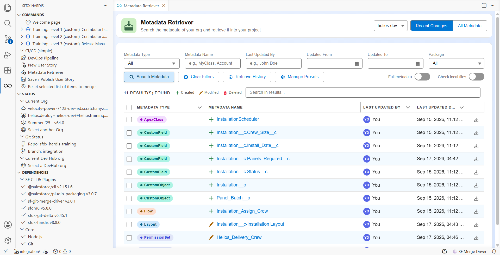

# Lab 7 - Production is broken: hotfix and retrofit

**Level**: 3 Release Manager
**Time**: ~60 min
**You will**: ship a fix straight to production without breaking the pipeline, then bring back a
change an admin made by hand.

## The situation

Two problems, and they arrive in the order they always do.

**17:40 on a Friday.** Planners cannot save an installation. The validation rule that went out this
week refuses a date that used to be fine. Waiting for the normal path means Monday.

**Monday morning.** While fixing the incident, an admin added a picklist value directly in
production, because that was the fastest way to unblock people. It works. It is in production and in
no branch, and the next deployment will silently remove it.

Both are normal. Handling them badly is what turns a normal week into a bad quarter.

## Before you start

- [ ] Lab 6 finished: the release is in production
- [ ] `helios-prod` connected in **Orgs Manager**

## Part 1: the hotfix

### 1. Decide that it is a hotfix

A hotfix skips the pipeline. That is its point, and its cost. Use it when **all three** are true:

1. Production is broken for real users right now
2. The fix is small and you can describe its blast radius in one sentence
3. Waiting for `integration` to `uat` to `main` is genuinely not acceptable

If any one is false, it is an ordinary story that happens to be urgent. Most things called hotfixes
are ordinary stories.

### 2. Branch from main, not from integration

This is the part people get wrong, and it produces an incident on top of an incident.

`integration` carries next week's work. Branch a hotfix from it and you ship next week's work to
production tonight.

In VS Code, **New User Story**, with:

| Question      | Answer                                                        |
|---------------|---------------------------------------------------------------|
| Target branch | **`main`**                                                    |
| Type          | **Fix**                                                       |
| Name          | `US-045-installation-date-hotfix`                             |
| Org           | `helios-prod`, because that is where you have to reproduce it |

### 3. Fix it

In `helios-prod`, adjust the validation rule so it no longer refuses a date that was already on the
record:

```
AND(
  ISCHANGED(Install_Date__c),
  Install_Date__c < TODAY(),
  NOT(ISPICKVAL(Status__c, "Completed"))
)
```

The `ISCHANGED` is what was missing: the rule was firing on every save of an old record, not only
when somebody moved the date.

### 4. Publish and ship

Publish, selecting only the validation rule. The Pull Request targets **`main`**.

The check deploys against production in validation mode, which is exactly what you want at 17:40:
the same gate, on the real org, taking two minutes.

Green. Merge. Watch the deployment. Confirm with a planner, or by saving a record yourself.

### 5. Put the fix back into the pipeline

Production now has a fix that `uat` and `integration` do not. Leave it there and the next release
overwrites it.

Open a second Pull Request, from your hotfix branch into `integration`. Same content, ordinary path.
Merge it, and the fix flows back up to `uat` on the next promotion.

**A hotfix is two Pull Requests.** One to production, one back into the pipeline. Doing only the
first is how a fix gets shipped twice and regressed once.

## Part 2: the retrofit

### 6. Find what production has that the repository does not

The admin added a picklist value `Needs Reinspection` to `Installation__c.Status__c`, live, on
Monday morning. Production now has something the repository does not, and the next deployment that
touches that field will quietly remove it.

There used to be a command that swept an org for every such difference and put them all on a branch.
It is deprecated, deliberately, and the reason is worth understanding before you reach for anything
automatic: **a sweep cannot tell you whether a difference means production is ahead or behind.** It
reports both the same way, and the second kind, accepted, rolls the repository back.

So you recover the change the way you would build it: as an ordinary User Story, retrieving exactly
what you know changed.

Start a User Story targeting `integration`, and pick `helios-prod` as the org to work in. Then open
the **Metadata Retriever** from the Welcome page.



Search for `Status__c`, tick the field, and retrieve it. One component, chosen by you, from an org
you named.

### 7. Read the diff before you keep any of it

Open the Source Control panel and read what landed.

You asked for one field and you will usually get more than the picklist value: an API version bump,
a reordered block, a `<fullName>` that differs in case. A retrieve returns the org's current
serialisation of the whole component, not just the part that changed.

Three kinds of difference, and only one of them is yours to keep:

| What you see in the diff                             | What to do                                                                |
|------------------------------------------------------|---------------------------------------------------------------------------|
| The picklist value an admin added to fix an incident | **Keep it.** It is real, it is needed, and it has to be in the repository |
| Noise: API version, attribute order, whitespace      | **Discard it.** Stage the hunks you want, not the file                    |
| Something that differs because production is behind  | **Discard it.** That is the pipeline's job, not yours                     |

The third one is the trap, and it is why this step is manual. Production being behind looks exactly
like production being ahead in a file diff. You are the one who knows which it is, because you know
what you went looking for.

Stage the picklist hunk. Leave the rest.

### 8. Bring it in, through the pipeline

Publish and open a Pull Request into `integration`, like any other story. Review it, merge it.

It flows to `uat`, and comes back to `main` on the next release, at which point production and the
repository agree again.

That last sentence is the whole point: **not to change production, but to stop production being
changed back.**

### 9. Write both down

```markdown
- **Lab 7, hotfix**: US-045 shipped straight to main, then merged back into integration so the next
  release does not regress it.
- **Lab 7, retrofit**: took the Needs Reinspection picklist value an admin added in production, put
  it through the pipeline from integration.
```

<details markdown="1"><summary>Under the hood: the two commands and the two configuration keys</summary>

**The hotfix** used nothing special. `hardis:work:new` with `main` as the target branch produces a
branch from `main`, and `hardis:work:save` computes the package against `main`. The pipeline treats
`main` as any other major branch. What makes it a hotfix is the target, not a mode.

The branch prefix matters for a reason beyond tidiness: the DORA change failure rate in Lab 6 counts
releases followed by a fix, and it recognises a fix by its branch name.

**The retrofit** used the Metadata Retriever, which runs a plain targeted retrieve:

    sf project retrieve start --metadata CustomField:Installation__c.Status__c --target-org helios-prod

and nothing else. No branch is created for you, no comparison is made on your behalf, and that is
the point.

There is an older command, `sf hardis:org:retrieve:sources:retrofit`, that swept the org for every
difference in a declared list of types and put them all on a branch. **It is deprecated and you
should not use it.** It automated the easy half of the job, finding differences, and left the half
that actually matters, deciding what each difference means, to whoever read the branch afterwards.
In practice nobody read it carefully every week, and a sweep accepted wholesale eventually reverts
something.

What replaces it is not a command, it is a habit, and it belongs to Lab 8: **put the org under
monitoring.** Monitoring tells you a manual change happened, on the day it happened, and who made
it. Then you retrieve that one thing, knowingly. Detection is automatic, the judgement is not.

</details>

## What you should see

- The validation rule fixed in `helios-prod`, through a Pull Request into `main`
- The same fix merged into `integration`
- `Needs Reinspection` present in the repository, in
  `force-app/main/default/objects/Installation__c/fields/Status__c.field-meta.xml`
- Two lines in `MY-PIPELINE.md`

## If it goes wrong

**The hotfix Pull Request wants to bring next week's work with it.**
You branched from `integration`. Start again from `main`.

**The retrieve brought back far more than the picklist value.**
Expected. A retrieve returns the org's whole current version of the component. Stage the hunk you
came for and discard the rest, rather than committing the file.

**The diff wants to remove things.**
Production is behind the repository for those components. Do not keep them: that is a deployment
problem, not a retrofit one.

**The picklist value disappears again after the next release.**
It reached the repository on a branch that never got merged. Check that it is really on
`integration`.

## Check your work

Welcome page > **Training** > **Check my work**, then pick level 3 and lab 7.

## Go deeper

- [Hotfixes](https://sfdx-hardis.cloudity.com/salesforce-devops-hotfixes/)
- [Retrofit](https://sfdx-hardis.cloudity.com/salesforce-devops-retrofit/)

[Next: Lab 8 - Put production under monitoring](lab-08-monitoring.md){ .md-button .md-button--primary }
